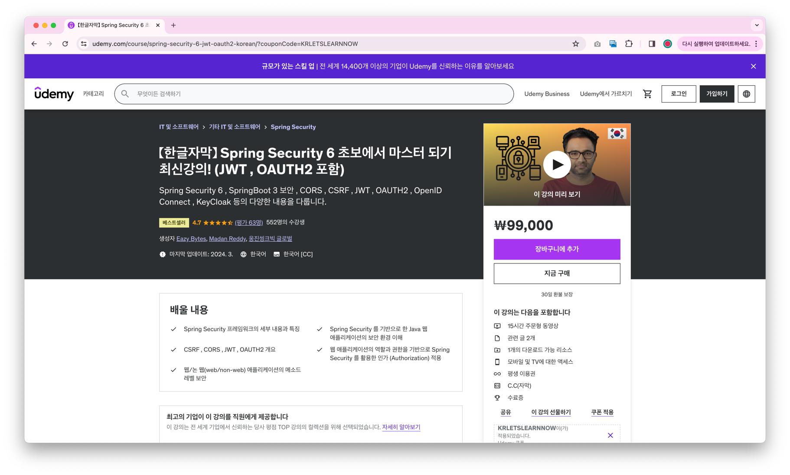

## 🌊 TAVE 13th - Backend Study Team 1
**TAVE 13기 백엔드 스터디 1팀**  
`site` https://tavewave.github.io/  
`blog` https://blog.naver.com/t-ave  
`instagram` https://www.instagram.com/tave_wave/

### ✅ Description
| 팀명     | 테이브의 보안검색대              |
|--------|-------------------------|
| 활동기간   | 2024.03.10 ~ 2024.04.30 |
| 활동장소   | 을지로 3가역                 |
| 스터디 내용 | Spring Security         |
| 팀장     | 양채린                     |
| 팀원     | 유지선, 이준범, 조예지           |

### 👥 Members
| 양채린                                |유지선|이준범| 조예지 |
|--------------------------------------------------------------------|-|-|----|
| https://github.com/chaeeerish |https://github.com/iiqcov|https://github.com/ss7622| https://github.com/CYJhub   |

### 🔖 Rule
- 매주 토요일 2시간 이상 오프라인 스터디를 진행해야 한다.
- 팀장을 제외하고 돌아가면서 서기를 담당한다.
- 스터디 시작 후 10분 이내와 종료 후 10분 이내에 인증 사진을 공지해야 한다.
- 스터디 결과물: 깃허브, 서기, 진행표, 후기, 그 외 첨부 자료

### 📚 Contents
해당 스터디는 다음의 강의를 기반으로 합니다.
(https://www.udemy.com/course/spring-security-6-jwt-oauth2-korean/?couponCode=KRLETSLEARNNOW)

### 👫🏻 How the study progresses
**🛫 Before Study**
- [ ] 스터디룸 예약
- [ ] **모임 하루** 전에 운영진에게 **모임 날짜 및 시간** 공지 - 단체 카카오톡방 태그
- [ ] Github의 각 주차 폴더에 정리한 내용 업로드
- [ ] _(발표자)_ 발표 준비

**✈️ During Study**
- [ ] **스터디 시작 후 10분 이내**에 인증사진 업로드
  - 지각자가 있을시, 다시 한 번 찍어서 업로드
- [ ] _(팀장)_ 진행표 작성
- [ ] _(서기)_ 노션 작성
  - 제출은 pdf 변환로 변환하여 한다.

**🛬 After Study**
- [ ] **스터디 종료 후 10분 이내**에 인증사진 업로드
- [ ] **스터디 종료 후 48시간 이내**에 아지트 스터디 Thread에 진행표 업로드
