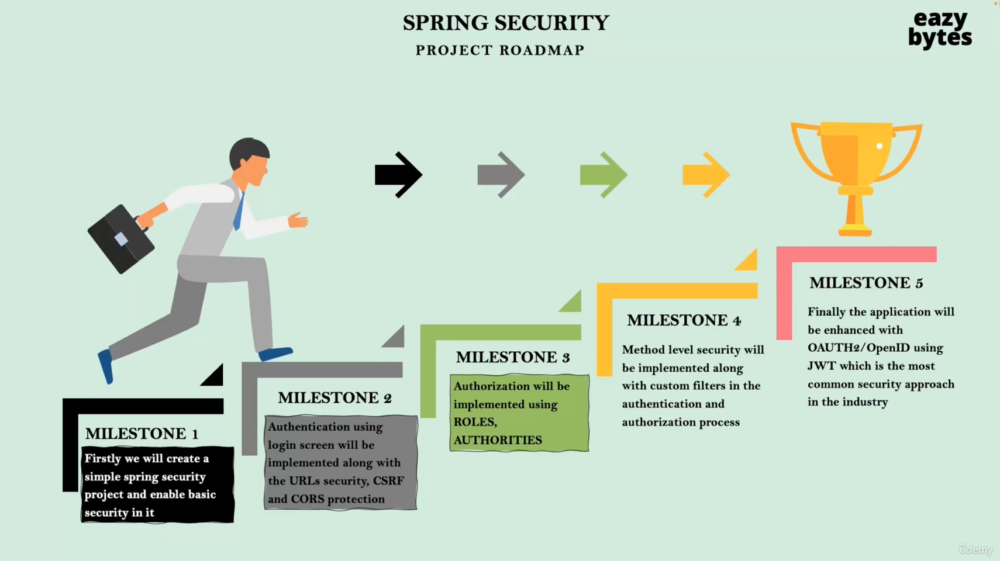
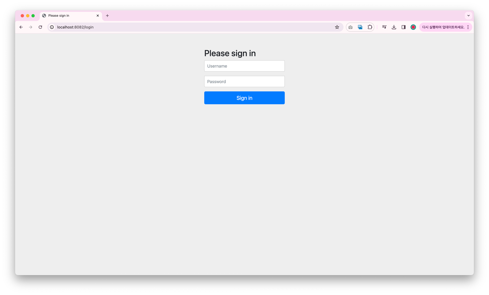
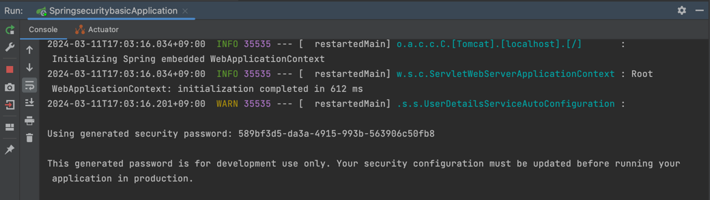
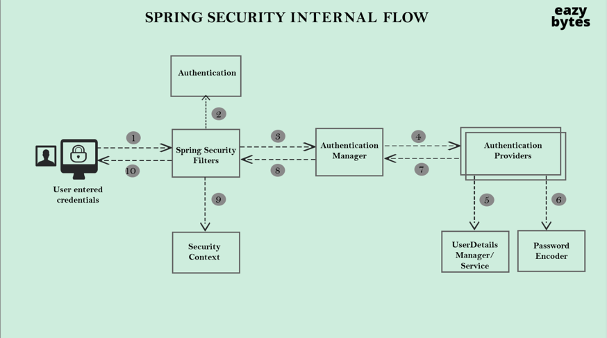
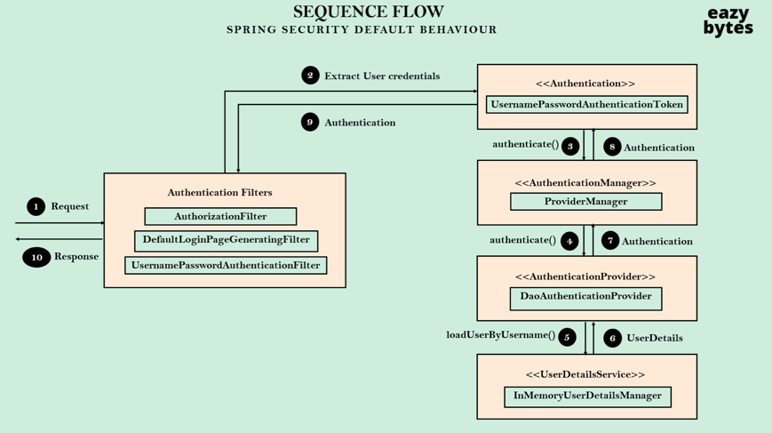
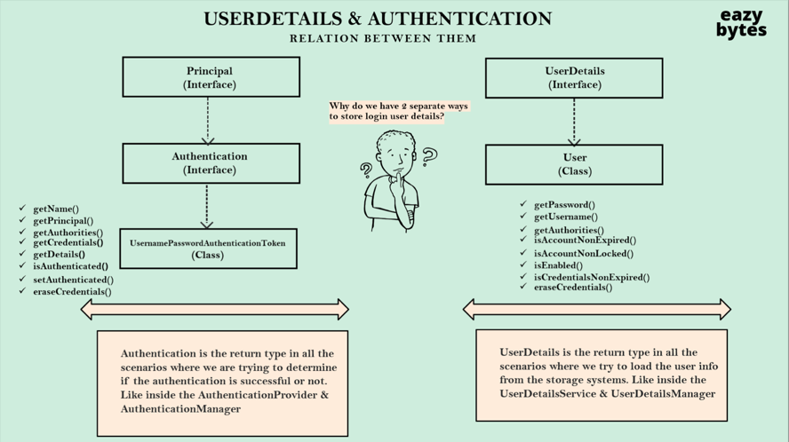

## WEEK 1️⃣ - 양채린
## Section 1️⃣
### Course Agenda
- Roles, Authorities 기반으로 한 역할 구현
- 암호를 입력할 때 Spring Security가 제공하는 다른 전략
- Spring Security를 이용한 메소드 레벨 보안
- Spring Security가 CORS, CSRF와 같은 일반적인 공격을 어떻게 다루는지 
- JWT 토큰과 인증, 인가에서의 그것의 역할
- OAUTH2, OpenID와 웹 어플리케이션 보호하기
- Keycloak을 이용한 인증 서버
- 해싱, 토큰 등의 보안 주제

### Road Map


### 보안은 무엇이며 보안이 중요한 이유
- 은행과 비슷하게 우리의 웹 어플리케이션도 귀중한 자산을 가지고 있다.
  - 예를 들어, 개인 기록, 병원 정보 등이 있다.
  - 이러한 중요한 정보를 지키기 위해서 웹 어플리케이션 보안을 강화해야 한다.
- 데이터 보호 뿐만 아니라 비즈니스 로직도 보호하고 싶을 수 있다.
  - 예를 들어, 구글은 그들의 검색 알고리즘을 공유하고 싶지 않을 것이다.
- 보안은 비기능적 요구사항이다.
  - 고객이 요구하지 않아도 기본적으로 지켜져야 한다.
  - 노골적으로 정의되어 있지 않아도 모두 우리에게 보안을 기대한다.
- 개발 단계에서부터 보안을 생각해야 한다.
  - UAT 테스트, 퍼포먼스 테스팅, 프로덕션 개발 이후가 아니다.
- 보안은 여러 종류의 보안이 있다.
  - HTTPS
  - 방화벽
  - SSL 인증
  - 인증, 권한
  - 이러한 종류의 보안은 서버 관리자와 DevOps 팀이 담당한다.
- 보안은 왜 중요한가?
  - 보안이 없으면 데이터 침해, 데이터 손실 등의 손실이 일어날 수 있다.
- 대부분의 일반적인 공격을 방어해야 한다.
  - CSRF, Broken Authentication과 같은 공격을 막아야 한다.

### 보안 없이 간단한 Spring Boot 앱 구현
```
Project: Maven
Language: Java
Spring Boot: 3.2.3
Packaging: Jar
Java: 17
Dependencies
- Spring Web
- Spring Boot DevTools
```

### Spring Security로 Spring Boot의 기본 앱 보안 강화

Spring Security Dependency만 추가했을 뿐인데 로그인 창이 생겼다.

user, 비밀번호를 입력하면 인증된다. (비밀번호는 매번 새롭게 생성된다.)


또한, 새로고침을 하여도 매번 자격 증명 정보 입력을 요구하지 않는다. 스프링 시큐리티가 세션 ID나 토큰 세부 정보를 저장해주어 동일한 브라우저 안에서 자격 증명을 묻지 않는다.
데이터베이스의 도움 혹은 두 프레임워크, 권한 부여 서버의 도움을 받아 최종 사용자를 인증하는 방법을 배우게 될 것이다.
위의 방법은 웹 어플리케이션을 보호하는 가장 간단한 방법이다.

### 애플리케이션 속성 파일 안에 있는 정적 인증 정보 설정
https://docs.spring.io/spring-boot/docs/current/reference/html/application-properties.html
위의 url에서 application.properties의 속성을 찾을 수 있다.

```properties
spring.security.user.name=chaeeerish
spring.security.user.password=12345
```

### Spring Security를 사용하는 이유
- 보안에만 집중하는 헌신적인 개발자들이 만들었다. 우리는 매시간 매분 매초 어플리케이션의 보안에 집중하고 있을 수 없다.
- 모든 시나리오를 반영하기 때문에 웹 어플리케이션을 최소한의 구성으로 보호할 수 있다.
- CSRF, CORs와 같은 흔한 보한 취약점에 대해서는 Spring Security 팀이 매일 패치하거나 업데이트한다.
- 웹페이지의 REST API들, 마이크로서비스, 역할 기반 매커니즘, 권한 부여 규칙을 시행할 수 있다. 메소드 레벨 보안을 두번째 레벨의 보안으로 가져갈 수도 있다.
- 인증 및 권한 부여를 구현하는 과정에서 다양한 보안 기준을 제공한다.
  - username / password
  - JWT Tokens
  - OAuth2
  - OpendID
- 견고하고 강력한 보안 프레임워크이다.

### 서블릿과 필터 소개

- 서블릿
  - 우리의 브라우저들은 HTTP 프로토콜만 이해할 수 있다. 따라서, 어떤 Java 웹 어플리케이션이든지 요청을 받은 후 HTTP 프로토콜로 전송한다.
  - Java 코드는 HTTP 프로토콜 요청을 이해할 수 없기 때문에, Java 코드와 브라우저 사이에 중개자가 존재한다.
  - 이 중개자가 서블릿 컨테이너, 웹 서버라고 부른다. Apache Tomcat이 대표적인 예시이다.
  - 브라우저로부터 받은 HTTP 메시지를 Servlet Request object로 변환한다.
  - 다시 브라우저에 요청을 보낼 때에도 HTTP ServletResponse object를 이용하여 브라우저가 이해할 수 있는 HTTP 메시지로 변환한다.
  - 복잡한 성격 때문에 요즘에는 아무도 직접 서블릿을 사용하지 않는다.
  - SpringBoot, Spring Framework가 등장한 이유이다.
  - 서블릿과 관련한 복잡한 로직을 그들이 담당하여 처리한다.
- 필터
  - 필터는 특별한 종류의 서블릿이다.
  - 웹 어플리케이션으로 들어오는 모든 요청을 가로챈다.
  - 이러한 필터에는 실질적인 비즈니스 로직이 실행되기 전에 프리 로직, 프리 워크를 정의할 수 있다.
  - 클라이언트와 서블릿 사이에 필터를 사용한다.
  - 필터에 정의내린 로직을 실행하게 된다.
- 이러한 필터를 사용해아만 Spring Security 프레임워크는 보안을 시행한다.

### Spring Security의 내부 흐름 소개

- Spring Seucurity 구조 및 내부 흐름
  - 서블릿 컨테이너 또는 Tomcat 서버 또는 웹 어플리케이션이 이 요청을 수신함과 동시에 Spring Security 필터를 거치게 된다.
  - 이 필터들이 백엔드 서버로 들어오는 모든 요청을 감시한다.
  - 이 필터는 엔드 유저가 보내는 유저네임, 비밀번호를 추출하고 2단계 인증 객체로 변환한다.
  - 인증 객체는 Spring Security 안에서 엔드 유저의 정보를 저장하기 위한 핵심 표준이다.
  - 이 인증 객체가 형성되면 Spring Security 필터는 이 요청을 Authentication Manager(인증 관리자)에게 넘길 것이다.
  - 이 인증 관리자는 실질적인 인증 로직을 관리하는 관리 인터페이스 또는 클래스이다.
  - 인증 관리자의 역할은 웹 어플리케이션 안에 어떤 인증 제공자(Authentication Provider)가 존재하는지 확인한다.
  - 이 인증 제공자들 내에 실질적인 인증 로직을 작성한다.
  - 하나의 인증 제공자는 유저 네임과 비밀번호 인증을 담당하게 하, 다른 인증 제공자는 로그인을 하기 위해 OR 매핑을 활용하게 할 수도 있다.
  - 무한대로 정의할 수 있다.
  - 인증 관리자는 이 요청을 인증 제공자들에게 전송하는 것 뿐만 아니라 
    - 모든 인증 관리자 시도 했고, 모든 시도에서 인증 실패한 시점에서야 인증 관리자는 엔드 유저에게 인증이 실패했다고 응답할 것이다.
  - UserDetailsManager / UserDetailsService에서 미리 제공된다.
    - 데이터베이스같은 저장소에서 유저 정보를 불러온다.
  - PasswordEncoder과 협동하여 엔드 유저가 제공한 자격 증명이 유효한지 판별한다.
  - 모든 인증이 완료되면, 다시 인증 관리자를 거쳐서 필터로 간다.
  - 2단계에서 이들이 생서한 인증 객체(Authentication)를 보안 컨텍스트(Security Context) 안에 저장한다. (9단계)
  - 보안 컨텍스트 내부에 이러한 인증 정보를 저장하고 있기 때문에 첫 로그인 이후에는 자격 증명을 요구하지 않는다.
    - 따라서, 이 Spring Security 필터들이 인증을 수행할지 않을지 결정하는 요소이다.

### Spring Security 내부 흐름 데모
- Spring Security Framework 디버깅 하면서 내부 코드 살펴보기

**AuthorizationFilter**
- 엔드유저가 접근하고자하는 URL을 제한한다. 공개 URL이라면 응답은 엔드 유저에게 자격 증명을 요구하지 않고 바로 표시될 것이다.
- 보안 URL에 접근하고자 한다면 해당 요청을 이 필터 체인의 다음 필터로 리다이렉트 한다. => doFilter()
```java
public void doFilter(ServletRequest servletRequest, ServletResponse servletResponse, FilterChain chain) throws ServletException, IOException {
    HttpServletRequest request = (HttpServletRequest)servletRequest;
    HttpServletResponse response = (HttpServletResponse)servletResponse;
    
    if (this.observeOncePerRequest && this.isApplied(request)) {
        chain.doFilter(request, response);
    } else if (this.skipDispatch(request)) {
        chain.doFilter(request, response);
    } else {
        String alreadyFilteredAttributeName = this.getAlreadyFilteredAttributeName();
        request.setAttribute(alreadyFilteredAttributeName, Boolean.TRUE);

        try {
            AuthorizationDecision decision = this.authorizationManager.check(this::getAuthentication, request);
            this.eventPublisher.publishAuthorizationEvent(this::getAuthentication, request, decision);
            if (decision != null && !decision.isGranted()) {
                throw new AccessDeniedException("Access Denied");
            }

            chain.doFilter(request, response);
        } finally {
            request.removeAttribute(alreadyFilteredAttributeName);
        }

    }
}
```

**DefaultLoginPageGeneratingFilter**
- 로그인 페이지가 표시되는 이유가 이 필터의 도움이다.
- 다음과 같이 html 페이지를 로드하는 것을 볼 수 있다.
```java
private String generateLoginPageHtml(HttpServletRequest request, boolean loginError, boolean logoutSuccess) {
    String errorMsg = loginError ? getLoginErrorMessage(request) : "Invalid credentials";
    String contextPath = request.getContextPath();
    StringBuilder sb = new StringBuilder();
    sb.append("<!DOCTYPE html>\n");
    sb.append("<html lang=\"en\">\n");
    sb.append("  <head>\n");
    sb.append("    <meta charset=\"utf-8\">\n");
    sb.append("    <meta name=\"viewport\" content=\"width=device-width, initial-scale=1, shrink-to-fit=no\">\n");
    sb.append("    <meta name=\"description\" content=\"\">\n");
    sb.append("    <meta name=\"author\" content=\"\">\n");
    sb.append("    <title>Please sign in</title>\n");
    sb.append("    <link href=\"https://maxcdn.bootstrapcdn.com/bootstrap/4.0.0-beta/css/bootstrap.min.css\" "
            + "rel=\"stylesheet\" integrity=\"sha384-/Y6pD6FV/Vv2HJnA6t+vslU6fwYXjCFtcEpHbNJ0lyAFsXTsjBbfaDjzALeQsN6M\" crossorigin=\"anonymous\">\n");
    sb.append("    <link href=\"https://getbootstrap.com/docs/4.0/examples/signin/signin.css\" "
            + "rel=\"stylesheet\" integrity=\"sha384-oOE/3m0LUMPub4kaC09mrdEhIc+e3exm4xOGxAmuFXhBNF4hcg/6MiAXAf5p0P56\" crossorigin=\"anonymous\"/>\n");
    sb.append("  </head>\n");
    sb.append("  <body>\n");
    sb.append("     <div class=\"container\">\n");
    
    // 생략
    
    sb.append("</div>\n");
    sb.append("</body></html>");
    return sb.toString();
}
```

**UsernamePasswordAuthticationFilter**
- 수신하는 http의 출력 요청으로부터 유저 네임과 비밀번호를 추출한다.
```java
@Override
public Authentication attemptAuthentication(HttpServletRequest request, HttpServletResponse response)
        throws AuthenticationException {
    if (this.postOnly && !request.getMethod().equals("POST")) {
        throw new AuthenticationServiceException("Authentication method not supported: " + request.getMethod());
    }
    String username = obtainUsername(request);
    username = (username != null) ? username.trim() : "";
    String password = obtainPassword(request);
    password = (password != null) ? password : "";
    UsernamePasswordAuthenticationToken authRequest = UsernamePasswordAuthenticationToken.unauthenticated(username,
            password);
    // Allow subclasses to set the "details" property
    setDetails(request, authRequest);
    return this.getAuthenticationManager().authenticate(authRequest);
}
```

**ProviderManager**
- 이 클래스는 인증 관리자를 구현한다.
- 사용 가능한 모든 인증 제공자와 개발자가 작성한 인증 제공자와 상호작용을 시도할 것이다.
- 첫 번째 인증 제공자가 인증 실패를 반환한다면 다음 인증 제공자를 시도하게 된다.
```java
while(var9.hasNext()) {
    AuthenticationProvider provider = (AuthenticationProvider)var9.next();
    if (provider.supports(toTest)) {
        if (logger.isTraceEnabled()) {
            Log var10000 = logger;
            String var10002 = provider.getClass().getSimpleName();
            ++currentPosition;
            var10000.trace(LogMessage.format("Authenticating request with %s (%d/%d)", var10002, currentPosition, size));
        }

        try {
            result = provider.authenticate(authentication);
            if (result != null) {
                this.copyDetails(authentication, result);
                break;
            }
        } catch (InternalAuthenticationServiceException | AccountStatusException var14) {
            this.prepareException(var14, authentication);
            throw var14;
        } catch (AuthenticationException var15) {
            lastException = var15;
        }
    }
}
```

**DaoAuthenticationProvider**
- 유저 네임이 무엇인지 불러온다.
- retrieveUser 메소드를 통해 UserDetailsManager 또는 UserDetailsService의 도움을 받는다. (저장소에서 유저 정보 불러오기)
  - 모든 인증 제공자는 UserDetailsService, Password Encoder의 도움을 받는다.
```java
public Authentication authenticate(Authentication authentication) throws AuthenticationException{
    Assert.isInstanceOf(UsernamePasswordAuthenticationToken.class,authentication,()->{
    return this.messages.getMessage("AbstractUserDetailsAuthenticationProvider.onlySupports","Only UsernamePasswordAuthenticationToken is supported");
    });
    String username=this.determineUsername(authentication);
    boolean cacheWasUsed=true;
    UserDetails user=this.userCache.getUserFromCache(username);
    if(user==null){
    cacheWasUsed=false;

    try{
    user=this.retrieveUser(username,(UsernamePasswordAuthenticationToken)authentication);
    }catch(UsernameNotFoundException var6){
    this.logger.debug("Failed to find user '"+username+"'");
    if(!this.hideUserNotFoundExceptions){
    throw var6;
    }

    throw new BadCredentialsException(this.messages.getMessage("AbstractUserDetailsAuthenticationProvider.badCredentials","Bad credentials"));
    }

    Assert.notNull(user,"retrieveUser returned null - a violation of the interface contract");
    }
    // 생략
}
```

**InMemoryUserDetailsManager**
- UserDetailsManager 인터페이스를 구현한 클래스
```java
public class InMemoryUserDetailsManager implements UserDetailsManager, UserDetailsPasswordService {
    protected final Log logger = LogFactory.getLog(this.getClass());
    private final Map<String, MutableUserDetails> users = new HashMap();
    private SecurityContextHolderStrategy securityContextHolderStrategy = SecurityContextHolder.getContextHolderStrategy();
    private AuthenticationManager authenticationManager;
    // 생략
    public UserDetails loadUserByUsername(String username) throws UsernameNotFoundException {
        UserDetails user = (UserDetails) this.users.get(username.toLowerCase());
        if (user == null) {
            throw new UsernameNotFoundException(username);
        } else {
            return new User(user.getUsername(), user.getPassword(), user.isEnabled(), user.isAccountNonExpired(), user.isCredentialsNonExpired(), user.isAccountNonLocked(), user.getAuthorities());
        }
    }
    // 생략
}
```

### Spring Security 기본 동작의 순서 흐름

1. 엔드 유저는 API 경로에 접근하고자 한다. 엔드 유저는 해당 API가 공개인지 보안인지 모른다. 
2. Spring Security 필터는 요청을 가로 막고, 보안 API 경로라면 자격 증명을 요구할 로그인 페이지를 보여준다. 
3. 엔드 유저가 자격 증명을 입력하면, 요청이 UsernamePasswordAuthentication 필터에 의해 다시 가로막힌다.
4. 유저 네임과 비밀번호를 추출하여 UsernamePasswordAuthenticationToken 객체를 형성한다. 
5. Provider Manager의 authenticate 메소드를 호출한다. 모든 가능한 인증 제공자를 시도할 것이다.
6. DaoAuthenticationProvider에서 UserDetailsManager의 구현체인 InMemoryUserDetailsManager의 loadUserByUsername 메소드를 호출한다.
7. PasswordEncoder에서 비밀번호 매칭 여부를 확인한다.
8. 일치하면, 인증 객체 내부의 모든 필수 정보를 채움으로써 Provider Manager에게 인증이 성공적이라는 응답을 전송한다.
9. Provider Manager는 Spring Security 필터에 같은 내용을 전달한다.
10. 이 인증 정보를 보안 컨텍스트 객체 내부에 저장한다.
11. 따라서, 해당 유저가 다른 보안 경로를 호출하면 자격 증명을 요구하지 않는다.

### 인증 정보 없이 요청을 처리하는 과정 이해
세션 ID는 Spring Security 프레임워크에 의해 생성되어 브라우저로 전송되고 쿠키로 설정된다.  
쿠키이기 때문에 브라우저 탭에 남는다. 브라우저가 유효한 세션 ID를 전송하는 한 Spring Security는 자격 증명을 요구하지 않는다.

## Section 2️⃣
### EazyBank 앱에 필요한 백엔드 REST 서비스
```
Services without any security
/contact 문의하기 페이지
/notices 공지사항 페이지

Services with security
/myAccount 계정 정보 페이지
/myBalance 계좌 정보 페이지
/myLoans 대출 정보 페이지
/myCards 카드 정보 페이지
```

### Spring Security 프레임워크의 기본 설정 확인
- 기본적으로 모든 REST API가 Spring Security 프레임워크에 의해 보호된다.
- 하지만, 우리는 맞춤형 보안 요구사항도 가지고 있다. 몇 URL은 보호되고, 나머지 URL은 보호되지 않길 바라는 것이다.
- SpringBootWebSecurityConfiguration 클래스의 defaultSecurityFilterChain 메소드가 모든 엔드포인트 URL을 보호하게 만드는 코드를 가지고 있다.
```java
// 만약 개발자가 SecurityFilterChain Bean을 지정한다면 이 설정은 일방적인 개입을 완전히 중단한다.
@Bean
@Order(2147483642)
SecurityFilterChain defaultSecurityFilterChain(HttpSecurity http) throws Exception {
    http.authorizeHttpRequests((requests) -> {
        ((AuthorizeHttpRequestsConfigurer.AuthorizedUrl)requests.anyRequest()).authenticated();
    });
    http.formLogin(Customizer.withDefaults());
    http.httpBasic(Customizer.withDefaults());
    return (SecurityFilterChain)http.build();
}
```
**사용자 맞춤 설정**
ProjectSecurityConfig.java
```java
@Configuration
public class ProjectSecurityConfig {
    @Bean
    SecurityFilterChain defaultSecurityFilterChain(HttpSecurity http) throws Exception {
        http.authorizeHttpRequests((requests) -> {
                    requests.requestMatchers("/myAccount", "/myBalance", "/myLoans", "/myCards").authenticated()
                            .requestMatchers("/notices", "/contact").permitAll();
                })
                .formLogin(Customizer.withDefaults())
                .httpBasic(Customizer.withDefaults());

        return http.build();
    }
}
```

**모든 요청을 거부하길 원한다면**
```java
http.authorizeHttpRequests(requests -> requests.anyRequest().denyAll())
        .formLogin(Customizer.withDefaults())
        .httpBasic(Customizer.withDefaults());
```
(모든 API에 대해서 권한 부여 에러인 403 에러를 발생시킨다.)

### 모든 요청 허용 처리
```java
http.authorizeHttpRequests(requests -> requests.anyRequest().permitAll())
        .formLogin(Customizer.withDefaults())
        .httpBasic(Customizer.withDefaults());
```

## Section 3️⃣
- 개발 어플리케이션에서는 자격증명을 어플리케이션 메모리에 저장할 수 있다.
- 운영 어플리케이션에서는 엔드 유저의 자격 증명을 데이터베이스에 저장하거나 저장장치 안에 저장하는 방법을 사용할 수 있다. Keyclock나 Okta와 같은 인증 서비스를 이용할 수 있다.
- 이 섹션에서는 어플리케이션 메모리 안에 유저를 저장하여 여러 유저를 생성하는 방법을 배울 것이다.
- 또한, 데이터베이스와 같은 저장장치에 유저의 정보를 저장하는 방법도 배워볼 것이다.

### InMemoryUserDetailsManager를 사용한 유저 설정(1)
ProjectSecurityConfig.java
```java
@Bean
public InMemoryUserDetailsManager userDetailsService() {
    // 스프링 프레임워크에 의해서 빈으로 변경될 것이다.

    // User는 클래스, UserDetails는 인터페이스이다.
    UserDetails admin = User.withDefaultPasswordEncoder() // 권장하는 메소드는 아니다.
            .username("admin")
            .password("12345")
            .authorities("admin")
            .build(); // User라는 새 객체를 생성해준다.
    UserDetails user = User.withDefaultPasswordEncoder()
            .username("user")
            .password("12345")
            .authorities("read")
            .build();

    // 이 두 User는 InMemoryUserDetailsManager의 생성자로 전달된다.
    return new InMemoryUserDetailsManager(admin, user);
}
```
InMemoryUserDetailsManager.java
```java
// 생성자
public InMemoryUserDetailsManager(UserDetails... users) {
    UserDetails[] var2 = users;
    int var3 = users.length;
    for(int var4 = 0; var4 < var3; ++var4) {
        UserDetails user = var2[var4];
        this.createUser(user);
    }
}
```

### InMemoryUserDetailsManager를 사용한 유저 설정(2)
ProjectSecurityConfig.java
```java
@Bean
public InMemoryUserDetailsManager userDetailsService() {
    UserDetails admin = User.withUsername("admin")
            .password("12345")
            .authorities("admin")
            .build();
    UserDetails user = User.withUsername("user")
            .password("12345")
            .authorities("read")
            .build();
    return new InMemoryUserDetailsManager(admin, user);
 }
 
@Bean
// NoOpPasswordEncoder 유형의 Bean을 생성하여 비밀번호를 일반 테스트 처리한다.
public PasswordEncoder passwordEncoder() {
    return NoOpPasswordEncoder.getInstance();
}
```

### 유저 관리 인터페이스와 클래스들에 대한 이해
- UserDetailsService
  UserDetailsService.java
```java
public interface UserDetailsService {
    UserDetails loadUserByUsername(String username) throws UsernameNotFoundException;
}
```
- 유저 세부 정보를 로드하는 loadUserByUsername 메서드를 가지고 있다.
- 비밀번호 없이 username으로만 load하는 이유는 비밀번호를 네트워크에 담아 데이터베이스 서버에 전송하는 것은 불필요하기 때문이다.
- UserDetailsManager
  - 유저 생성, 업데이트, 삭제, 비밀번호 변경 및 유저의 존재 여부와 같은 모든 메소드를 포함한다.
    UserDetailsManager.java
```java
public interface UserDetailsManager extends UserDetailsService {
    void createUser(UserDetails user);
    void updateUser(UserDetails user);
    void deleteUser(String username);
    void changePassword(String oldPassword, String newPassword);
    boolean userExists(String username);
}
```
- UserDetailsManager 인터페이스를 구현한 예시 클래스가 InMemoryUserDetailsManager, JdbcUserDetailsManager이다.
- Authentication Provider
  - 에는 자체 로직을 작성할 수 있다.
- UserDetails
  - 저장 시스템에서 로드하고자 하는 유저의 세부 정보를 나타내는 인터페이스이다.
  - 이 인터페이스를 구현한 클래스가 User 클래스이다.

### UserDetails 인터페이스와 유저 클래스 심층 분석
(UserDetailsService와 같은 모든 상위 클래스와 인터페이스 내에서 UserDetails가 메소드 반환 유형 또는 비즈니스 로직 내에서 사용된다.
따라서, UserDetails 인터페이스와 그 구현 클래스 내에 정확히 무엇이 있는지 이해하는 것은 중요하다.)
(UserDetails와 User 클래스 내에 있는 메소드 목록을 확인해 보면 setter 메소드가 없다. 보안의 이유 때문이다.)

- 왜 로그인 유저 세부 정보를 저장하는 두 가지 별개의 방법이 있는가
  
  1번째 방법) UserDetails와 User 클래스
- 유저의 세부 정보를 데이터베이스 메모리 등 저장 시스템에 로드하려고 사용한다.
- 이 유저 정보는 반드시 Authentication Provider에게 전달된다.

2번째 방법)
- Authentication Provider에서 인증이 성공하면 모든 정보와 함께 성공적인 **인증 세부 정보를 인증 객체 데이터 유형으로 변환**하는 것이 책임이다.
- 인증의 구현 중 하나는 "UsernamePasswordAuthenticationToken"이다.
- 이 인증 인터페이스는 "Principle"이다.
  - 엔티티의 이름이나 개인의 이름 또는 로그인 ID를 나타낸다.
    Authentication.java
```java
public interface Authentication extends Principal, Serializable {
	Collection<? extends GrantedAuthority> getAuthorities();
	Object getCredentials();
	Object getDetails();
	Object getPrincipal();
	boolean isAuthenticated();
    // 인증이 성공하면 isAuthenticated 값을 True로 설정한다.
	void setAuthenticated(boolean isAuthenticated) throws IllegalArgumentException;
}
```

DaoAuthenticationProvider.java
```java
// 인증이 성공하면 이 메소드가 호출된다.
protected Authentication createSuccessAuthentication(Object principal, Authentication authentication, UserDetails user){
    boolean upgradeEncoding=this.userDetailsPasswordService!=null&&this.passwordEncoder.upgradeEncoding(user.getPassword());
    // UserDetails에서 Authentication으로 필요한 정보를 채우고 반환한다.
    if(upgradeEncoding){
      String presentedPassword=authentication.getCredentials().toString();
      String newPassword=this.passwordEncoder.encode(presentedPassword);
      user=this.userDetailsPasswordService.updatePassword(user,newPassword);
    }

    return super.createSuccessAuthentication(principal,authentication,user);
}
```

### UserDetailsManager를 구현하는 클래스 심층 분석
dependencies 추가
```xml
<dependency>
    <groupId>org.springframework.ldap</groupId>
    <artifactId>spring-ldap-core</artifactId>
</dependency>
<dependency>
    <groupId>org.springframework.security</groupId>
    <artifactId>spring-security-ldap</artifactId>
</dependency>
```

**InMemoryUserDetailsManager.java**
```java
public class InMemoryUserDetailsManager implements UserDetailsManager, UserDetailsPasswordService {
    // 생략
    @Override
    public void createUser(UserDetails user) {
        Assert.isTrue(!userExists(user.getUsername()), "user should not exist");
        this.users.put(user.getUsername().toLowerCase(), new MutableUser(user));
    }

    @Override
    public void deleteUser(String username) {
        this.users.remove(username.toLowerCase());
    }

    @Override
    public boolean userExists(String username) {
        return this.users.containsKey(username.toLowerCase());
    }

  @Override
  public UserDetails loadUserByUsername(String username) throws UsernameNotFoundException {
    UserDetails user = this.users.get(username.toLowerCase());
    if (user == null) {
      throw new UsernameNotFoundException(username);
    }
    return new User(user.getUsername(), user.getPassword(), user.isEnabled(), user.isAccountNonExpired(),
            user.isCredentialsNonExpired(), user.isAccountNonLocked(), user.getAuthorities());
  }
    // 생략
}
```

**JdbcUserDetailsManager.java**
```java
public class JdbcUserDetailsManager extends JdbcDaoImpl implements UserDetailsManager, GroupManager {

}
```
다음과 같이 SQL 쿼리를 이용한다.
```java
public static final String DEF_USERS_BY_USERNAME_QUERY = "select username,password,enabled "
        + "from users "
        + "where username = ?";
```