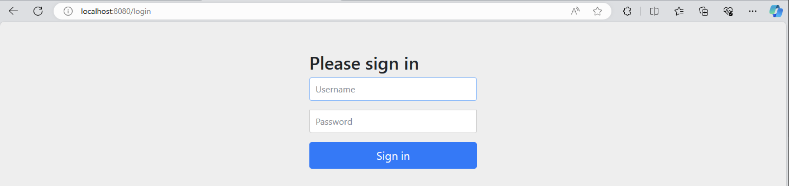

# Section 1

### Spring Security Dependencies

```
dependencies {
	implementation 'org.springframework.boot:spring-boot-starter-security'
	testImplementation 'org.springframework.security:spring-security-test'
}
```

### Spring Security Framework를 적용한 경우

적용하지 않았을 때 그냥 접속되던 url이 자격증명을 요구하게 됨



> Username : `user` \
> Password : 프로젝트를 실행한 콘솔에서 볼 수 있음

### Spring Security 특성

- 자격증명을 한 번 하게 되면 같은 브라우저에서는 자격증명을 다시 요구하지 않음
  - Spring Security 가 `세션 ID`나 `토큰 세부 정보`를 저장해주어 브라우저가 사용자를 기억하게 됨
- 위 방법의 한계

  - Username이 고정됨
  - 서버를 실행할 때마다 비밀번호가 계속 갱신됨

- 추천하는 하는 자격증명 방법
  - 자격 증명 불러오기
  - 저장 시스템에 자격 증명 정보 보관하기

### 사용자마다 특정 id, password 입력으로 인증하도록 설정하기

`application.properties` 설정하기

```
spring.security.user.name = eazybytes
spring.security.user.password = 12345
```

- 모든 기본 설정 공유
  -> 언제든 `내부 애플리케이션`이나 `비생산 애플리케이션` 또는 몇 가지 `POC 애플리케이션`을 개발할 때 사용 가능

### Spring Security 사용 이유

- 고유의 커스텀 코드나 고유의 단체 프레임워크를 웹 애플리케이션에 적용하고 보호하는 것은 굉장히 어려움
  - 매일 수백개의 보안 취약점이 밝혀짐 -> 매일 커스텀 코드를 업데이트 하는 것은 어려움
- Spring Security는 모든 보안 시나리오를 참고하여 제작됨
  -> 웹 애플리케이션을 최소한의 구성으로 쉽게 보호 가능
- `CORS`, `CSRF`와 같은 보안 취약점들에 대한 부분들도 함께 다루고 있음
- 역할 기반 메커니즘 권한과 같은 권한 부여 규칙 시행 가능
- 인증(authentication) 및 권한 부여(authorization)를 구현하는 과정에서 다양한 보안기준 지원

## Spirng Security Flow

### Spring Security Filters

웹 서비스의 엔드 유저가 접근한 리소스가 공개적으로 접근 가능한 자원인지 판별

- 엔드 유저의 첫 번째 접근 : 해당 엔드 유저에게 인증을 강제해야할지 여부를 결정
- 엔드 유저의 두 번 이상 접근 : 이미 로그인했는지 여부 확인
  - 기존 세션ID, 토큰 확인
  - 입력된 `userId`와 `password`를 Spring Security의 인증 객체로 변환 적용
    - 인증 객체 : 엔드 유저의 정보를 저장하는 핵심 표준

-> `Spring Security filter`가 인증 객체를 `인증 관리자`에게 넘김

### Authentication Manager

- 실질적으로 인증 로직을 관리하는 인터페이스 또는 클래스
- 웹 어플리케이션에 어떤 인증 제공자가 존재하는지 확인

-> 모든 인증 제공자를 거쳐 제공

### Authentication Providers

- 실질적인 인증 로직 정의 가능
- 여러 개의 인증 제공자를 준비하여 다양한 인증 역할 위임 가능

### UserDetails Manager / Service & PasswordEncoder

- 엔드 유저가 제공한 자격 증명이 유효한지 협동하여 판별

### Spring Context

- 인증 제공자를 통해 인증을 거친 인증 객체 저장
  - 저장되려는 인증 객체는 세션 ID, 인증 여부의 정보 저장

-> 이후 두 번째 자격증명을 확인할 때 Spring Context를 통하여 인증 여부 확인 가능

## Spring Security 내부 필터

### AuthorizationFilter

엔드 유저가 접근하고자 하는 URL에 제한을 거는 역할

- 공개 URL : 엔드 유저에게 자격 증명을 요구하지 않고 바로 표시
- 보안 URL : 해당 URL의 접근을 멈추고 해당 요청을 Spring Security 필터 체인의 다음 필터로 리다이렉트

`doFilter()`를 통하여 URL 종류 확인

```Java
public void doFilter(ServletRequest servletRequest, ServletResponse servletResponse, FilterChain chain) throws ServletException, IOException {
    HttpServletRequest request = (HttpServletRequest)servletRequest;
    HttpServletResponse response = (HttpServletResponse)servletResponse;

    if (this.observeOncePerRequest && this.isApplied(request)) {
        chain.doFilter(request, response);
    } else if (this.skipDispatch(request)) {
        chain.doFilter(request, response);
    } else {
        String alreadyFilteredAttributeName = this.getAlreadyFilteredAttributeName();
        request.setAttribute(alreadyFilteredAttributeName, Boolean.TRUE);

        try {
            AuthorizationDecision decision = this.authorizationManager.check(this::getAuthentication, request);
            this.eventPublisher.publishAuthorizationEvent(this::getAuthentication, request, decision);
            if (decision != null && !decision.isGranted()) {
                throw new AccessDeniedException("Access Denied");
            }

            chain.doFilter(request, response);
        } finally {
            request.removeAttribute(alreadyFilteredAttributeName);
        }

    }
}
```

### DefaultLoginPageGeneratingFilter

- 보안 URL에 접근하게 되었을 때 기본 로그인 페이지를 제공하는 필터
- `AuthorizationFilter` 에서 리다이렉트 되는 필터

```Java
private String generateLoginPageHtml(HttpServletRequest request, boolean loginError, boolean logoutSuccess) {
		String errorMsg = loginError ? getLoginErrorMessage(request) : "Invalid credentials";
		String contextPath = request.getContextPath();
		StringBuilder sb = new StringBuilder();
		sb.append("<!DOCTYPE html>\n");
		sb.append("<html lang=\"en\">\n");
		sb.append("  <head>\n");
		sb.append("    <meta charset=\"utf-8\">\n");
		sb.append("    <meta name=\"viewport\" content=\"width=device-width, initial-scale=1, shrink-to-fit=no\">\n");
		sb.append("    <meta name=\"description\" content=\"\">\n");
		sb.append("    <meta name=\"author\" content=\"\">\n");
		sb.append("    <title>Please sign in</title>\n");
		// 생략
}
```

### UsernamePasswordAuthenticationFilter

엔드 유저가 본인의 username, password와 같은 자격증명을 한 이후 리다이렉트 되는 필터

- `attemputhentication()` : 수신하는 http 출력 요청으로부터 username 과 password 추출 -> 유저의 정보를 기반으로 `UsernamePasswordAuthenticationToken` 객체 생성

(`Authentication` - `AbstractAuthenticationToken` - `UsernamePasswordAuthenticationToken`)

```Java
@Override
	public Authentication attemptAuthentication(HttpServletRequest request, HttpServletResponse response)
			throws AuthenticationException {
		if (this.postOnly && !request.getMethod().equals("POST")) {
			throw new AuthenticationServiceException("Authentication method not supported: " + request.getMethod());
		}
		String username = obtainUsername(request);
		username = (username != null) ? username.trim() : "";
		String password = obtainPassword(request);
		password = (password != null) ? password : "";
		UsernamePasswordAuthenticationToken authRequest = UsernamePasswordAuthenticationToken.unauthenticated(username,
				password);
		// Allow subclasses to set the "details" property
		setDetails(request, authRequest);
		return this.getAuthenticationManager().authenticate(authRequest);
	}
```

- 이후 `AuthenticationManger`를 호출하여 토큰정보를 인자로 넘겨 인증 과정을 거치게 됨

### ProviderManager

인증 관리자의 구현 클래스

```Java
public class ProviderManager implements AuthenticationManager, MessageSourceAware, InitializingBean {
    @Override
	public Authentication authenticate(Authentication authentication) throws AuthenticationException {
	// 생략
    for (AuthenticationProvider provider : getProviders()) {
		// 생략
        }
    }
}
```

- `for (AuthenticationProvider provider : getProvider)` 를 통하여 모든 적용 가능한 인증 제공자 반복
  - 앞의 인증 제공자의 인증을 성공한 경우 : 다음 인증 제공자 시도x
  - 앞의 인증 제공자의 인증을 실패한 경우 : 다음 인증 제공자 시도o

### DaoAuthenticationProvider

`UserDetailsManager` 의 구현체 중 하나의 도움을 보다 유저 정보 저장

```Java
public class DaoAuthenticationProvider extends AbstractUserDetailsAuthenticationProvider {
    // 생략
    @Override
	@SuppressWarnings("deprecation")
	protected void additionalAuthenticationChecks(UserDetails userDetails,
			UsernamePasswordAuthenticationToken authentication) throws AuthenticationException {
		if (authentication.getCredentials() == null) {
			this.logger.debug("Failed to authenticate since no credentials provided");
			throw new BadCredentialsException(this.messages
				.getMessage("AbstractUserDetailsAuthenticationProvider.badCredentials", "Bad credentials"));
		}
		String presentedPassword = authentication.getCredentials().toString();
		if (!this.passwordEncoder.matches(presentedPassword, userDetails.getPassword())) {
			this.logger.debug("Failed to authenticate since password does not match stored value");
			throw new BadCredentialsException(this.messages
				.getMessage("AbstractUserDetailsAuthenticationProvider.badCredentials", "Bad credentials"));
		}
        // 생략
	}
```

- `additionalAuthenticationChecks()` : 저장소로부터 불러온 유저 정보에 기반해 `PassswordEncoder`를 활용하여 UI에서 제공한 비밀번호와 저장소 내부의 비밀번호를 맞춤

### PasswordEncoder

- 비밀번호를 일반 텍스트로 저장했을 때 비밀번호의 저장과 비교를 위하여 호출
- 비밀번호의 일치 여부가 `boolean` 값으로 응답이 `ProviderManager`에 전달됨

### Spring Security Flow


- 인증을 한 번 완료한 경우
  - 브라우저의 쿠키에 `JESSIONID` 기록
    - 이후 요청을 보낼 때 함께 전송 -> 자격증명을 요구받지 않음
    - 값이 변조된다면 다시 자격증명을 하도록 함
