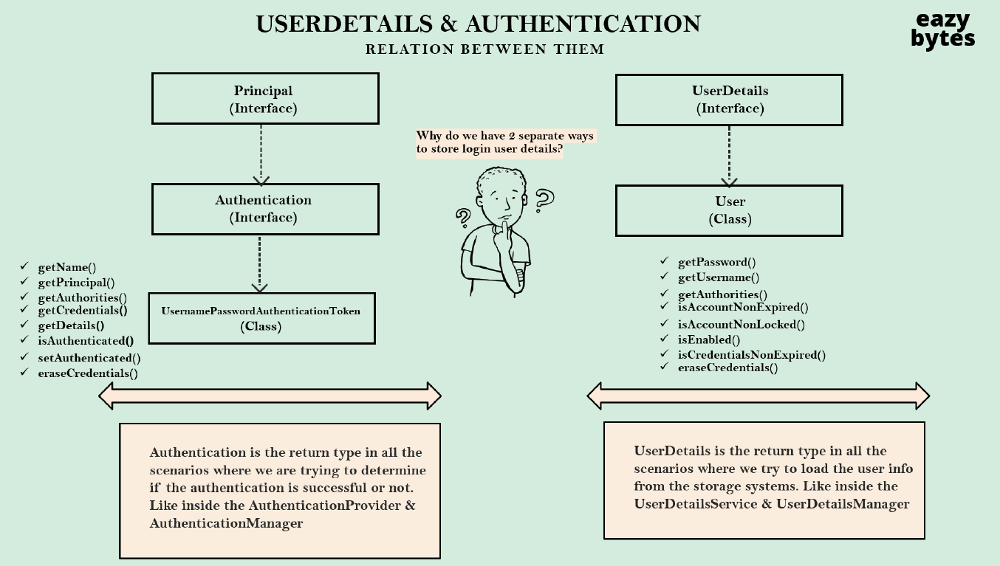

# Section 3.

### 메모리에 유저 정보를 저장하는 첫 번째 방법 
- UserDetailsManager를 extends한 InMemoryUserDetailsManager클래스를 정의해주면 된다.
```java
@Bean
    public InMemoryUserDetailsManager userDetailsService(){
        UserDetails admin = User.withDefaultPasswordEncoder()
                .username("admin")
                .password("12345")
                .authorities("admin")
                .build();

        UserDetails user = User.withDefaultPasswordEncoder()
                .username("user")
                .password("12345")
                .authorities("read")
                .build();

        return new InMemoryUserDetailsManager(admin,user);
    }
```
위와 같은 코드에서 User.build()를 호출하면 유저의 세부사항이 담긴 User 객체를 생성할 수 있고, 이렇게 생성한 객체를
InMemoryUserDetailsManager의 생성자에 인자로 집어넣어 메모리에 저장할 수 있는것이다.

```java
public InMemoryUserDetailsManager(Collection<UserDetails> users) {
        Iterator var2 = users.iterator();

        while(var2.hasNext()) {
            UserDetails user = (UserDetails)var2.next();
            this.createUser(user);  // <---- 유저 생성
        }

    }
```

```java
public void createUser(UserDetails user) {
        Assert.isTrue(!this.userExists(user.getUsername()), "user should not exist");
        this.users.put(user.getUsername().toLowerCase(), new MutableUser(user)); <-- put 메소드를 통해 저장
    }
```

- 위의 실제 코드를 보면 다음과 같이 넘어온 유저의 정보를 저장하는 것을 확인할 수 있다.

### 메모리에 유저를 저장하는 두 번째 방법
- 두 번째 방법은 withDefaultPasswordEncoder()를 사용하지 않는다.
- 그 대신 Bean으로 NoOpPasswordEncoder를 등록해서 사용하는데, 이 방식은 비밀번호를 인코딩 하지 않고 String 그대로 저장하겠다는 의미이다.
- NoOpPasswordEncoder를 Bean으로 등록하면 모든 유저를 NoOpPasswordEncoder 방식으로 저장하겠다고 해석이된다.

### UserDetailsService란 무엇일까
- 유저 정보를 가져오는 역할을 한다.
- UserDetails라는 인터페이스를 구현한다.
- LoadUserByUserName이라는 추상메소드가 UserDetilsService 인터페이스에 정의돼있다.
- LoadUserByUserName메소드는 UserName을 기반으로 저장소에서 유저 정보를 찾아온다.
- 비밀번호로 유저 정보를 찾지 않는 이유는 비밀번호가 서버에 유출될 가능성이 있기 때문이다.

### UserDetailsManager란 무엇일까
- 유저를 새롭게 만들거나 업데이트, 삭제하는 역할을 한다.
- UserDetailsService 인터페이스를 구현한다.
- LoadUserByUserName도 정의돼있다.
- 스프링 시큐리티 팀에서 구현한 샘플클래스가 있다.
  - InMemoryUserDetailsManager, JdbcUserDetailsManager, LdapUserDetailsManager가 존재한다.
  - 데이터베이스에서 유저정보를 가져올땐 JdbcUserDetailsManager를 사용하면 된다.
  - Ldap서버에 유저 정보를 저장했다면 LdapUserDetailsManager를 사용하면 된다.
 
### 가져온 정보는 어떤 형식으로 저장될까
- UserDetails는 유저의 정보를 저장할 수 있는 인터페이스이다.
- UserDetails를 구현한 User 클래스에 가져온 유저의 정보를 저장한다.

### 정리
- ProviderManager에 Athentication 객체 즉 입력받은 유저의 정보가 넘어온다.
- ProviderManager는 가능한 모든 Authentication Provider에 유저의 정보를 넘긴다.
- DaoAuthenticationProvider에 유저 정보가 넘어가고 InMemoryUserManager 내부의 LoadUserByUserName 메소드가 실행된다.
- UserName을 기반으로 유저 정보가 찾아지고
```java
public UserDetails loadUserByUsername(String username) throws UsernameNotFoundException {
        UserDetails user = (UserDetails)this.users.get(username.toLowerCase());
        if (user == null) {
            throw new UsernameNotFoundException(username);
        } else {
            return new User(user.getUsername(), user.getPassword(), user.isEnabled(), user.isAccountNonExpired(), user.isCredentialsNonExpired(), user.isAccountNonLocked(), user.getAuthorities());
        }
    }
```
- 다음과 같이 찾아진 유저 정보가 있다면 User 객체에 해당 정보를 담아 반환한다.

### UserDetails 인터페이스 분석
- 유저의 이름, 비밀번호, 권한 등의 정보는 UserDetails의 구현체 안에 저장된다.
- UserDetails를 구현하는 UserDetailsManager, UserDetailsService등 많은 구현체들이 있기 때문에 UserDetails를 이해하는 것은 중요하다.

```java
public interface UserDetails extends Serializable {
    Collection<? extends GrantedAuthority> getAuthorities();

    String getPassword();

    String getUsername();

    boolean isAccountNonExpired();

    boolean isAccountNonLocked();

    boolean isCredentialsNonExpired();

    boolean isEnabled();
}
```
- 첫 번째 메소드는 getAuthorities 메소드다. 엔드유저의 권한 또는 역할 목록을 반환한다.
- getPassword, getUsername은 유저의 비밀번호와 유저이름을 반환한다.
- isAccountNonExpired 계정 유효기간이 만료되었는지를 판단한다.
- isAccountNonLocked 유저의 계정이 잠겨있는지 판단한다 잠겨있다면 잠겨진 시간동안은 로그인이 블락된다.
- isCredentialsNonExpired 유저의 자격증명이 만료되었는지를 판단한다 (일정기간이 지나면 비밀번호를 변경해야 한다고 뜨는 예시).
- isEnabled 계정의 활성화 비활성화 (페이스북의 계정 활성화, 비활성화 예시)

### UserDetails의 구현체 User 클래스
```java
 public User(String username, String password, Collection<? extends GrantedAuthority> authorities) {
        this(username, password, true, true, true, true, authorities);
    }

    public User(String username, String password, boolean enabled, boolean accountNonExpired, boolean credentialsNonExpired, boolean accountNonLocked, Collection<? extends GrantedAuthority> authorities) {
        Assert.isTrue(username != null && !"".equals(username) && password != null, "Cannot pass null or empty values to constructor");
        this.username = username;
        this.password = password;
        this.enabled = enabled;
        this.accountNonExpired = accountNonExpired;
        this.credentialsNonExpired = credentialsNonExpired;
        this.accountNonLocked = accountNonLocked;
        this.authorities = Collections.unmodifiableSet(sortAuthorities(authorities));
    }
```
- User 클래스는 두 가지 생성자가 있다.
- 하나는 username, password, authority만 받는 생성자고 다른 하나는 모든 인자를 받는 생성자이다.
- User 클래스에는 Setter가 없다. 한 번 생성한 이후에는 수정이 불가하도록 만들어, 유저의 정보를 마음대로 수정할수 없도록 만들었다.

### 왜 유저 정보를 저장하는 방식이 두 가지가 있는것일까?

### User 클래스에 관하여
- UserDetials 와 User 클래스는 데이터베이스나 메모리등 저장 시스템에서 유저의 정보를 로드할 때 사용된다.
- 여기서 로드된 유저의 정보는 AuthenticationProvider에 다시 전달된다.
- AuthenticationProvider에서 인증이 성공하면 유저의 정보를 Authentication 객체에 담아 반환한다.
- 즉 유저의 세부정보를 저장할 때 사용된다.

### Authentication 에 관하여
- Authentication 객체는 유저의 인증 성공 여부를 다룰때 항상 사용되는 객체이다.
- Authentication 객체 내부에는 인증이 성공했는지 아닌지와 관련된 정보만 저장되며, 계정이 활성화 되었는지, 비밀번호가 만료되진 않았는지 등에 관한 정보는 저장되지 않는다. 왜냐하면 그러한 조건이 충족 되었을 때만 인증이 성공하기 때문이다.
- 즉 UserDetails에 저장된 정보를 바탕으로 인증이 성공했는지 여부만 확인하면 되기 때문에, Authentication 객체에는 유저의 기본 정보와 인증 여부만이 저장되게 된다. (인증에 필요한 정보들을 다시 반환해서 보내줄 필요는 없기 때)

- AuthenticationProvider에서 UserDetails 정보를 바탕으로 Authentication 객체를 생성하여 반환할 것이다.
- 그렇게 생성한 Authentication 객체는 바로 UsernamePasswordAuthentication Token이다.

### Authentication 인터페이스에 관하여
```java
public interface Authentication extends Principal, Serializable {
    Collection<? extends GrantedAuthority> getAuthorities();

    Object getCredentials();

    Object getDetails();

    Object getPrincipal();

    boolean isAuthenticated();  <-- 주어진 유저가 성공적으로 인증되었는지를 판단

    void setAuthenticated(boolean isAuthenticated) throws IllegalArgumentException;<-- 유저가 인증에 성공했다면 True를 통해 인증 성공을 설정하고, 아니라면 False를 반환해 인증 실패로 설정한다.
}
```
### 정리
- InMemoryUserDetailsManager를 확인하면 UserDetails를 반환한다.
  - public UserDetails loadUserByUsername(String username) throws UsernameNotFoundException {
- 반환된 UserDetails는 DaoAuthenticationProvider로 넘어가며 인증에 필요한 유저정보를 UserDetails에서 추출한다.
```java
 protected Authentication createSuccessAuthentication(Object principal, Authentication authentication, UserDetails user) {
        boolean upgradeEncoding = this.userDetailsPasswordService != null && this.passwordEncoder.upgradeEncoding(user.getPassword());
        if (upgradeEncoding) {
            String presentedPassword = authentication.getCredentials().toString();
            String newPassword = this.passwordEncoder.encode(presentedPassword);
            user = this.userDetailsPasswordService.updatePassword(user, newPassword);
        }

        return super.createSuccessAuthentication(principal, authentication, user);
    }
```
- 추출된 정보를 바탕으로 유저의 인증 여부를 판단하고, Authentication 객체를 만들어 반환한다.

### UserDetailsService 심층분석
- 유저의 정보를 불러오는데 사용되도록 설계되었다.
- LodaUserByUsername 메소드에서 입력받은 username을 기반으로 저장소에서 유저 정보를 꺼내온다.
- 이전에 강조한 것처럼 비밀번호를 기반으로 저장소에서 유저 정보를 꺼내려는 시도는 하면 안된다.

### UserDetailsManager 심층분석
- UserDetailsService를 구현하고 확장시킨 인터페이스이다.
- 유저를 생성하거나 정보를 업데이트, 삭제하는 역할을 맡고있다.
- createUser, DeleteUser, updateUser 등의 메소드가 존재한다.
- 저장소내에 유저가 존재하는지 여부만 판단하는 메소드인 userExists 메소드도 존재한다.

## UserDetailsManager를 구현하는 클래스는 무엇이 있는가

### InMemoryUserDetailsManager
- 유저를 생성할때마다 호출되는 createUser 메소드가 존재한다.
```java
public void createUser(UserDetails user) {
        Assert.isTrue(!this.userExists(user.getUsername()), "user should not exist");
        this.users.put(user.getUsername().toLowerCase(), new MutableUser(user));
    }
```
- InMemoryUSerDetails의 모든 생성자에 createUser메소드가 존재한다.
```java
 public InMemoryUserDetailsManager(Collection<UserDetails> users) {
        Iterator var2 = users.iterator();

        while(var2.hasNext()) {
            UserDetails user = (UserDetails)var2.next();
            this.createUser(user); <--- 여기
        }

    }
```
- 유저의 이름은 getUsername을 통해 추출되고, 나머지 정보는 MutableUser에 담겨서 Users라는 맵에 저장된다.
- deleteUser 메소드는 Key value인 유저 네임을 넘겨주면 해쉬맵에서 해당 유저의 정보를 삭제한다.
- UpdateUser도 마찬가지이다.
- UserExists는 단순히 유저가 존재하는지 여부만 boolean으로 반환한다.


### JdbcUserDetailsManager
- jdbcDetailsManager의 LoadUserByUsername 메소드를 살펴보자
```java
protected List<UserDetails> loadUsersByUsername(String username) {
        return this.getJdbcTemplate().query(this.getUsersByUsernameQuery(), this::mapToUser, new Object[]{username});
    }
```
- 다음과 같이 쿼리를 통해 데이터베이스에서 유저정보를 가져오는 것을 알 수 있다.
```java
    private String usersByUsernameQuery = "select username,password,enabled from users where username = ?";
```
- usersByUsernameQuery 쿼리를 찾아보면 다음과 같이 username, password, enabled(활성화 상태)를 가져오 것을 확인할 수 있다.

### LdapUserDetailsManager
- 위의 두 DetailsManager와 유사한 구조를 띈다. 그저 Ldap 서버에서 정보를 찾아온다는 차이점만 있을 뿐이다.
