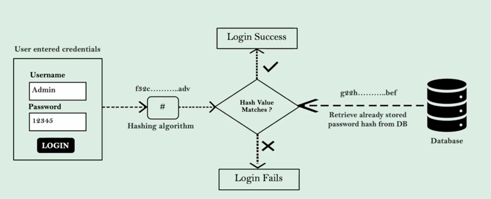

## SECTION 4️⃣ - PasswordEncoders를 이용한 비밀번호 관리
### Spring Security에서 비밀번호가 기본적으로 인증되는 과정
- 인증객체(아이디, 비밀번호) 내부에 사용자가 입력한 자격증명에 자격증명이 존재하는지 확인한다.
- 특정 누군가가 단순히 쿼리를 실행해서 데이터베이스에 저장된 사용자의 비밀번호를 알지 못하도록, 암호화 해서저장해야 한다.
```java
@Bean
public PasswordEncoder passwordEncoder() {
    return NoOpPasswordEncoder.getInstance();
}
```

### 인코딩 vs 암호화 vs 해싱
- **인코딩**  
  - 데이터를 한 형식에서 다른 형식으로 변환하는 과정
  - 누구나 디코딩하면 최초의 텍스트 비밀번호를 알 수 있다.
  - 비밀번호 관리에 적합하지 않다.
- **암호화**
  - **암호화 과정에서 사용한 동일한 알고리즘으로 복호화할 수 있다.**
  - 특정 알고리즘과 key값을 이용하여 암호화를 진행한다.
  - 이 암호화에 사용된 비밀 키는 백엔드 어플리케이션 내부에 기밀 데이터로 관리된다.
  - 비밀번호 관리에 적합하지 않다.
- **해싱**
  - 아무도 비밀번호를 알 수 없다.
  - 데이터가 수학적 해싱 기능(해싱 함수)를 통해 해시값으로 변환된다.
    - 하지만, 역함수는 성립하지 않는다.
  - 로그인 과정에서 유저가 입력한 비밀번호에 해싱 기능을 적용해서 두 개의 해시값을 비교한다.
  - Bcrypt: 해싱 알고리즘
  - 해싱을 시도할 때마다 같은 해시값을 반환하지 않는다.

### 해싱과 PasswordEncoders로 비밀번호가 인증되는 과정


### PasswordEncoder 인터페이스 심층 분석
- PasswordEncoder의 다양한 구현
```java
// 두 개의 추상 메소드, 한 개의 기본 메소드
public interface PasswordEncoder {
　　String encode(CharSequence rawPassword); // 비밀번호를 단방향 암호화
　　boolean matches(CharSequence rawPassword, String encodedPassword); // 암호화되지 않은 비밀번호(raw-)와 암호화된 비밀번호(encoded-)가 일치하는지 비교
    default boolean upgradeEncoding(String encodedPassword) { // 두 번 해싱 -> 더 많은 보호
        return false; 
    }; 
}
```

### PasswordEncoder 구현 클래스 심층 분석
- NoOpPasswordEncoder
  - 운영 앱에 추천하지 않는다.
- StandardPasswordEncoder
  - 운영 앱에 추천하지 않는다.
  - @Deprecated
  - SHA256 알고리즘 사용한다.
- Pbkdf2PasswordEncoder
  - 더 이상 안전하지 않다.
  - 어떤 해커가 그래픽 프로세싱 처리 장치 기계와 같이 많은 데이터와 명령을 처리할 수 있는 고성능 GPU 기계를 갖고 있다면, 손쉽게 무차별 대입 공격에 넘어갈 수 있다.
- BCryptPasswordEncoder
  - BCryptPasswordEncoder에 설정한 작업량 또는 라운드 수에 따라 CPU 연산은 더 많아진다.
  - 웹 어플리케이션의 성능 문제를 해결하기 위해 추천하는 방식이다.
- SCryptPasswordEncoder
  - BCryptPasswordEncoder의 고급 버전이다.
- Argon2PasswordEncoder
  - 최신 해싱 알고리즘을 사용한다.
  - 연산, 메모리 그리고 다수의 스레드, 다중 CPU 코어가 필요하다.

- 무차별 대입 공격 이란?
  - 쉬운 단어(사전적)부터 비밀번호에 많이 사용되는 텍스트(통계적)를 무차별로 입력해서 일치하는 값을 알아내는 것이다.
  - 이 공격에 대비하기 위해서 유저들은 단순 철자로된 비밀번호를 선택하지 않도록 유도한다.

### Bcrypt PasswordEncoder를 사용한 새로운 유저 등록 실습
ProjectSecurityConfig.java
```java
@Bean
public PasswordEncoder passwordEncoder() {
    return new BCryptPasswordEncoder();
}
```

LoginController.java
```java
@RestController
public class LoginController {
    @Autowired
    private CustomerRepository customerRepository;

    @Autowired
    private PasswordEncoder passwordEncoder;

    @PostMapping("/register")
    public ResponseEntity<String> registerUser(@RequestBody Customer customer) {
        Customer savedCustomer = null;
        ResponseEntity response = null;
        try {
            String hashPwd = passwordEncoder.encode(customer.getPwd()); // 암호화하고
            customer.setPwd(hashPwd); // 저장
            savedCustomer = customerRepository.save(customer);
            if (savedCustomer.getId() > 0) { 
                response = ResponseEntity
                        .status(HttpStatus.CREATED)
                        .body("Given user details are successfully registered");
            }
        } catch (Exception ex) {
            response = ResponseEntity
                    .status(HttpStatus.INTERNAL_SERVER_ERROR)
                    .body("An exception occured due to " + ex.getMessage());
        }
        return response;
    }
}
```

PasswordEncoder의 기본 생성자가 아닌 다른 생성자를 사용하여 값을 주입하면 된다. 