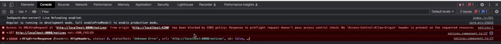
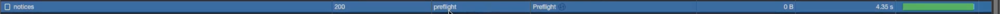
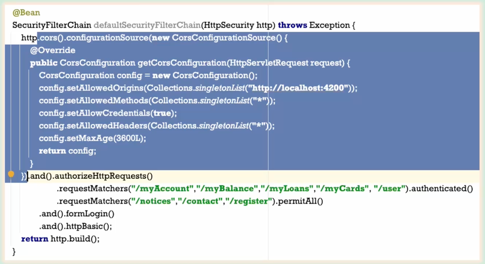
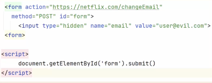
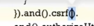
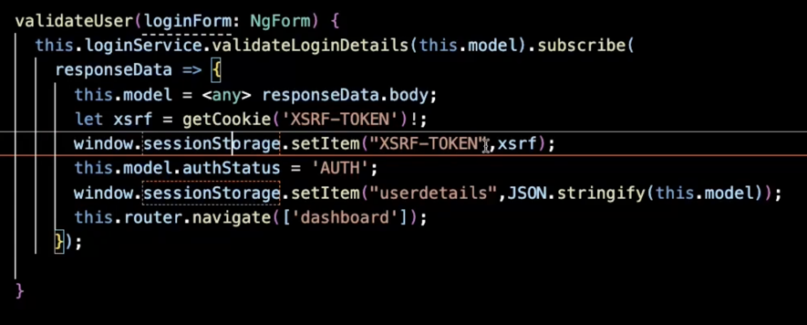
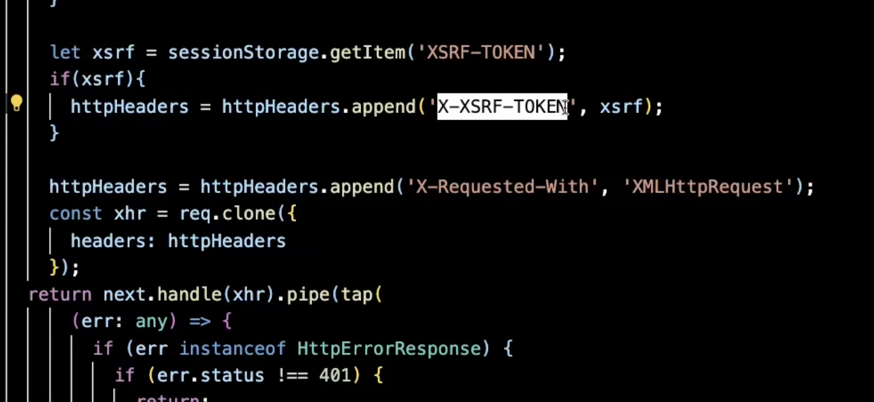
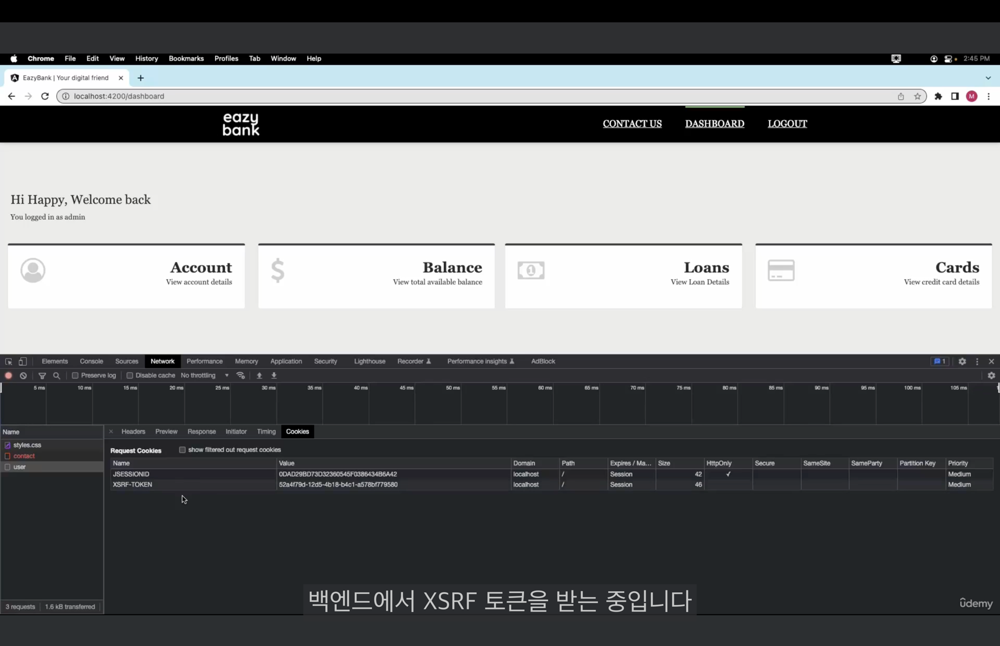

## Section 6️⃣
### CORS 에러

백엔드 로그에는 아무 에러가 잡히지 않은 것으로 보아, 요청이 도착하지도 않았다.  
브라우저 레벨에서 실패한 것이다.

- CORS
  - Cross Origin Resource Sharing
  - 클라이언트와 백엔드 서버가 통신할 때 나타나는 에러이다.
  - 여기서 출처는 **스키마(HTTP, HTTPs), 도메인, 포트**가 모두 조합된 것이다.
  - 하나라도 다른 상황을 교차 출처라고 부른다. 간단하게, 출처가 다르다는 뜻이다.
  - 보안 특성 때문이다. 이러한 보안 위험을 방지하기 위해서 최신의 프로세스는 두 개의 서로 다른 출처에서 소통하는 것을 특별한 설정이 없다면 차단하게 된다.
  - 따라서, 최신 브라우저들은 CORS가 기본적으로 활성화 되어 있다.
  - CORS는 보안 위협이 아니라 보호 단계이다.
  - 브라우저의 완벽한 기능 중에 하나이다.
- 그렇다면, 어떻게 소통을 하는가
  - @CrossOrigin 이용
    - 어느 출처에서 요청을 받을 것인지 명시한다.
    - 소통을 받으려는 또 다른 출처를 설정한다.
    - *: 어떠한 도메인이던 가능하다.
    - pre-flight 요청
      - 브라우저는 먼저 요청을 하지 않고, "교차 출처에서 이러한 소통을 시도하고 있어. 받을 수 있어?"라는 요청을 먼저 보낸다.
      - 백엔드 서버가 유효한 출처라고 판단을 하면, 그제서야 진짜 API를 요청한다.

    - 하지만, 100개도 넘는 컨트롤러의 CrossOrigin을 처리하는 것은 힘들다.
  - Configuration에서 메소드로 설정


### Spring Security로 CORS 문제 해결
```java
@Bean
SecurityFilterChain defaultSecurityFilterChain(HttpSecurity http) throws Exception {
    CsrfTokenRequestAttributeHandler requestHandler = new CsrfTokenRequestAttributeHandler();
    requestHandler.setCsrfRequestAttributeName("_csrf");

    http.securityContext((context) -> context
                    .requireExplicitSave(false))
            .sessionManagement(session -> session.sessionCreationPolicy(SessionCreationPolicy.ALWAYS))
            .cors(corsCustomizer -> corsCustomizer.configurationSource(new CorsConfigurationSource() { // 익명 객체
                @Override
                public CorsConfiguration getCorsConfiguration(HttpServletRequest request) {
                    CorsConfiguration config = new CorsConfiguration();
                    config.setAllowedOrigins(Collections.singletonList("http://localhost:4200"));
                    config.setAllowedMethods(Collections.singletonList("*"));
                    config.setAllowCredentials(true); // 쿠키, 캐시 등을 담는 것을 동의한다.
                    config.setAllowedHeaders(Collections.singletonList("*"));
                    config.setMaxAge(3600L); // preflight 캐시
                    return config;
                }
            })).csrf((csrf) -> csrf.csrfTokenRequestHandler(requestHandler).ignoringRequestMatchers("/contact", "/register")
                    .csrfTokenRepository(CookieCsrfTokenRepository.withHttpOnlyFalse()))
                    .addFilterAfter(new CsrfCookieFilter(), BasicAuthenticationFilter.class)
            .authorizeHttpRequests((requests)->requests
                    .requestMatchers("/myAccount", "/myBalance", "/myLoans", "/myCards", "/user").authenticated()
                    .requestMatchers("/notices", "/contact", "/register").permitAll())
            .formLogin(Customizer.withDefaults())
            .httpBasic(Customizer.withDefaults());
    return http.build();
}  
```

**CF) cacheControl**  
브라우저의 캐시를 사용한다.
```java
@GetMapping("/notices")
public ResponseEntity<List<Notice>> getNotices() {
    List<Notice> notices = noticeRepository.findAllActiveNotices();
    if (notices != null ) {
        return ResponseEntity.ok()
                .cacheControl(CacheControl.maxAge(60, TimeUnit.SECONDS)) // 브라우저가 60초 동안 notices API를 호출하지 않는다. 요구 사항에 따라 어떠한 데이터들이 자주 바뀌지 않을 것 같다면 사용한다.
                .body(notices);
    }else {
        return null;
    }
}
```

### Spring Security 내 기본 CSRF 보호 실습
- CSRF는 보안 공격이다. 보안의 취약성을 의미한다.
- CSRF 설정을 비활성화하면, 브라우저를 통해 처리할 수 있는 모든 요청에 대해 CSRF 보호를 사용하는 것이다.
- csrf.disable() 코드를 삭제하면 **403 에러**가 발생한다. (권한 접근 금지 에러)
- Spring Security가 GET 작업은 허용한다. 데이터를 변화하는 것이 아니기 때문이다.
- CSRF를 비활성화 하는 것은 권장되지 않는다.
- CSRF를 보호하기 위해서는 post, put, patch의 메소드를 막아야 한다.
```java
.csrf((csrf) -> csrf.csrfTokenRequestHandler(requestHandler).ignoringRequestMatchers("/contact", "/register")
                    .csrfTokenRepository(CookieCsrfTokenRepository.withHttpOnlyFalse()))
                    .addFilterAfter(new CsrfCookieFilter(), BasicAuthenticationFilter.class)
```

### CSRF 공격 소개
- 해커는 CSRF 공격을 통해서 백엔드 어플리케이션의 정보를 빼내간다.
1. Netflix에 로그인한다.
2. 자격증명을 입력하는 순간, 넷플릭스 서버는 쿠키를 생성하고 브라우저 내에 netflix.com으로 저장한다.
3. 다른 도메인(facebook.com)은 이 쿠키를 훔쳐갈 수 없다. 처음에 만들어진 도메인에만 공유하도록 설계되어 있다.
4. 엔드 유저는 evil.com을 방문하도록 유도된다.
5. 엔드 유저는 현혹되어 특정 버튼을 클릭하면, 다음과 같은 잠복 코드가 실행된다.

6. netflix.com/changeEmail에 POST 요청을 보낸다.
7. 이 요청을 보낼 때마다 브라우저는 netflix.com 도메인에서 쿠키 정보를 보내준다. 왜냐하면 요청이 netflix.com으로 가는 것이기 때문이다.
8. 넷플릭스 서버가 CSRF 공격에 대비를 해두지 않으면 이 요청이 실제 넷플릭스 사이트에서 오는 것인지, evil.com에서 오는 것인지 구분할 수 없다.
9. 넷플릭스의 이메일이 해커의 이메일로 변경되면, 그 계정을 통제하는 것은 해커이다.

### CSRF 공격을 처리하는 솔루션
- CSRF 토큰은 안전한 랜덤 토큰이다.
- 이 요청이 우리가 인증한 사용자에게서 온 것이 맞는가를 인정한다.
- 엔드 유저의 세션마다 고유하다.
- 정당한 유저와 해커를 구분할 수 있다.
- 브라우저는 넷플릭스 서버에서 두 개의 쿠키를 받는다. 하나는 인증 정보 관련된 쿠키, 다른 하나는 CSRF 관련된 쿠키이다. 
- CSRF 토큰을 언제든지 받으면 쿠키 안에 저장한다. 하지만, 브라우저가 자동으로 쿠키를 보내는 것이 아니라 코드로 쿠키를 구성해서 보내기 위해서는 수동으로 쿠키를 읽어야 한다.
- netflix.com에서 쿠키를 읽기 위해서는 JavaScript로 읽어야 한다. HTML 코드를 통해서는 해커가 evil.com에서 하던 것을 할 수가 없다.
- evil.com에서 JavaScript 작업을 하기 위해서는 evil.com의 JavaScript로 접속해야 한다.
- 그러면 도메인이 CSRF 토큰의 쿠키에 접근하지 못한다. 이러면 헤더나 바디 안에 토큰을 넣어서 전송할 수 없다.
- 해커는 브라우저가 백엔드 서버에 자동으로 전송되는 것에만 의존했기 때문이다.  

(그 웹페이지의 세션에 저장된다.)

### 공개 API에 대한 CSRF 보호 무시
- 공공 API로는 해커가 뭔가 할 수 있는 보안 취약성이 없다.
  - 
```java
.csrf((csrf) -> csrf.csrfTokenRequestHandler(requestHandler).ignoringRequestMatchers("/contact", "/register")
```
- 또한 /notcies의 GET 메소드도 항상 Spring Security가 CSRF 보호를 하지 않는다.

### 웹 어플리케이션에서 CSRF 토큰 솔루션 구현
ProjectSecurityConfig.java
```java
CsrfTokenRequestAttributeHandler requestHandler = new CsrfTokenRequestAttributeHandler();
requestHandler.setCsrfRequestAttributeName("_csrf");
```


(이 메소드에서 모든 CSRF 설정들을 전달해야 한다.)
```java
.csrf((csrf) -> csrf.csrfTokenRequestHandler(requestHandler).ignoringRequestMatchers("/contact", "/register") // 공공 API URL
                        .csrfTokenRepository(CookieCsrfTokenRepository.withHttpOnlyFalse()))
                        .addFilterAfter(new CsrfCookieFilter(), BasicAuthenticationFilter.class)
```
- CookieCsrfTokenRepository
  - CSRF 토큰을 쿠키로 유지하는 역할이고, 헤더에서 이 이름으로 찾는다. 
  - withHttpOnlyFalse
    - withHttpOnlyFalse이 옵션으로 쿠키를 생성해줘.
    - 그래야, js 코드가 쿠키 값을 읽을 수 있어.
- 위의 설정들을 해주면, CSRF 토큰을 생성할 수 있고, 이를 어플리케이션 메모리에 저장할 수 있다. 또한, 헤더와 쿠키 이름 값들을 UI 어플리케이션으로부터 읽어내는 것도 가능하다.
- 먼저, 백엔드 어플리케이션이 첫 로그인 이후 UI 어플리케이션에 헤더와 쿠키 값을 보내야 한다.

CsrfCookieFilter.class
```java
public class CsrfCookieFilter extends OncePerRequestFilter {
    @Override
    protected void doFilterInternal(HttpServletRequest request, HttpServletResponse response, FilterChain filterChain)
            throws ServletException, IOException {
        CsrfToken csrfToken = (CsrfToken) request.getAttribute(CsrfToken.class.getName()); // null이 아닐 경우 CSRF 토큰을 생성했다는 뜻이다.
        if(null != csrfToken.getHeaderName()){
            response.setHeader(csrfToken.getHeaderName(), csrfToken.getToken());
        }
        filterChain.doFilter(request, response);
    }
}
```

(이 필터와 Spring Security가 연결되는 과정)
```
.addFilterAfter(new CsrfCookieFilter(), BasicAuthenticationFilter.class)
```
BasicAuthenticationFilter을 먼저 실행하고 CsrfCookieFilter을 실행한다.  

(추가 설정)
```
http.securityContext((context) -> context
                .requireExplicitSave(false)) // SecurityContextHolder 안에 있는 인증 정보들을 저장하는 역할을 내가 맡지 않고 프레임워크 들이 대신 수행할꺼야.
        .sessionManagement(session -> session.sessionCreationPolicy(SessionCreationPolicy.ALWAYS)) // 첫 로그인이 성공하면 항상 JSESSIONID를 생성해줘.
```

- UI 어플리케이션에서의 설정

  - header 이름을 통해 CSRF 토큰을 읽어야 한다.

  - 다시 response에 담아서 보낸다.

### CSRF 관련 변경사항 테스트
- contact API를 더이상 공공 API로 만들지 않고 테스트를 진행한다.
- 로그인을 진행하니, XSRF-TOKEN이 쿠키에 저장되고 있다.

- 다음 post api를 호출하니 자동으로 csrf token이 헤더에 담겨서 가게 된다.