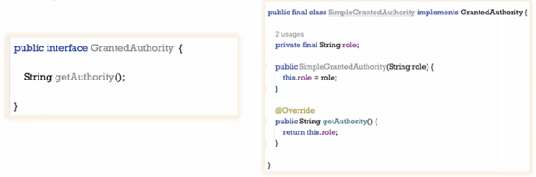

## Section 7️⃣
### Authentication 인증 vs Authorization 인가
- 인증
  - 인증이 없다면, 어떠한 개인이자 엔드 유저도 안전한 API에 접근할 수 없다.
  - 권한 부여보다 먼저 등장한다.
  - Authentication fail = 401 Error
- 인가
  - 인증이 완료된 후에 진행된다.
  - 특정의 최종 사용자가 어떠한 권한, 특권 혹은 역할을 가지고 있는지 확인할 것이다.
  - 점원, 캐셔, 매니저 ...
  - 인증 없이 인가는 절대 존재하지 않는다.
  - 로그인 이후에 권한과 접근 범위 및 역할에 대해서 고려할 것이다.
  - Authorization fail = 403 Error
  - 이 유저는 인증은 성공하였으나 접근할 권한이 없다.

이 전의 섹션에서는 단순히 인증에 집중하고 인증이 성공적일 때마다 모든 엔드 유저에게 권한을 부여했다.

### Spring Security의 권한 보관 방법
- Spring Security에서 권한 정보가 정확히 어디서 저장되는가
- Authorities 권한 vs Role 역할
- GratnedAuthority를 구현한 구현체가 SimpleGratnedAuthority이다.

  - getAuthority()
  - String role
  - setter method는 없다.

### 새로운 데이터베이스 테이블에서 권한을 불러오기 위한 백엔드 수정 작업
Authority.java
```java
@Entity
@Table(name = "authorities")
public class Authority {
    @Id
    @GeneratedValue(strategy= GenerationType.AUTO,generator="native")
    @GenericGenerator(name = "native",strategy = "native")
    private Long id;

    private String name;

    @ManyToOne
    @JoinColumn(name = "customer_id") // 민감한 정보 이므롤 response에 포함되지 않도록 한다.
    private Customer customer; // 부모 테이블인 고객과 연결되어 있다.

    public Long getId() {
        return id;
    }

    public void setId(Long id) {
        this.id = id;
    }

    public String getName() {
        return name;
    }

    public void setName(String name) {
        this.name = name;
    }

    public Customer getCustomer() {
        return customer;
    }

    public void setCustomer(Customer customer) {
        this.customer = customer;
    }
}
```

Customer.java
```java
    @JsonProperty(access = JsonProperty.Access.WRITE_ONLY) // 사용자를 생성하기 위한 요청 본문을 처리할 때는 사용되고, 응답결과를 생성할 때는 해당 필드에서 제외된다.
    private String pwd;
    
    //
    
    @JsonIgnore
    @OneToMany(mappedBy="customer",fetch=FetchType.EAGER) // 권한 테이블 내의 여러 레코드와 결합될 때
    private Set<Authority> authorities;
```

- 모든 엔드 유저의 권한을 위해 데이터베이스 내에 권한의 이름을 전달한다.
```java
@Override
public Authentication authenticate(Authentication authentication) throws AuthenticationException {
// ...
            return new UsernamePasswordAuthenticationToken(username, pwd, getGrantedAuthorities(customer.get(0).getAuthorities()));
// ...
}

private List<GrantedAuthority> getGrantedAuthorities(Set<Authority> authorities) {
    List<GrantedAuthority> grantedAuthorities = new ArrayList<>();
    for (Authority authority : authorities) {
        grantedAuthorities.add(new SimpleGrantedAuthority(authority.getName()));
    }
    return grantedAuthorities;
}
```
### Spring Security로 웹 어플리케이션 내 권한 설정 - 이론
- 3가지 메소드
  - hasAuthority()
    - 특정 권한을 엔드포인트 배열 서비스에 대해 구성하여 해당 권한을 가진 사용자만 특정 엔드포인트에 접근할 수 있다.
  - hasAnyAuthority()
    - 나열된 권한 중 하나라도 가지고 있으면 API에 접근할 수 있다.
  - access()
    - 복잡한 권한 부여의 규칙을 구성할 수 있다. 
    - and, or 등 논리 연산자를 사용할 수 있다.
- 어디로부터 이런 메소드를 호출해야 하는가
  - hasAuthority(), hasAnyAuthority()를 사용하지 않는다면, 단순히 .authenticated()를 사용할 수 있다.

### Spring Security로 웹 어플리케이션 내 권한 설정 - 코딩
ProjectSecurityConfig.java
```
.requestMatchers("/myAccount").hasAuthority("VIEWACCOUNT")
.requestMatchers("/myBalance").hasAnyAuthority("VIEWACCOUNT","VIEWBALANCE")
.requestMatchers("/myLoans").hasAuthority("VIEWLOANS")
.requestMatchers("/myCards").hasAuthority("VIEWCARDS")
.requestMatchers("/user").authenticated() // 어떠한 권한부여도 강제로 하지 않는다. 로그인한 유저는 누구든 접근할 수 있다.
.requestMatchers("/notices","/contact","/register").permitAll()) // 공개 API URL
```

### Spring Secruity에서 권한 vs 역할
- 권한 Authority
  - 웹 어플리케이션 내에서 엔드 유저가 수행할 수 있는 개별 작업을 나타낸다.
  - 세밀한 방식으로 액세스를 제한한다.
  - 계정, 카드 또는 대출 세부 정보 등
- 역할 Role
  - 권한을 역할로써 묶는다.
  - 권한이나 작업의 그룹
  - 접근을 듬성 듬성 제한한다.
  - ROLE_ADMIN, ROLE_USER
    - 특정 문자열이 권한인지 역할인지 구분하기 위해서 표준이 강제되어 있다.
    - ROLE_ 접두사를 가져야 한다.

### Spring Security로 웹 어플리케이션 내 역할 권한 설정
- 역할을 활용하여 권한 부여를 강제하기 위해서 3가지 메소드가 필요하다.
  - hasRole()
  - hasAnyRole()
  - access()
    - or, not 같은 조건 사용 가능
  - **주의: hasRole(), hasAnyRole(), access() 메소드를 사용하려 할 때 접두사를 언급해서는 안된다.**
```
.requestMatchers("/myAccount").hasRole("USER")
.requestMatchers("/myBalance").hasAnyRole("USER","ADMIN")
.requestMatchers("/myLoans").hasRole("USER")
.requestMatchers("/myCards").hasRole("USER")
.requestMatchers("/user").authenticated()
.requestMatchers("/notices","/contact","/register").permitAll())
```