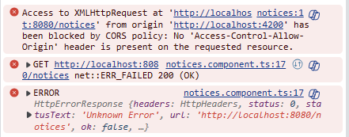
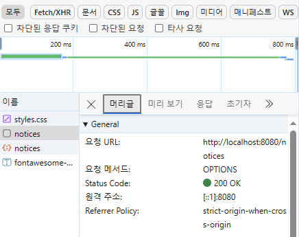
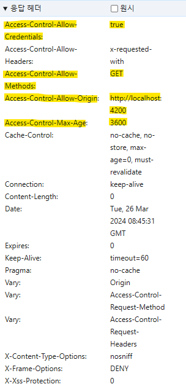

# Section 6

## CORS

### CORS가 발생하는 경우

```Java
// SpringSecurityConfig
@Bean
SecurityFilterChain defaultSecurityFilterChain(HttpSecurity http) throws Exception{
    http.csrf((csrf) -> csrf.disable())
        .authorizeHttpRequests((requests) -> requests
                .requestMatchers("/myAccount","/myBalance","/myLoans","/myCards").authenticated()
                .requestMatchers("/notices","/contact").permitAll())
        .formLogin(Customizer.withDefaults())
        .httpBasic(Customizer.withDefaults());
    return http.build();
}
```



- 클라이언트 애플리케이션과 포트 8080에 호스트된 백엔드 애플리케이션과의 소통이 `CORS` 정책에 따라 차단됨 \
  -> 소통이 이루어지지 않았다는 것을 의미
- 백엔드 콘솔에 예외는 발생하지 않음 \
  -> 백엔드에 요청이 도착하지 않음

### CORS

- **Cross Origin Resource Sharing**
- 클라이언트와 백엔드라는 다른 출처에서 서로 자원을 공유하려 할 때 발생
  - 출처 : `HTTP 프로토콜` + `도메인` + `포트` \
    -> 모두가 같은 출처에서 공유되는 것을 기대할 수 없음 \
    -> 서로 다른 출처에서의 공유 : 교차 출처
- Chrome, Firefox, Safari 같은 최신 브라우저에서 적용
  - 많은 최신 보안 위험들을 막기 위하여 적용
- 현재 테스트의 경우 도메인과 프로토콜은 동일하지만 포트가 달라 CORS가 적용됨
  - Angular : 4200
  - Spring Boot : 8080

## CORS 설정 방법

### 1. `Controller` 클래스의 REST API가 적용된 것에 `@CrossOrigin` 주석 달기

- `@CrossOrigin` : 어느 출처에서 소통을 받으려는 것인지 말해주는 것 \
  -> 백엔드에서는 소통을 받는 다른 출처를 작성해주어야 함
  - 4200 포트만 허용하는 경우
  ```Java
  @CrossOrigin(origin = "http://localhost:4200")
  ```
  - 모든 포트를 허용하는 경우
  ```Java
  @CrossOrigin(origin = "*")
  ```
- 많은 Controller들에게 모두 출처 값을 정의하는 것은 불가능

### 2. Security FilterChain의 Bean 생성 시 CORS 설정 정의 가능

```Java
@Bean
SecurityFilterChain defaultSecurityFilterChain(HttpSecurity http) throws Exception{
  http.cors().configurationSource(new CorsConfigurationSource(){
    @Override
    public CorsConfiguration getCorsConfiguration(HttpServletRequest request){
      CorsConfiguration config = new CorsConfiguration();
      config.setAllowedOrigins(Collections.singletonList("http://localhost:4200"));
      config.setAllowedMethods(Collections.singletonList("*"));
      config.setAllowCredentials(true);
      config.setAllowedHeaders(Collections.singletonList("*"));
      config.setMaxAge(3600L);
      return config;
    }
  })
}
```

- `setAllowedOrigins()` : 소통을 하고자 하는 출처들의 리스트를 적을 수 있음
  - 프로토콜, 도메인, 포트를 모두 적어주어야 함
- `setAllowedMethods()` : 허용할 http 메소드 설정 가능
- `setAllowCredentials()` : 인증 정보를 넘기고 받는데에 동의한다고 설정
- `setAllowedHeaders()` : 허용할 요청 본문의 형식 등을 지정 가능
- `setMaxAge()` : 사전 요청(pre-flight)의 결과를 캐시하는 시간 설정 가능
  - 주로 24시간, 7일, 30일 등으로 설정

> **`WebMvcConfigurer`를 사용하여 Spring MVC를 통해 CORS 설정 가능**
>
> - Spring Security를 이용하는 방식이 더 세밀함
> - 두 방식 모두 적용시 Spring Security가 먼저 적용

> Q. 브라우저들이 어떻게 백엔드에서 설정한 것을 어떻게 알 수 있는가? \
> \
> 브라우저들이 pre-flight 요청 진행 \
> 백엔드에게 먼저 교차 출처에서의 소통 시도를 받을 수 있냐는 질문을 보냄 \
> -> 백엔드가 설정을 토대로 유효한 출처인지 확인 후 브라우저에게 알려줌 \
> -> 브라우저가 진짜 요청을 보냄

### SecurityConfig에 적용

```Java
@Bean
SecurityFilterChain defaultSecurityFilterChain(HttpSecurity http) throws Exception {
    http.cors(corsCustomizer -> corsCustomizer.configurationSource(new CorsConfigurationSource() {
        @Override
        public CorsConfiguration getCorsConfiguration(HttpServletRequest request) {
            CorsConfiguration config = new CorsConfiguration();
            config.setAllowedOrigins(Collections.singletonList("http://localhost:4200"));
            config.setAllowedMethods(Collections.singletonList("*"));
            config.setAllowCredentials(true);
            config.setAllowedHeaders(Collections.singletonList("*"));
            config.setMaxAge(3600L);
            return config;
        }
    }));
    http.csrf((csrf) -> csrf.disable())
            .authorizeHttpRequests((requests) -> requests
                    .requestMatchers("/myAccount","/myBalance","/myLoans","/myCards").authenticated()
                    .requestMatchers("/notices","/contact").permitAll())
            .formLogin(Customizer.withDefaults())
            .httpBasic(Customizer.withDefaults());
    return http.build();
}
```

- `CorsConfigurationSource`는 인터페이스 \
  -> 익명의 내부 클래스를 생성하여 적용

  - `CorsConfiguration` 객체 생성
    - 여러가지 `CorsConfigurations` 전달
    - 가장 중요한 설정 : `setAllowedOrigins`
      - 어떤 출처, 도메인, 서버들이 백엔드와 소통하도록 허용되었는지 설정

  

  - 설정 이후 접근한다면 CORS 에러 대신 `OPTIONS` 메소드를 통해 `pre-flight`을 진행한 것을 알 수 있음 \

  

  - CORS의 설정을 했던 것처럼 나오는 것을 확인할 수 있음

## CSRF

- Cross-Site Request Forgery
- CORS와는 다르게 CSRF는 보안 공격
  - 보안의 취약성을 의미
- CSRF공격로부터 보호하는 방법
  - 어떤 포스트 작업도 허용하지 않음
  - 데이터베이스 업데이트 요구를 허용하지 않음
  - 새로운 데이터가 생성되는 것을 허용하지 않음
    - CSRF 공격을 통한 요청의 결과를 직접 볼 수 없음 \
      -> 일반적으로 GET 요청에 대해서는 설정하지 않음
  - 기본적으로부터 Spring Security에서 차단
- 현재 설정
  ```Java
  http.csrf((csrf) -> csrf.disable())
  ```
  - CSRF 보호 비활성화
    - 새로운 유저를 등록하려 할 때 Spring Security가 CSRF 공격으로 받아들였기 때문

### CSRF 공격의 흐름

- 해커들이 무의식 중에 행동을 취하도록 유도

  > **넷플릭스를 이용하는 경우** \
  > 넷플릭스 자격증명 입력 \
  > -> 넷플릭스 서버는 쿠키를 생성하고 이를 브라우저 내 netflix.com 도메인으로 저장 \
  > -> 할당된 오리지널 도메인에만 쿠키 공유 \
  > \
  > 엔드 유저가 가상의 웹사이트에 접속 \
  > -> 유혹적인 버튼 클릭 \
  > -> 해커의 잠복 코드가 넷플릭스에서 이메일을 변경하도록 유도 \
  > \
  > -> 넷플릭스에 요청을 보낼 때마다 쿠키 요청 \
  > -> 넷플릭스에서 CSRF 공격을 다루지 못한다면 특정 웹사이트에서만 요청이 오도록 설정되지 않음 \
  > -> 해커에게 엔드 유저의 정보가 넘어갈 수 있음

### CSRF 공격을 해결하는 방법

- 백엔드 애플리케이션이 들어오는 HTTP 요청이 정당한 유저에게 오고 있는지 구분할 수 있어야 함
  - 백엔드는 이를 구분할 수 없음 : 두 요청 모두 유효한 쿠키와 인증 보유
    -> CSRF 토큰을 구현하여 사용
- CSRF 토큰
  - 안전한 랜덤 토큰
  - 많은 기업들이 CSRF 공격을 예방하기 위해 사용 중
  - 엔드 유저의 세션마다 고유하게 할당
  - 랜덤으로 큰 값 지정 \
    -> 알아맞추기 어려움
- CSRF 토큰 사용 시의 흐름
  - 엔드유저의 자격 증명 입력 시 CSRF 토큰을 쿠키로 전달
    - CSRF 토큰을 쿠키 자체에 넣어서 전송 \
      -> 클라이언트 측에서 토큰이 포함되도록 수동으로 코드를 읽어서 헤더나 body/payload 에 포함하여 보내야 함 \
       -> 동일 출처 정책에 따라 CSRF 토큰 탈취 불가능 - 웹 사이트의 스크립트는 동일한 출처에서 오는 문서나 스크립트만 접근 가능

### CSRF 공격 대처 방법 적용

- 공공 API
  - 누구나 접근 가능해야 함 \
    -> CSRF 공격에 대한 방어를 구축할 필요가 없음
  ```Java
  .csrf(csrf -> csrf.ignoringRequestMatchers("/contact", "/register"))
  ```
- 보안 API

  ```Java
  csrf((csrf) -> csrf.csrfTokenRequestHandler(requestHandler).ignoringRequestMatchers("/contact", "/register")
                .csrfTokenRepository(CookieCsrfTokenRepository.withHttpOnlyFalse()));
  ```

  - `CsrfTokenRequestAttributeHandler` 객체 생성
    - `CsrfTokenRequestHandler `구현하기 위함
    - CSRF 토큰 요청 속성
  - `AttributeHandle`의 도움을 받아 헤더 또는 쿠키의 값을 전달 받음
  - `csrfTokenRepository` 메소드
    - `CookieCsrfTokenRepository.withHttpOnlyFalse()`를 전해줌
  - `CookieCsrfTokenRepository`

    ```Java
    public final class CookieCsrfTokenRepository implements CsrfTokenRepository {

    static final String DEFAULT_CSRF_COOKIE_NAME = "XSRF-TOKEN";

    static final String DEFAULT_CSRF_PARAMETER_NAME = "_csrf";

    static final String DEFAULT_CSRF_HEADER_NAME = "X-XSRF-TOKEN";
    // 생략
    }
    ```

    - CSRF 토큰을 쿠키로 유지하는 역할
    - 지정된 이름으로 토큰 혹은 헤더로 저장
    - `withHttpOnlyFalse`를 불러오는 이유
      - `HttpOnlyFalse`를 설정으로 쿠키를 생성하여 클라이언트 내부의 스크립트 언어가 코드를 읽을 수 있도록 함
      - 쿠키 이름 및 헤더명이 설정됨

- 로그인 이후 클라이언트로 헤더와 쿠키 값을 보내도록 설정
  - 클라이언트로 보내게 될 모든 응답들에 filter 클래스 생성
  - `CsrfCookieFilter`
    - `OncePerRequestFilter` 상속 \
      -> `doFilterInternal` 오버라이드 필요
  ```Java
  public class CsrfCookieFilter extends OncePerRequestFilter {
    @Override
    protected void doFilterInternal(HttpServletRequest request, HttpServletResponse response, FilterChain filterChain)
            throws ServletException, IOException {
        CsrfToken csrfToken = (CsrfToken) request.getAttribute(CsrfToken.class.getName());
        if(null != csrfToken.getHeaderName()){
            response.setHeader(csrfToken.getHeaderName(), csrfToken.getToken());
        }
        filterChain.doFilter(request, response);
    }
  }
  ```
  - `HttpServletRequest`에서 가능한 csrfToken을 읽을 수 있도록 설정 \
    -> 토큰 값 생성 시 요청 속성으로 사용 가능하며 읽어내어 CSRF 토큰의 객체로 변환 진행
  - 토큰 객체 안에 헤더 이름이 있는지 확인
    - null이 아닐 경우
      - 프레임워크가 CSRF 토큰을 생성했다는 것을 의미 \
        -> HeaderName을 채우고 토큰을 Header에 설정 \
        -> 응답이 `FilterChain` 안에 있는 다음 필터에게 전달될 것
- CSRF토큰은 헤더에만 보내고 쿠키는 보내지 않음

```Java
.addFilterAfter(new CsrfCookieFilter(), BasicAuthenticationFilter.class)
```

- `BasicAuthenticationFilter` 적용 후 `CsrfCookieFilter` 적용
  - `BasicAuthenticationFilter`
    - Http Basic Authentication을 할 때 사용
  - 로그인 동작 완료 후 `CsrfCookieFilter`에서 CSRF토큰을 이동 시킴

```Java
.securityContext((context) -> context
                        .requireExplicitSave(false))
                .sessionManagement(session -> session.sessionCreationPolicy(SessionCreationPolicy.ALWAYS))
```

- `session.sessionCreationPolicy(SessionCreationPolicy.ALWAYS)`
  - 항상 세션을 생성하도록 지시
  - `JSESSIONID` 생성 \
     -> 요청을 할 때마다 로그인을 하지 않도록 설정 가능
    로그인해서 REST API들에 접근하려면
- `context.requireExplicitSave()`
  - SecurityContext의 변경 사항 저장 시간 선택
    - `true` (디폴트) : SecurityContext를 명시적오 저장 필요 \
    - `false` : SecurityContext를 자동으로 저장

```TypeScript
let xsrf = sessionStorage.getItem('XSRF-TOKEN');
    if(xsrf){
      httpHeaders = httpHeaders.append('X-XSRF-TOKEN', xsrf);
    }
    httpHeaders = httpHeaders.append('X-Requested-With', 'XMLHttpRequest');
```

- sessionStorage에서 `XSRF_TOKEN`의 여부를 확인하고 헤더로 적용

```Java
public class BasicAuthenticationFilter extends OncePerRequestFilter {
  @Override
	protected void doFilterInternal(HttpServletRequest request, HttpServletResponse response, FilterChain chain)
			throws IOException, ServletException {
		try {
			Authentication authRequest = this.authenticationConverter.convert(request);
			String username = authRequest.getName();
			if (authenticationIsRequired(username)) {
				Authentication authResult = this.authenticationManager.authenticate(authRequest);
				SecurityContext context = this.securityContextHolderStrategy.createEmptyContext();
				context.setAuthentication(authResult);
				this.securityContextHolderStrategy.setContext(context);
			}
      // 생략
		}
		chain.doFilter(request, response);
	}
}
```

- Http요청을 컨버터를 이용하여 `Authorization`이라는 이름을 가진 헤더 검색 \
   -> 헤더의 값은 BASIC \
   -> `username`과 `password` 추출
- `UserPasswordAtuenticationToken`으로 변환 후 `SecurityContext`에 인증 정보 저장

### 최종 설정

```Java
@Bean
SecurityFilterChain defaultSecurityFilterChain(HttpSecurity http) throws Exception {
    CsrfTokenRequestAttributeHandler requestHandler = new CsrfTokenRequestAttributeHandler();
    requestHandler.setCsrfRequestAttributeName("_csrf");

    http.securityContext((context) -> context
                    .requireExplicitSave(false))
            .sessionManagement(session -> session.sessionCreationPolicy(SessionCreationPolicy.ALWAYS))
            .cors(corsCustomizer -> corsCustomizer.configurationSource(new CorsConfigurationSource() {
                @Override
                public CorsConfiguration getCorsConfiguration(HttpServletRequest request) {
                    CorsConfiguration config = new CorsConfiguration();
                    config.setAllowedOrigins(Collections.singletonList("http://localhost:4200"));
                    config.setAllowedMethods(Collections.singletonList("*"));
                    config.setAllowCredentials(true);
                    config.setAllowedHeaders(Collections.singletonList("*"));
                    config.setMaxAge(3600L);
                    return config;
                }
            })).csrf((csrf) -> csrf.csrfTokenRequestHandler(requestHandler).ignoringRequestMatchers("/contact", "/register")
                    .csrfTokenRepository(CookieCsrfTokenRepository.withHttpOnlyFalse()))
                    .addFilterAfter(new CsrfCookieFilter(), BasicAuthenticationFilter.class)
            .authorizeHttpRequests((requests)->requests
                    .requestMatchers("/myAccount", "/myBalance", "/myLoans", "/myCards", "/user").authenticated()
                    .requestMatchers("/notices", "/contact", "/register").permitAll())
            .formLogin(Customizer.withDefaults())
            .httpBasic(Customizer.withDefaults());
    return http.build();
}
```
