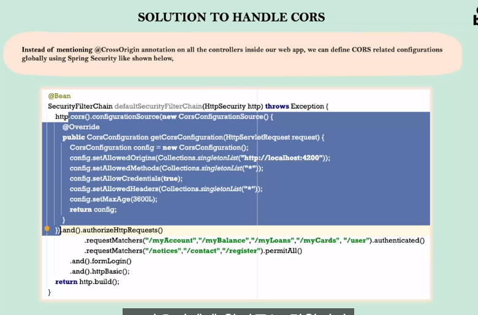
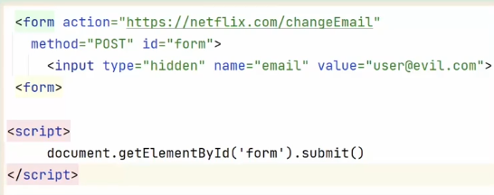

# Section 6.

### Cors란?
- Cross Origin Resource Sharing의 약자로 두 가지 이상의 다른 출처에서 자원을 공유한다는 의미이다.
  - 두가지 이상의 다른 출처란 프론트와 백을 의미한다.
- 출처란 무엇일까?: http 프로토콜, 도메인주소(url), 포트번호의 조합을 출처라고 볼 수 있다.
  - 셋중 하나라도 다르면 출처가 다르다로 할 수 있다.
- 이렇게 서로다른 출처에서 자원의 공유가 일어나면 최신 브라우저들은 모두 소통을 차단하도록 설정되어 있다.
- 그 이유는 이렇게 다른 출처에서 들어오는 요청을 차단함으로서 많은 보안적 이점을 가져갈 수 있기 때문이다.


### 그렇다면 우리는 웹을 개발할때 어떻게 해야할까?
- 1. 첫 번째 방법은 @RestController 어노테이션 밑에 @CrossOrigin이라는 어노테이션을 추가하면 된다.
  - @CrossOrigin이란 어느 출처와 소통을 할지 정의해주는 것으로
     - @CrossOrigin(origins = "http://localhost:4200") 이라고 명시해주면 해당 url과 소통이 가능하다
     - @CrossOrigin(origins = "*") 이렇게 하면 모든 도메인과 소통이 가능해진다.
     - 프론트에서 Rest Api 요청을 할 때 미리 pre-flight 라는 소통이 가능한지 물어보는 메세지를 백엔드에 보낸다. 백엔드에서 url을 확인후 소통이 가능한 url이라는 대답을 보내면 소통이 시작된다.
  - 하지만 이런 방법은 큰 프로젝트에서 설정하기에 너무 힘든 방식일 것이다.
- 2. 두 번재 방법은 SecurityFilterChain을 정의할 때 내부에 CORS 설정을 해두는 것이다.
  
  - 위 사진에 나온 setAllowedOrigins에 허용하는 출처들을 전부 적을 수 있다.
  - AllowedCredentials는 인증정보들을 주고받는것을 허용한다는 의미이다.
  - AllowedHeaders 다른출처에서 오는 모든 헤더를 허용한다는 의미이다.
  - setMaxAge는 이러한 정보를 어느시간동안 저장할 것이냐를 묻는것이고 해당 시간이 지나면 캐시에 저장되게 된다.


### SecurityFilterChain 내부에 CORS 설정하는 방법
```java
.cors(corsCustomizer -> corsCustomizer.configurationSource(new CorsConfigurationSource() {
                    @Override
                    public CorsConfiguration getCorsConfiguration(HttpServletRequest request) {
                        CorsConfiguration config = new CorsConfiguration();
                        config.setAllowedOrigins(Collections.singletonList("http://localhost:4200"));
                        config.setAllowedMethods(Collections.singletonList("*"));
                        config.setAllowCredentials(true);
                        config.setAllowedHeaders(Collections.singletonList("*"));
                        config.setMaxAge(3600L);
                        return config;
                    }
                }))
```
- configuration에 bean으로 등록해둔 defaultSecurityFilterChain 내부에 다음과 같이 CORS 설정을 진행하면 된다.
- 우선 .cors 메소드에서 .configurationSource를 설정해야한다.
- 내부 인자로 CorsConfigurationSource 인터페이스를 구현한 객체를 전달해준다.
-  CorsConfigurationSource 인터페이스는 getCorsConfiguration메소드를 사용함으로서 객체를 받을 수 있다.
-  getCorsConfiguration 메소드 내부에서는 CORS 설정을 진행해주면 된다.
-  setAllowedOrigins, setAllowedMethods 등등,, 위에서 언급했던 부분들을 getCorsConfiguration 메소드 내부에 정의해주면 설정된 정보를 포함하는 CorsConfiguration 객체가 반환되고 그것을 사용하여 CORS 설정을 할 수 있다.

### CSRF에 관하여
- CSRF는 보안 공격으로 주로 해커들이 사용하는 방법이다.
- 기본적으로 스프링 시큐리티는 데이터베이스에 접근하는 어떠한 포스트 작업을 허용하지 않음으로서 CSRF로 부터 데이터베이스를 보호한다.
### CSRF 상황 설명
1. 넷플릭스 시청을 위해 로그인을 한다.
2. 로그인을 하면 쿠키가 생성되고 이를 브라우저에 netflix.com이라는 도메인으로 저장해둔다.
3. 영화를 다 보고 유저가 evil.com에 접속한다.
4. evil.com엔 여러가지 유혹 광고들이 있다.

5. 링크를 클릭하면 위의 예시 코드가 실행되고, netflix.com에 post 요청이 일어나면서, 넷플릭스의 아이디와 비밀번호가 바뀌게 되는 것이다.

### CSRF 공격을 해결하는 방법
- CSRF 공격을 대비하기 위해선, 정당한 유저에게 들어오는 요청인지 해커 웹사이트에서 들어오는 요청인지를 확인할 필요가 있다.
- 현재 두 요청 모두 유효한 쿠키와 인증을 갖고 있기 때문에 구분할 수 없다.
- 그렇기에 새로운 토큰을 인증에 사용할 것이다.
- 토큰의 이름은 CSRF 토큰으로 랜덤하게 생성되는 토큰이다.
- 이 토큰은 엔드 유저의 세션마다 고유하게 할당되며, 랜덤으로 값을 지정한다.
- CSRF 토큰이 있다면 백엔드에서 정당한 유저와 해커 웹사이트를 구분할 수 있을것이다.

### 토큰을 사용했을 시 CSRF 상황 설명
1. 넷플릭스 시청을 위해 로그인을 한다.
2. 로그인을 하면 쿠키가 생성되고 이를 브라우저에 netflix.com이라는 도메인으로 저장해둔다.
3. 하나의 CSRF 쿠키가 더 생성되어 브라우저에 저장된다.
4. 유저가 evil.com에 접속한다.
5. 링크를 클릭힌다.
6. 해커 사이트에서 넷플릭스의 계정을 바꾸게 하는 동일한 코드가 전송된다.
7. 브라우저에서 넷플릭스 도메인에 두 가지 쿠키를 전송하려한다.
8. 한 개는 인증과 관련된 쿠키, 한 개는 CSRF와 관련된 쿠키이다.
9. 그러나 CSRF 토큰은 기존의 브라우저에 단순히 저장되지 않고, 여러가지 형식들로 저장되기 때문에 기존에 인증 관련 쿠키에 접근하던것처럼 동일한 방식으로 접근이 불가능하다.
10. 결국 악성 사이트에서 인증 관련 쿠키만이 보내지게 되고, CSRF 토큰이 없으므로 넷플릭스에선 접근을 거부한다.

### public api에 대한 CSRF 보안 해제하기
- 누구나 공개적으로 접근할 수 있는 post 요청에 대해선 csrf 보안을 설정할 이유가 없다.
- 따라서 공개적인 api에 한해서 csrf 보안을 해제하도록 하겠다.
```java
                })).csrf((csrf) -> csrf.csrfTokenRequestHandler(requestHandler).ignoringRequestMatchers("/contact", "/register")
```
- 위와 같은 방식으로 ignoringRequestMatcher에 api를 명시해줌으로 public api만 CSRF 보호를 해제한다.

### CSRF 토큰 구현하기
```java
CsrfTokenRequestAttributeHandler requestHandler = new CsrfTokenRequestAttributeHandler();
        requestHandler.setCsrfRequestAttributeName("_csrf");
```
- 우선 다음과 같이 CsrfTokenRequestAttrivuteHandler를 선언해준다.
- CsrfTokenRequestAttrivuteHandler는 ui어플리케이션에 헤더, 쿠키 같은 값을 전달해주는 코드가 짜여진 핸들러이다.
- CsrfRequestAttributeName _csrf라고 명시한다고 추가로 적어준다.
- 그리고 위에서 적었던 코드를 일부 수정해줘야한다.
```java
.csrf((csrf) -> csrf.csrfTokenRequestHandler(requestHandler).ignoringRequestMatchers("/contact", "/register")
                        .csrfTokenRepository(CookieCsrfTokenRepository.withHttpOnlyFalse()))
```
- 위와 같이 방금 생성한 requestHandler를 인자로 넣어준다. 이러면 CSRF와 관련된 모든 설정을 해줘야한다.
- CookiecsrfTokenRepository란 CsrfToken을 쿠키형식으로 저장해주는 repository이다.
- 이후 withHttpOnlyFalse 옵션을 설정해주어 자바스크립트로부터의 쿠키 접근이 가능해게 해준다.
- 이제 헤더값과 토큰 값을 프론트에 보내줘야한다.
- 모든 api에 토큰 값을 보내주려면 새로운 filter를 만들어줘야한다.
```java
public class CsrfCookieFilter extends OncePerRequestFilter {

    @Override
    protected void doFilterInternal(HttpServletRequest request, HttpServletResponse response, FilterChain filterChain)
            throws ServletException, IOException {
        CsrfToken csrfToken = (CsrfToken) request.getAttribute(CsrfToken.class.getName());
        if(null != csrfToken.getHeaderName()){
            response.setHeader(csrfToken.getHeaderName(), csrfToken.getToken());
        }
        filterChain.doFilter(request, response);
    }

}
```
- 다음과 같이 OncePerRequestFilter를 구현하여 doFilterInternal 메소드를 구현해준다
- 메소드 내부 코드는 우선 서블릿의 request에서 CsrfToken의 이름이 있는지 확인하는 것이며
- 만약 이름이 존재한다면 해당 이름과 동일한 csrfToken을 response의 헤더에 붙여서 반환해주는 역할이다.
- 그렇다면 csrf 토큰은 어디서 생겨서 request에 붙어오는 것일까?
- csrf 토큰은 csrfTokenRequestHandler에서 생성된다.
- 유저가 로그인을 시도하면 BasicAuthenticationFilter가 실행되고 csrfTokenRequestHandler에서 생성된 csrf 토큰이 프론트에서 넘어온 request에 붙어진다.
- 우리가 구현한 CsrfCookieFilter는 그러한 request에서 생성된 csrf 토큰을 추출하여 response에 붙여주는 역할을 담당하고 있다.
```java
http.securityContext((context) -> context
                        .requireExplicitSave(false))
                .sessionManagement(session -> session.sessionCreationPolicy(SessionCreationPolicy.ALWAYS))
```
- 이후 이러한 코드를 작성해줌으로서 보안관련 정보를 자동으로 저장하고 세션을 항상 생성함으로서 보안 api 요청시마다 로그인 url로 넘어가지 않도록 설정할 수 있다.
  
