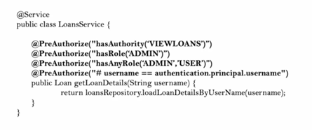
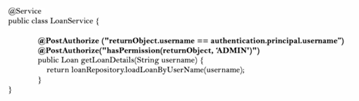
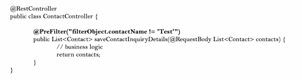
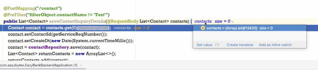
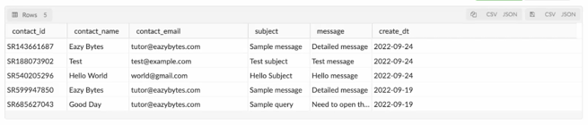

## Section 🔟 - 메소드 레벨 보안
### Spring Security 내 메소드 레벨 보안 소개
`@EnableMethodSecurity`를 통해서 메인 클래스 또는 구성 클래스 위의 인가 규칙을 적용할 수 있다.  
메소드 레벨 보안의 도움으로 웹이 아닌 어플리케이션에서도 강제로 인가를 할 수 있다.  
접근 권한이 있는 사용자만이 Java 메소드를 호출할 수 있도록 한다.

1. Invocation Authorization
- 어떠한 자바 메소드 위에 특정 메소드 호출을 위해 메소드 레벨 보안을 사용하게 되면 로그인된 유저 또는 엔드 유저가 이에 따른 권한이나 역할을 구성하는 데 필요한 설정이 있어야 한다.
2. Filtering Authorization
- 자바 메소드는 다량의 Input을 받는다. 어떤 데이터를 수락하고 싶은지 어떤 데이터를 엔드 유저에게 돌려 보내고 싶은지를 검증할 수 있다.

권한 규칙을 설정하는 3가지 스타일
1. @PreAuthorize & @PostAuthorize
2. @Secured
3. @RoleAllowed
_(@Secured, @RoleAllowed는 @PreAuthorize & @PostAuthorize 보다 덜 강력하다.)_

### 메소드 레벨 보안의 메소드 호출 권한 설명
1. @PreAuthorize  
  
- @PreAuthorize 속에 hasAuthority, hasAnyAuthority, hasRole, hasAnyRole 메소드를 사용할 수 있다.  
- sPEL의 도움으로 입력 매개변수를 가지고 로그인된 id와 메소드로 받은 input id가 동일한지 확인하고 있다.
> 참고) **sPEL**  
> Spring Expression Language  
> 런타임에서 객체에 대한 쿼리와 조작을 지원하는 표현 언어이다.  
> #로 시작하며 중괄호로 묶어서 표현한다. `#{표현식}`
> 속성 값을 참조할 때는 $ 기호와 중괄호로 묶어서 표현한다. `${a.name}`  
> 예시 - @PreAuthorize("hasRole('ROLE_USER') AND principal.username == #account.username")  
> [(참고 사이트)](https://devwithpug.github.io/spring/spring-spel/)

  2. @PostAuthorize  
  
- 어떤 것들이 돌려보내지고 있는지 검증되도록 한다.  
- 리턴 객체가 특정 유저와 연관되어 있는지 확인할 수 있다.
- @PostAuthorize 안에서 hasAuthority, hasAnyAuthority, hasRole, hasAnyRole 메소드를 사용할 수 있다.  

하지만, 요구 사항이 super complex 하다면 PermissionEvaluate라는 인터페이스를 오버라이드 하여 클래스를 직접 정의할 수 있다.  
이 인터페이스는 hasPermission이라는 메소드 이름을 갖게 되고 복잡한 로직은 해당 메소드에 작성한다.  
ture or false에 따라서 메소드 호출이 허용되는지 Spring Security가 확인한다.  
hasPermission 키워드를 @PreAuthorize 또는 PostAuthorize 주석으로 보내야한다.  

**이 모든 주석이 작동하는 방식은 Spring AOP를 활용하기 때문이다.**  
메소드 호출 이전에 메소드 호출로 인터셉트하여 모든 권한 보유 관련 규칙을 실행할 수 있는 것이다.  

### @PreAuthorize를 사용한 메소드 레벨 보안 실습
EazyBankBackendApplication.java
```java
@SpringBootApplication
@EnableMethodSecurity(prePostEnabled = true,  securedEnabled = true,  jsr250Enabled = true)
public class EazyBankBackendApplication {
	public static void main(String[] args) {
		SpringApplication.run(EazyBankBackendApplication.class, args);
	}
}
```

LoanRepository.java  
(Repository Layer, Service Layser, Controller Layer 모두에 사용할 수 있다.)
```java
@Repository
public interface LoanRepository extends CrudRepository<Loans, Long> {
	@PreAuthorize("hasRole('USER')")
	List<Loans> findByCustomerIdOrderByStartDtDesc(int customerId);
}
```

### @PostAuthorize를 사용한 메소드 레벨 보안 실습
LoansController.java
```java
@RestController
public class LoansController {
    @Autowired
    private LoanRepository loanRepository;

    @GetMapping("/myLoans")
    @PostAuthorize("hasRole('USER')")
    public List<Loans> getLoanDetails(@RequestParam int id) {
        List<Loans> loans = loanRepository.findByCustomerIdOrderByStartDtDesc(id);
        if (loans != null ) {
            return loans;
        }else {
            return null;
        }
    }
}
```

### 메소드 레벨 보안 내 권한 필터링 설명
- @PreFilter & @PostFilter
  - 메소드 호출을 제어하는 것 이외에 필터링 조건도 강제할 수 있다.
  - PreFilter 하려는 메소드 입력은 반드시 컬렉션 인터페이스 유형이어야 한다. (List, Set, Map)


이름이 Test가 아닌 contact 객체를 리턴하고 싶은 상황이다.  

### @PreFilter 주석(어노테이션) 실습
ContactController.java
```java
@PostMapping("/contact")
@PreFilter("filterObject.contactName != 'Test'")
public List<Contact> saveContactInquiryDetails(@RequestBody List<Contact> contacts) {
    Contact contact = contacts.get(0);
    contact.setContactId(getServiceReqNumber());
    contact.setCreateDt(new Date(System.currentTimeMillis()));
    contact = contactRepository.save(contact);
    List<Contact> returnContacts = new ArrayList<>();
    returnContacts.add(contact);
    return returnContacts;
}
```


위의 사진과 같이 contacts 목록 사이즈가 0이 된다. PreFilter 기준으로 걸러졌기 때문이다.

### @PostFilter 주석(어노테이션) 실습
ContactController.java
```java
@PostMapping("/contact")
@PostFilter("filterObject.contactName != 'Test'")
public List<Contact> saveContactInquiryDetails(@RequestBody List<Contact> contacts) {
    Contact contact = contacts.get(0);
    contact.setContactId(getServiceReqNumber());
    contact.setCreateDt(new Date(System.currentTimeMillis()));
    contact = contactRepository.save(contact);
    List<Contact> returnContacts = new ArrayList<>();
    returnContacts.add(contact);
    return returnContacts;
}
```


데이터베이스에는 저장되었지만 서비스 요청 숫자를 UI 어플리케이션에서 받지는 못한다. 