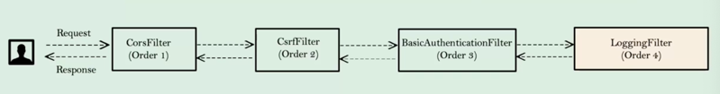

## Section 8️⃣
### Spring Security 내 필터 소개 및 사용법
- 왜 Spring Secuirty에서 커스텀 필터를 사용하는가
  - 복잡한 기업 응용 프로그램에서 종종 상황에 따라 일부를 하우스 키핑해야 할 수 있다.
  - 예시
    - validation 추가
    - 추적, 감사 및 세부 정보 보고
    - ip addr 등 엔드 유저의 일부 세부 정보를 로깅
    - 암호화 및 복호화
    - OTP를 사용한 다중 인자 인증
  - 모든 요청을 가로채기를 원할 때 가장 명백한 옵션은 HTTP 필터이다.
- 또한, Spring Security 필터 체인의 필터의 수는 상당히 많다.
  - 모든 필터가 필터 1이 실행된 후, 필터 2, 필터 3으로 하나씩 진행된다.

### Spring Security 프레임워크의 내장 필터 시
- 내장 필터 구성 살펴보기 
  - @EnableWebSecurity(debug=true)
  - application.properties에서 FilterChainProxy 클래스 활성화
    - 
  - 하지만, 위의 변경은 실제 운영 서버에서는 하면 안된다.
    - 왜냐하면, 내부 필터 세부 정보 뿐만 아니라 엔드 유저의 민감한 정보까지 로그에 기록되어 보안 위협을 받을 수 있다.
    - 
- 로깅된 스프링 시큐리티 필터
  - 

### 사용자 정의 필터 생성법
> 어떻게 나만의 커스텀 필터를 생성하는가 => 단순히 jakarta.servlet 패키지 내에 있는 필터 인터페이스를 확장하여 구현하면 된다.

- doFilter() 메소드 오버라이드를 오버라이드 한다.
  - 세 가지 입력 매개 변수를 제공하거나 액세스
    - ServletRequest
      - 엔드 유저로부터 오는 HTTP input 요청
    - ServletResponse
      - 엔드 유저나 클라이언트에게 다시 보낼 HTTP 응답
    - FilterChain
      - 정의된 순서대로 실행되는 필터들의 집합
      - 실행이 끝나면 FilterChin 내의 다음 가능한 필터를 불러온다.

- 어떻게 커스텀 필터를 Spring Security FilterChain에 주입할 수 있는가
  - addFilterBefore(filter, class)
  - addFilterAfter(filter, class)
  - addFilterAt(filter, class)
- Filter 인터페이스 내에 세 가지 메소드가 있다.
  - init()
    - 기본적으로 우리가 이 필터를 실행할 때 init에 작성한 로직이 실행된다.
  - doFilter()
    - init, destroy를 오버라이드 하지 않아도 된다.
    - 주 메소드인 doFilter에 나만의 커스텀 필터 로직을 구현해도 된다.
  - destroy()

### addFilterBefore() 메소드로 사용자 정의 필터 추가

요구 사항이 인증 전에 일부 로직을 실행하는 것이라면 커스텀 필터를 만들고 이를 BasicAuthenticationFilter 전에 구성해야 한다.  
따라서, RequestValidationFilter를 BasicAuthenticationFilter 바로 전에 구성할 것이다.  

- RequestValidationFilter
  - test 값을 포함한 유저 이름으로 로그인을 시도하면 유효하지 않은 요청이라는 오류를 발생시킬 것이다.
  
RequestValidationFilter.java
```java
public class RequestValidationBeforeFilter  implements Filter {

    public static final String AUTHENTICATION_SCHEME_BASIC = "Basic";
    private Charset credentialsCharset = StandardCharsets.UTF_8;

    @Override
    public void doFilter(ServletRequest request, ServletResponse response, FilterChain chain)
            throws IOException, ServletException {
        HttpServletRequest req = (HttpServletRequest) request;
        HttpServletResponse res = (HttpServletResponse) response;
        String header = req.getHeader(AUTHORIZATION);
        if (header != null) {
            header = header.trim();
            if (StringUtils.startsWithIgnoreCase(header, AUTHENTICATION_SCHEME_BASIC)) {
                byte[] base64Token = header.substring(6).getBytes(StandardCharsets.UTF_8);
                byte[] decoded;
                try {
                    decoded = Base64.getDecoder().decode(base64Token);
                    String token = new String(decoded, credentialsCharset);
                    int delim = token.indexOf(":");
                    if (delim == -1) {
                        throw new BadCredentialsException("Invalid basic authentication token");
                    }
                    String email = token.substring(0, delim); // 이메일 추출 
                    if (email.toLowerCase().contains("test")) { // test 확인
                        res.setStatus(HttpServletResponse.SC_BAD_REQUEST); // 에러 리턴
                        return;
                    }
                } catch (IllegalArgumentException e) {
                    throw new BadCredentialsException("Failed to decode basic authentication token");
                }
            }
        }
        chain.doFilter(request, response);
    }
}
```

ProjectSecurityConfig.java
```java
// 생략
                })).csrf((csrf) -> csrf.csrfTokenRequestHandler(requestHandler).ignoringRequestMatchers("/contact","/register")
                        .csrfTokenRepository(CookieCsrfTokenRepository.withHttpOnlyFalse()))
                        .addFilterAfter(new CsrfCookieFilter(), BasicAuthenticationFilter.class)
                        .addFilterBefore(new RequestValidationBeforeFilter(), BasicAuthenticationFilter.class)
// 생략
```

주의) 어느 커스텀 필터이든 시간이 오래 걸리는 로직은 사용하지 않는 것이 좋다. DB 쿼리와 몇 천개의 코드들은 웹 어플리케이션으로 오는 각각의 여청이 커스텀 필터에 의해 걸러지고 다른 요청에도 똑같이 실행되기 때문이다. 필수로 지정한 로직만 작성하도록 신중하게 고려되어야 한다.

### addFilterAfter() 메소드로 사용자 정의 필터 추가

인증이 마무리 되면 몇 가지 비즈니스 로직을 실행해야 되는 조건이 있다고 생각해보자.  
Spring Security in-built fiter 바로 다음에 새로운 필터를 구성하려고 하면 addFilterAfter()를 실행하면 된다.  

- LoggingFilter
  - 어떠한 유저 인증이 성공이고 그가 어떤 권한을 가졌는지 확인하는 필터이다.
  - 인증이 성공적이었고 엔드 유저에게 로그, 감사, 이메일을 보내는 필터이다.

AuthoritiesLoggingAfterFilter.java
```java
public class AuthoritiesLoggingAfterFilter implements Filter {

    private final Logger LOG =
            Logger.getLogger(AuthoritiesLoggingAfterFilter.class.getName());

    @Override
    public void doFilter(ServletRequest request, ServletResponse response, FilterChain chain)
            throws IOException, ServletException {

        Authentication authentication = SecurityContextHolder.getContext().getAuthentication(); // 인증이 성공적이면 인증된 유저의 세부정보는 SecurityContext에 저장된다. 현재 인증된 유저의 세부정보를 인증 객체의 형태로 제공한다.
        if (null != authentication) { // null이 아니라는 것은 인증에 성공되었다.
            LOG.info("User " + authentication.getName() + " is successfully authenticated and "
                    + "has the authorities " + authentication.getAuthorities().toString());
        }
        chain.doFilter(request, response);
    }
}
```

- 필터를 등록한다.
ProjectSecurityConfig.java
```java
.addFilterAfter(new AuthoritiesLoggingAfterFilter(), BasicAuthenticationFilter.class)
```

### addFilterAt() 메소드로 사용자 정의 필터 추가

Spring Security 중 하나의 위치와 정확히 같은 위치에 필터를 구성할 수 있다.  
Spring Security는 같은 위치에 있는 필터 중 무작위로 하나를 먼저 실행한다.  
따라서, 조심스럽게 사용해야하는 메소드이다.  
전세계에서 addFilterAt을 사용하는 시나리오가 많지 않을 수 있다.
  
- LoggingFilter()
  - 유저 인증을 실행중이라는 로깅을 한다.

AuthoritiesLoggingAtFilter.java
```java
public class AuthoritiesLoggingAtFilter implements Filter {
    private final Logger LOG =
            Logger.getLogger(AuthoritiesLoggingAtFilter.class.getName());

    @Override
    public void doFilter(ServletRequest request, ServletResponse response, FilterChain chain)
            throws IOException, ServletException {
        LOG.info("Authentication Validation is in progress");
        chain.doFilter(request, response);
    }
}
```

- 필터를 등록한다.
ProjectSecurityConfig.java
```java
.addFilterAt(new AuthoritiesLoggingAtFilter(), BasicAuthenticationFilter.class)
```

### GenericFilterBean과 OncePerRequestFilter 설명
필터 인터페이스 외에도 Spring 프레임워크의 다른 옵션들이 있다.
1. GenericFilterBean
- 추상 클래스이다.
- 필터를 implement한다.
- web.xml이나 배포 설명자 내에서 구성한 모든 설정 매개변수, 초기 매개변수 및 서블릿 컨텍스트 매개변수의 세부 정보를 제공한다.
- 따라서 이 클래스 내에는 설정 매개변수, 초기 매개변수 및 서블릿 컨텍스트 매개변수를 제공하는 여러가지 메소드가 존재한다.

2. OncePerRequestFilter
- 필터를 Spring Security Filter Chain에 구성하려고 할 때 스프링 시큐리티는 해당 필터가 요청 당 한번만 실행된다고 보장하지 않는다.
- 필터를 여러 번 호출되는 상황이 일어날 수 있다.
- 요청당 한 번만 실행되어야 하는 경우에는 이 추상클래스를 확장하여 커스텀 필터를 정의해야 한다.
- 이 필터에서는 모든 비즈니스 로직을 doFilterInternal에 정의해야 한다.
- sholdNotFilter() 메소드는 일부 API 경로에 대해서 이 필터를 실행하고 싶지 않다면 이 메소드를 활용할 수 있다.
- BasicAuthenticationFilter도 OncePerRequestFilter를 확장했기 때문에, doFilterInternal 메소드에 모든 비즈니스 로직이 구현되어 있다.
