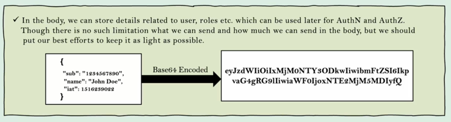

## Section 9️⃣ - JSON Web Token을 사용한 토큰 기반 인증
### JSESSIONID 및 관련 문제 실습
현재 브라우저에 두 개의 쿠키가 있다. (JSESSIONID, XSRF-TOKEN)

쿠키로 저장되어 있기 때문에 백엔드에 보내지 않아도 된다. 백엔드에 요청을 보낼 때마다 자동으로 첨부될 것이다.  
토큰은 인증 및 승인에서 굉장히 중요한 역할을 수행하고 있다.  
하지만, 기업 규모의 어플리케이션에서는 JSESSIONID로만은 충분하지 않다.  
그 이유는 다음과 같다.  
1. 해당 토큰은 유저 데이터를 가지고있지 않다. 무작위로 생성되었기 때문이다.
2. JSESSIONID는 브라우저 속 쿠키로 저장되는데 해당 쿠키는 유저 세션과 관련이 있다. 어떤 유저가 브라우저를 닫지 않고 누군가가 그 브라우저에 쿠키로 저장된 토큰을 악용할 수 있다.

### 인증 기반 토큰의 장점
- 이러한 토큰은 일반적으로 인증이 완료되자마자 처음으로 생성된다.
- 과정
  - 엔드 유저가 백엔드 인증 서버에 본인의 ID와 비밀번호를 보낸다. 
  - 이 정보가 유효하다면 인증 서버는 토큰을 리턴한다.
  - 클라이언트가 보안된 API에 해당 토큰과 함께 요청한다.
  - 토큰이 유효하다면 백엔드 서버는 유효한 응답을 할 것이다.
- 왜 토큰을 사용하는가?
  - 매 요청마다 실제 자격증명을 보내지 않아도 된다. 자격증명이 불필요하게 노출되는 것을 막을 수 있다.
  - 누군가 모든 토큰을 해킹했다는 사실을 알게 되면, 해당 토큰을 단순히 무시하면 된다.
  - 토큰은 짧은 수명을 갖도록 설계할 수 있다. 민감한 어플리케이션일 수록 이 수명을 짧게 저장할 수 있다.
  - 엔드 유저의 유저 정보 혹은 역할 정보를 저장할 수 있다. MSA에서 토큰 안에 이메일, 역할, 권한과 같은 엔드 유저 정보를 저장할 수 있다.
  - 토큰은 재사용 할 수 있다. 지메일에서 구글 드라이브로 넘어가도 토큰을 추가로 발급받지 않아도 된다.
  - 클러스터 속 어떤 인스턴스와도 소통할 수 있다. 각 인스턴스 들은 세션 속에 어떠한 정보도 저장하지 않아도 된다. 토큰이 가지고 있을 것이기 때문이다. 이를 무상태(stateless)라고 한다.

### JWT 토큰 심층 분석 1
JWT = JSON Web Token
- JSON 형식으로 데이터를 유지한다.
- 웹 요청에 사용된다.
- 토큰 자체의 내부에서 유저와 관련된 데이터를 저장 및 공유할 수 있다.

  - 헤더
    - 
    - 알고리즘 종류, 토큰 종류, 토큰 형식 등 메타 정보를 담고 있다.
    - 메타 정보를 Base64로 인코딩 한다.
  - 페이로드 (내용)
    - 
    - 이름, 역할, 만료 시간, 발행자 등 유저 정보를 저장한다.
    - 평문 형식을 Base64로 인코딩 한다.
  - 서명 (옵션)
    - 서명 덕에 나중에 누군가 토큰을 조작하려고 하면 쉽게 감지할 수 있다.
    - 서명이 있으면 토큰을 어디에도 저장할 필요가 없다.
  
> 또 다른 장점으로는 해당 JWT 토큰을 처음 생성될 때마다 데이터 베이스 혹은 캐시에 저장한다.

### JWT 토큰 심층 분석 2
- 엔드 유저가 로그인을 하고 JWT 토큰을 이해하고 있는 유저라면, 자신의 역할을 USER에서 ADMIN으로 바꿀 수도 있다.
- 인코딩과 디코딩은 간단한 과정이기 때문이다.
- 따라서, 전자 서명을 추가한다.
  - SHA-256과 같은 알고리즘의 도움을 받는다.
  - 이 비밀 값은 JWT 토큰을 발행하는 백엔드 어플리케이션에서만 알 수 있다.
  - 해커가 어떠한 정보를 조작하려는지에 상관 없이 이를 쉽게 알아차릴 수 있다.
- 따라서 이는 토큰을 저장하지 않고도 조작되었는지 확인할 수 있는 좋은 방법이다.


### JWT 토큰 사용을 위한 프로젝트 설정
- dependency 추가하기
pom.xml
```xml
<dependency>
    <groupId>io.jsonwebtoken</groupId>
    <artifactId>jjwt-api</artifactId>
    <version>0.12.3</version>
</dependency>
<dependency>
    <groupId>io.jsonwebtoken</groupId>
    <artifactId>jjwt-impl</artifactId>
    <version>0.12.3</version>
    <scope>runtime</scope>
</dependency>
<dependency>
    <groupId>io.jsonwebtoken</groupId>
    <artifactId>jjwt-jackson</artifactId>
    <version>0.12.3</version>
    <scope>runtime</scope>
</dependency>
```

- JSESSIONID 삭제하기
ProjectSecurityConfig.java에서 아래의 두 줄을 삭제한다.
```java
http.securityContext((context) -> context.requireExplicitSave(false))
        .sessionManagement(session -> session.sessionCreationPolicy(SessionCreationPolicy.ALWAYS))
```

아래의 코드를 추가한다.  
무상태로 스스로 해결할테니 JSESSIONID와 History를 생성하지 말아달라고 전달하는 것이다.
```java
http.sessionManagement(session -> session.sessionCreationPolicy(SessionCreationPolicy.STATELESS))
```

아래의 부분을 추가한다.
```java
config.setExposedHeaders(Arrays.asList("Authorization"));
```
왜 CSRF 토큰 헤더에는 똑같이 하지 않았는가?
> 프레임워크에서 제공한 헤더이기 때문에 프레임워크가 내부적으로 해결할 것이다.
> 여기서는 직접 작성한 토큰으로 헤더에 넣을 것이기 때문이다.

### JWT 토큰 생성을 위한 필터 설정
로그인이 성공적으로 완료되자마자 JWT 토큰을 생성한다.
JWTTokenGeneratorFilter.java
```java
public class JWTTokenGeneratorFilter extends OncePerRequestFilter {
    @Override
    protected void doFilterInternal(HttpServletRequest request, HttpServletResponse response,
                                    FilterChain filterChain) throws ServletException, IOException {
        Authentication authentication = SecurityContextHolder.getContext().getAuthentication(); // BasicAuthentication 필터 다음에 넣을 것이기 때문에, 엔드 유저의 인증 객체를 가져올 수 있다.
        if (null != authentication) { // null이 아니면 인증이 완료되었다는 뜻이다. 
            SecretKey key = Keys.hmacShaKeyFor(SecurityConstants.JWT_KEY.getBytes(StandardCharsets.UTF_8)); // 비밀 값을 이용하여 비밀 키를 만든다.
            String jwt = Jwts.builder().issuer("Eazy Bank").subject("JWT Token") // issuer: 발행하는 개인 혹은 조직, subject: 
                    .claim("username", authentication.getName())
                    .claim("authorities", populateAuthorities(authentication.getAuthorities())) 
                    // 하지만, 비밀번호는 담지 않아야 한다. 누구나 쉽게 디코딩할 수 있기 때문이다.
                    .issuedAt(new Date())
                    .expiration(new Date((new Date()).getTime() + 30000000)) // 언제 만료될 것인가? 발행 시간 이후 30000000ms이다.
                    .signWith(key).compact();
            response.setHeader(SecurityConstants.JWT_HEADER, jwt);
        }

        filterChain.doFilter(request, response);
    }

    // 이 메소드에 조건을 제공하면 그 조건에 따라 필터를 실행하지 않는다.
    // 오직 로그인 과정 중에만 이 필터를 사용하고 싶다. 따라서 로그인 API인지 확인하는 로직을 추가했다.
    // false 이면 이 필터가 실행된다.
    @Override
    protected boolean shouldNotFilter(HttpServletRequest request) {
        return !request.getServletPath().equals("/user");
    }

    // 모든 권한을 읽어와서 문자열로 만든다.
    private String populateAuthorities(Collection<? extends GrantedAuthority> collection) {
        Set<String> authoritiesSet = new HashSet<>();
        for (GrantedAuthority authority : collection) {
            authoritiesSet.add(authority.getAuthority());
        }
        return String.join(",", authoritiesSet);
    }
}
```

SecurityConstants.java
```java
public interface SecurityConstants {
    public static final String JWT_KEY = "jxgEQeXHuPq8VdbyYFNkANdudQ53YUn4"; // 백엔드 어플리케이션만 알고 있을 것이다. 지금은 이렇게 했지만, 런타임 중에 injection 하도록 해야 한다. (ex. 환경변수)
    public static final String JWT_HEADER = "Authorization";
}
```

- 필터 등록하기
ProjectSecurityConfig.java
```java
.addFilterAfter(new JWTTokenGeneratorFilter(), BasicAuthenticationFilter.class)
```

### JWT 토큰 인증을 위한 필터 설정
JWT 토큰의 유효성을 검증하는 필터를 생성한다.  
JWTTokenValidatorFilter.java
```java
public class JWTTokenValidatorFilter  extends OncePerRequestFilter {
    @Override
    protected void doFilterInternal(HttpServletRequest request, HttpServletResponse response,
                                    FilterChain filterChain) throws ServletException, IOException {
        String jwt = request.getHeader(SecurityConstants.JWT_HEADER); // 인가 헤더 값
        if (null != jwt) {
            try {
                SecretKey key = Keys.hmacShaKeyFor(
                        SecurityConstants.JWT_KEY.getBytes(StandardCharsets.UTF_8)); // JWT 토큰을 만들 때와 같은 키 이용, JWT를 생성할 때 사용되는 키 생성

                Claims claims = Jwts.parser()
                        .verifyWith(key)
                        .build()
                        .parseSignedClaims(jwt) // 검증할 JWT를 Jws 타입으로 파싱하여 리턴
                        .getPayload(); // 바디
                String username = String.valueOf(claims.get("username"));
                String authorities = (String) claims.get("authorities");
                Authentication auth = new UsernamePasswordAuthenticationToken(username, null, 
                        AuthorityUtils.commaSeparatedStringToAuthorityList(authorities)); // 추출한 사용자 이름과 권한을 사용하여 Authentication 객체 생성
                SecurityContextHolder.getContext().setAuthentication(auth); // 현재 스레드에 인증 객체 설정
            } catch (Exception e) {
                throw new BadCredentialsException("Invalid Token received!");
            }

        }
        filterChain.doFilter(request, response);
    }

    // 로그인 API를 제외하고 모든 API에 대해서 해당 필터가 실행하도록 설정한다.
    @Override
    protected boolean shouldNotFilter(HttpServletRequest request) {
        return request.getServletPath().equals("/user");
    }
}
```

- 필터 등록하기
ProjectSecurityConfig.java
```java
.addFilterBefore(new JWTTokenValidatorFilter(), BasicAuthenticationFilter.class)
```

### JWT 토큰 기반 인증을 위한 클라이언트 측 수정 작업
- 백엔드 어플리케이션의 어디에도 JWT 토큰을 저장하지 않았다. 전자 서명을 사용해 계속 토큰을 검증한다.
- 데이터베이스를 이용하면 무수히 많은 데이터베이스 요청이 생길 것이다. 성능적으로 좋지 않다.