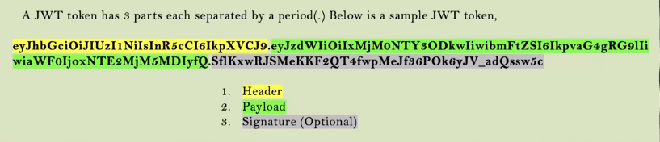
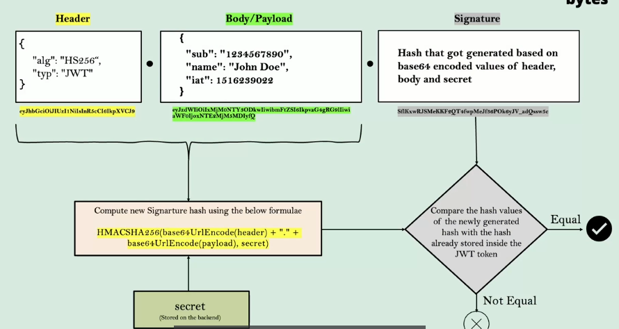

# Section 9.

### JSESSIONID 에 관하여
- jsessionid는 로그인시 자동으로 생성되는 쿠키로, 해당 쿠키가 저장되면 다시 보안api 요청시 재 로그인이 필요없다.
- 그러나 jsessionid는 작은 규모의 프로젝트에선 적합하지만 대규모의 프로젝트에서는 적합하지 않은데
  - 1. 해당 토큰은 유저 데이터를 갖고 있지 않다. (무작위로 생성된 값이기 때문에 유저 데이터를 넣을 수 없다.)
    2. 보안상 취약하여 브라우저에 저장된 해당 쿠키를 악용할 가능성이 높다.
  - 그렇기에 우리는 jsessionid 보다 더 나은 선택지를 찾아야한다.

### 토큰이란 무엇인가?
- 토큰이란 범용고유 식별자(UUID) 형식의 일반 문자열 또는 json web token 두 종류 중 하나이다.
- 해당 토큰들은 엔드 유저의 인증 작업이 완료되는 로그인 작업 중 처음으로 생성된다.
- 토큰은 생성된 후 프론트에 의해 보호된 api를 요청할 때마다 백엔드 시스템으로 같이 전달된다.

### 토큰 생성 흐름
1. 엔드 유저가 백엔드에 본인의 ID와 비밀번호를 입력한다.
2. 자격증명이 유효하다면 백엔드에서는 토큰을 생성한다. 이는 무작위로 생성되며 해당 토큰은 엔드 유저에게 반환된다.
3. 엔드 유저가 보안 api 요청을 한다. 이때 프론트에서는 받았던 것과 동일한 토큰을 백엔드에 보낸다.
4. 백엔드는 해당 토큰이 유효하다면 짜여진 로직에 의한 올바른 반응을 보일것이다.

### 토큰의 장점
1. 토큰을 이용하면 맨 처음 로그인 이후 재로그인을 할 필요가 없다. (자격증명이 불필요하게 네트워크에 노출되는 것을 막으며, 백엔드의 자격증명 로직이 실행되지 않기에 시간적으로도 이득이 된다.)
2. 해커가 네트워크의 특정 시간 모든 자격증명과 쿠키들을 훔쳤을 경우 토큰을 사용하는 경우엔 자격증명이 이뤄지지 않기에 해당 토큰만 무효화 시키면 되지만 만약 자격증명을 계속 이용하고 있었으면 모든 유저가 ID와 비밀번호를 바꿔야한다. (보안에 예민한 사이트일수록 토큰의 생명주기를 짧게 가져야한다.)
3. 토큰을 사용하여 유저의 정보 혹은 role을 저장할 수 있다.
4. 토큰을 재사용 할 수 있다. (구글메일, 구글 지도등 한 조직에서 운영하는 여러 어플리케이션 사이 토큰을 공유하여 자격증명을 생략할 수 있다.)
5. 유저의 정보를 하나도 저장하지 않아도 되는 statless 상태로 존재할 수 있다. 

### JWT 토큰에 관하여
- 내부적으로 데이터를 JSON 형태로 저장하기 때문에 json web token이라 한다.
- Rest 서비스의 도움으로 JSON 형식으로 소통하게 설계되었다.
- 가장 많이 사용되는 토큰이다.
- 인증 및 인가 사용이 가능하다.
- 토큰 내부에서 유저와 관련된 정보를 저장 및 공유할 수 있다.
- 서버쪽 세션 안에 유저에 대한 정보를 저장하고 있어야하는 부담을 줄여준다.

### JWT 토큰의 구조
- jwt 토큰은 헤더, 페이로드(바디), signature(서명)로 구분되며 이 세 가지는 .으로 구분된다, 헤더와 바디는 필수 부분이다.

- 헤더는 토큰의 메타데이터 정보를 바디는 주로 알고리즘이 무엇인지, 토큰의 종류가 무엇인지, 토큰의 형식은 어떤 것인지 등의 정보를 담고있다.
- 주로 헤더와 바디의 JSON 형태를 BASE64형태로 인코딩하여 저장한다.
- 토큰의 서명에 저장된값을 통해 토큰을 테이터베이스나 쿠키에 저장하지 않고도 유효성 검사를 할 수 있다고 한다. 

### jwt 토큰의 서명
- 서명은 선택적인 부분이며, 생성된 토큰을 조직속 내부 애플리케이션과 공유할 때마다 선택적으로 포함시킬 수 있다.
- 만약 jwt 토큰이 조직속 내부 네트워크에서만 이동하는 것이 아니라, 외부의 엔드유저에게도 공유가 된다면, 헤더와 바디안에 담긴 아이디와 권한 값을 절대 변경하지 못하도록 해야할 것이다.
  - jwt 토큰 안에 담긴 값을 수정하지 못하도록 하는 역할이 바로 서명 부분이다.
- 만약 해커가 jwt 토큰에 담긴 자신의 권한을 admin으로 수정하려한다면 손쉽게 base64 디코딩과 인코딩을 통하여 jwt 토큰을 수정할 수 있을것이다.
- 그럼 어떻게 jwt 토큰 조작을 방지할 수 있을까
  - 새로운 jwt 토큰을 생성할 때마다, HMACSHA256과 같은 알고리즘의 도움을 받아 서명 부분을 작성하는 것이다.
  - HMACSHA256 알고리즘은 헤더, 바디 그리고 시크릿 값을 사용하여 서명부분을 만든다.
  - 입력 형식은 다음과 같다 HMACSH256(BASE64Encode(헤더) +"." + BASE64Encode(바디),시크릿값)
  - 해당 시크릿값이 무엇인지는 백엔드 어플리케이션에서만 알 수 있다.
  - 알고리즘의 출력은 전달된 값을 기반으로 한 무작위 해시 문자열이다.
  - 이제 해시 문자열은 서명 부분에 붙어 클라이언트에게 전송된다.
  - 이제 엔드유저가 jwt 토큰 값을 변경하려 한다면 손쉽게 이를 감지할 수 있을것이다.
- flow 차트를 통해 이해해 보자
- 
- 1. jwt 토큰을 생성하여 엔드 유저에게 보낸다
  2. 엔드 유저는 jwt 토큰을 붙여서 특정 요청을 애플리케이션에 요청한다.
  3. 백엔드에서 jwt 토큰에 담긴 헤더값과 바디값, 시크릿 키를 활용하여 다시 한 번 해시값을 계산한다.
  4. 만약 계산된 해시값과 jwt 토큰 서명 부분에 담긴 값이 다르다면 조작됐다 판단하여 요청을 거부할 것이다.
  5. 따라서 jwt 토큰을 특정 세션이나 쿠키, 데이터베이스에 저장하지 않고서도 시크릿 값을 활용하여 검증을 진행할 수 있는것이다.
 

### jwt 토큰 구현
#### 환경설정하기기
- 우선 다음과 같은 의존성을 추가해줘야한다.
```java
<dependency>
			<groupId>io.jsonwebtoken</groupId>
			<artifactId>jjwt-impl</artifactId>
			<version>0.11.5</version>
		</dependency>
		<dependency>
			<groupId>io.jsonwebtoken</groupId>
			<artifactId>jjwt-impl</artifactId>
			<version>0.11.5</version>
			<scope>runtime</scope>>
		</dependency>
		<dependency>
			<groupId>io.jsonwebtoken</groupId>
			<artifactId>jjwt-jackson</artifactId>
			<version>0.11.5</version>
			<scope>runtime</scope>>
		</dependency>
```
- 이후 밑의 코드 부분을 defaultSecurityFilterChain에서 삭제해준다.
```java
http.securityContext((context) -> context.requireExplicitSave(false))
                .sessionManagement(session -> session.sessionCreationPolicy(SessionCreationPolicy.ALWAYS))
```
- 해당 부분을 통해 항상 jsessionId를 생성하며 생성된 jsessionId를 활용해 보안 요청을 처리했었는데 이제 우리는 jsessionId가 아닌 jwt 토큰을 활용할 것이므로 해당 코드를 지워주는 것이다.
- 이후 sessionManagement().sessionCreationPolicy(SessionCreationPolicy.STATELESS)를 설정하여 세션을 생성하지 않고 stateless 상태로 진행하겠다는 것을 알려준다.
- 그리고 cors 설정도 바꿔주어야한다. 백엔드에서 생성한 jwt token은 Authorization 헤더에 넣어서 UI로 보낼것인데, 만약 cors 설정을 바꿔주지 않으면 프론트에서 헤더 데이터에 jwt 토큰을 백엔드로 반환시키지 못하기 때문에 그러한 부분도 설정을 해줘야 한다.
- config.setExposedHeaders(Arrays.asList("Authorization"))을 추가해주면 된다.

#### 로그인 이후 즉시 jwt 토큰을 발급해주는 filter 구현하기
- 우선 필터는 각 로그인요청당 한 번만 실행되야하기 때문에 OncePerRequestFilter를 구현할 것이다.
- 오버라이드해야하는 메소드는 doFilterInternal이다.
- 해당 필터의 위치는 로그인이 성공하고 난 이후여야 하므로 BasicAuthentication 필터 다음에 위치시켜야 한다.
- BasicAuthentication 필터 이후에 실행됨으로 시큐리티Context에 인증관련 정보가 저장돼 있을것이다.
  - SecurityContextHolder.getContext().getAuthentication();을 통해 authentication 객체를 추출할 수 있다.
- 이제 SecurityConstants 인터페이스를 정의해주며 해당 인터페이스 안에 비밀 값을 설정해준다.
  - 해당 비밀값은 외부에 노출이 되면 안되니 컴파일 시점에 주입되도록 devops를 활용해야한다.
  - 아니면 github나 jenkins를 활용하여 환경변수로 설정할 수도 있다.
- 이제 해당 비밀값을 활용하여 jwt 토큰 서명 부분을 만들기 위해 필요한 비밀 키값을 생성한다.
  - 비밀 키값은 Keys.hmacShaKeyFor(SecurityConstants.JWT_KEY.getBytes(StandardCharsets.UTF_8))을 활용하여 생성해주고 헤더와 바디값을 설정하면 이 비밀키 값과 함께 서명 부분을 만들게 된다.
- jwts.builder().setIssuer("이준범")을 통해서 jwt 토큰의 발행지를 입력할 수 있고
- .setSubject("")를 통해 이름을 설정할 수 있다
- .claim("username",authentication.getName())을 통해 유저 네임을 추출하고
- .claim("authorites",populateAuhorities(authentication.getAuthorities()))를 통해 권한을 설정한다.
  - 비밀번호는 절대로 토큰에 설정하여 외부에 노출시키면 안된다.
- setIssuedAt(new Date())를 통하여 발행 일자를 등록해주고
- setExpiraion(new Date(new Date()).getTime() + 300000000)를 통해 토큰의 유효시간을 설정해준다
  - 숫자의 단위는 미리세크이다 위의 숫자는 대략 8시간 정도다.
- 마무리로 signWith(key).compact()를 통해 서명 부분을 작성해주고
- response.setHeader(SecurityConstants.JWT_HEADER,jwt)를 통해 응답헤더에 설정해주면 된다.
  - 여기서 JWT_HEADER의 값은 Authorization이다.

####  추가로 살펴볼 메소드
```java
    protected boolean shouldNotFilter(HttpServletRequest request) {
        return !request.getServletPath().equals("/user");
    }
```
- 해당 메소드는 조건이 제공되면 그 조건에 따라 필터의 실행을 막는 역할을 수행한다.
- 해당 jwt 생성 필터는 오로지 로그인 과정에서만 필터가 수행되어야 한다.
- 그렇기에 로그인 수행과정 이외의 상황에서 필터가 작동되는 것을 막기 위해 /user에서만 jwt 생성 필터가 작동되도록 설정해준 것이다.
- 우리가 만든 컨트롤러에서 로그인 api는 /user이기 때문이다.???????????????????????
- 이제 configuration에서 addFilterAfter로 필터를 삽입해주면 된다.

#### jwt 토큰이 유효한지 확인하는 filter 구현하기
- 위의 순서와 똑같이 OncePerRequestFilter를 extends 하여 구현해준다.
- 우선 request.getHeader(SecurityConstants.JWT_HEADER);로 authoriztion 헤더에 담긴 jwt 토큰을 가져온다.
- 이후 같은 비밀 값을 활용하여 다시 비밀키 값을 생성해야 한다.
  - Keys.hmacShaKeyFor(SecurityConstants.JWT_KEY.getBytes(StandardCharsets.UTF_8))
- 비밀 키 값을 바탕으로 서명 부분을 만들고 jwt 토큰에 들어있는 서명 부분과 일치하는지 비교해줘야 한다.
  - 서명 부분을 만드려면 헤더와 바디가 필요하다 헤더와 바디를 추출하는 코드는
  - .parseSignedClaims(jwt).getPayload(); 이다 여기서 헤더와 바디를 추출한다.
  - 이후 .verifyWith(key) 메소드 내부에서 자동적으로 서명을 생성하고 jwt의 서명 부분과 일치하는지 비교를 한다.
  - 일치한다면
```java
String username = String.valueOf(claims.get("username"));
                String authorities = (String) claims.get("authorities");
                Authentication auth = new UsernamePasswordAuthenticationToken(username, null,
                        AuthorityUtils.commaSeparatedStringToAuthorityList(authorities));
                SecurityContextHolder.getContext().setAuthentication(auth);
```
- 다음과 같이 authentication 객체를 만들어 SecurityContext에 저장해주고 계속 활용할 수 있게 해준다.
- 이렇게 직접 authentication 객체를 만들어 SecurityContext에 저장해주면 jwt 토큰 인증이 성공적이었다는 것을 Spring security가 알수있게 된다.
- 마지막으로 해당 필터는 로그인 요청 이외에서 모두 실행되어야 하므로
```java
protected boolean shouldNotFilter(HttpServletRequest request) {
        return request.getServletPath().equals("/user");
    }
```
- 이렇게 /user에서만 실행이 되지 않게 설정해준다.
