## Section 1️⃣1️⃣ - OAUTH2와 OpenID 심층 분석
### OAUTH2가 해결할 수 있는 문제
(만약 본인의 단체가 여러 개의 웹 어플리케이션 혹은 모바일 앱이나 microservices를 소유하고 있다면, 보안 로직, 인증 그리고 허가 로직을 항상 분리하는 것이다.)  

- OAUTH란?
  - 업계 표준이다.
  - 그들의 어플리케이션 내에서 인증과 허가를 실행하기 위해서 사용한다.
- OAUTH가 해결하는 업계의 문제점
  - OAUTH 이전에 모든 엔드 유저들은 제 3의 어플리케이션에게 본인의 인증서를 요구해야 했다. 예를 들면, 트위터 인증서
  - 하지만, 본인의 인증서를 제 3의 어플리케이션에게 주는 것이기 때문에 남용되거나 다른 목적으로 사용될 수 있다.
  - 따라서, 실제 인증서를 요구하지 않고 임시적인 접근을 허용할 수 있는 방안이 OAUTH2이다.
  - 임시적인 접근 토큰을 통해 제한 접근만을 허용하는 것이다.
- 예시
  - 구글은 구글 드라이브, 유튜브, 지메일 등 다양한 모바일 어플리케이션과 웹 어플리케이션이 있지만 매번 다른 인증서를 발급받거나 등록할 필요가 없다.
  - OAUTH2의 별개의 인증 서버를 이용하여 한번만 인증을 받고 승인을 받으면 되는 것이다.

### OAUTH2 소개
- OAUTH 2.0 Framework
  - Open Authorization
  - 오픈 소스
  - 웹 어플리케이션 내에서 승인이나 허가를 받을 때 따라야 하는 적정한 기준 정의
  - 단순 사양, 인터페이스, 프로토콜
  - 예시) 제한된 허가를 통해 제 3 어플리케이션이 사진을 보는 것 이외에 편집 등의 행위를 못하도록 막는다.
  - 구성
    - Access Token
      - 전용 키
    - Grant Type
      - 인증의 한 종류
        - 두 개의 어플리케이션의 소통 ➡️ Client Credentials Grant Type
        - 디바이스들과 연관되어 있다면 ➡️ Device Code Grant Flow
  - https://oauth.net/2/

### OAUTH2 용어 및 전문 용어
- Resource Owner
  - You
  - 엔드 유저의 리소스들이 어플리케이션 내에 보관되어 있다.
- Client
  - 제 3 웹 어플리케이션
- Authorization Server
  - 인증서에 대해서 묻는다.
  - 제대로 된 인증서를 입력하면 인증 서버가 사용자를 인증한다.
- Resource Server
  - 예를 들어, 트위터 어플리케이션이 리소스 서버이다.
  - 내 리소스들이 저장되어 있다.
- Scopes
  - 클라이언트가 원하는 세분화된 허가이다.

### OAUTH2 플로우 예시 - 이론
<트윗 분석 어플리케이션>
1. 트위터를 이용한 어플리케이션을 만들고 싶다.
2. 트위터의 클라이언트로 등록한다. (클라이언트 ID와 기밀을 받는다.)
3. 엔드 유저가 트위터 분석을 원하면 트위터 로그인 페이지로 이동한다. (엔드 유저는 안심한다. 본인의 인증서를 해당 웹사이트가 아닌 믿을만한 트위터 사이트에 입력하기 때문이다.)
4. 트위터의 인증 서버에서 인증이 완료되면 트위터는 유저에게 트윗 데이터를 공유해도 되는지 허락을 구한다.
5. 승인 서버가 Access Token, Refresh Token을 발급한다.
6. 리소스 서버에서 API를 실행하려 할때마다 승인 서버에서 받은 액세스 토큰을 넘겨주어야 한다. 
7. 리소스 서버는 Auth 서버와 Acess Token을 확인한다. (이 둘은 같은 단체에 속해있기 때문이다.)
8. 리소스 서버가 리소스를 클라이언트에게 전달한다.
9. 클라이언트는 비즈니스 로직을 실행하여 리포트를 엔드 유저에게 전달한다.

### OAUTH2 플로우 예시 - 실습
- [구글 OAuth](https://myaccount.google.com/?utm_source=sign_in_no_continue&pli=1)를 이용하여 [Slack](https://slack.com/intl/ko-kr/?utm_medium=paid_search&utm_source=google&utm_campaign=kr__202403&campaign=7013y000002hliPAAQ&gad_source=1&gclid=CjwKCAjwwr6wBhBcEiwAfMEQswP2Bc5EDK2WBouarEEDbj5o4nwEzky93w28dJXf-Y3ZpcN58K_KPhoCcSIQAvD_BwE)에 로그인하기

### OAUTH2 내 권한 코드 부여 유형 흐름 심층 분석
- 다양한 승인 유형
  - (이러한 인증 유형 중 하나를 웹 어플리케이션 시나리오를 바탕으로 선택해야 한다.)

**OAUTH2 FLOW**  
1. 유저는 클라이언트 어플리케이션에게 리소스 서버에서 리소스를 접속하게 해달라고 주장한다.
2. 유저는 AUTH 서버의 로그인 페이지로 접근한다.
- 클라이언트가 인증 서버에게 보내야하는 정보
  - client_id
  - redirect_url
  - scope
    - 요구받고자 하는 허가 내용
  - state
    - csrf 토큰 역할
  - response_type
3. 유저가 신원을 인증하면, 인증 서버는 AUTHORIZATION CODE를 제공한다.
4. 클라이언트는 유저 인증이 성공적으로 이루어졌다는 회신을 한다.
- 클라이언트가 인증 서버에게 보내야하는 정보
  - code
  - client_id
    - 클라이언트 어플리케이션의 정보
  - client_secret
    - 클라이언트 어플리케이션의 정보
  - grant_type
  - redirect_uri
5. 인증 서버는 Access Token을 발급한다.
6. 클라이언트는 Access Token을 포함하여 리소스 서버에게 리소스를 요청한다.
7. 리소스 서버는 리소스를 돌려준다.

> 2. 4.를 결합하고 단일 단계로 토큰을 제공할 수 있는 암시적 방법이 있지만, 보안성이 낮기 때문에 사용하지 않는다.

### OAUTH2 내 권한 코드 부여 유형 흐름 분석
https://oauth.com/playground/
1. client 등록하기
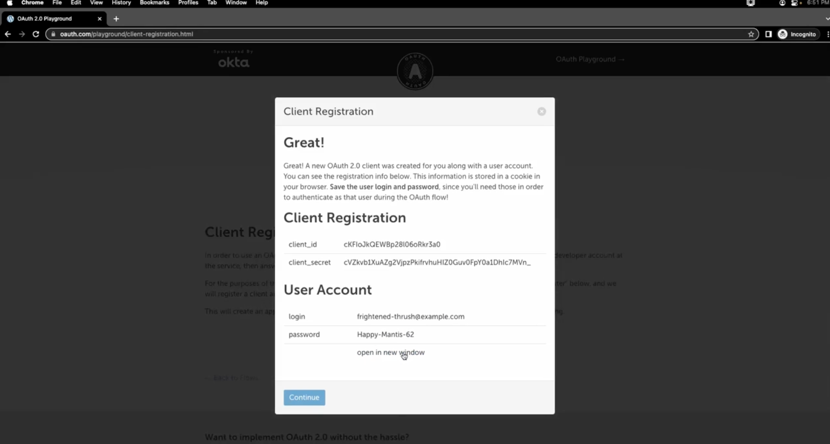
2. 인증 서버로 리다이렉트하기
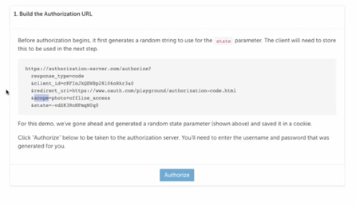
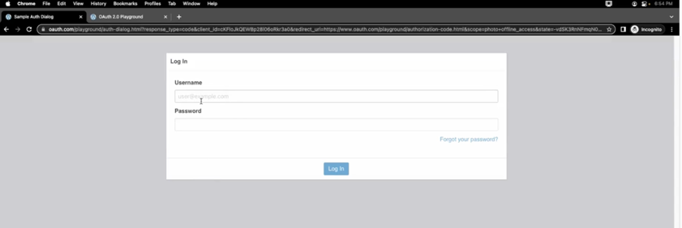
3. scope 허용하기
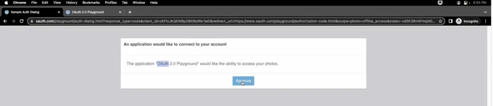
4. 클라이언트가 인증 서버에 액세스 토큰 요청하기
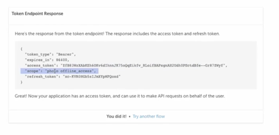

### OAUTH2 내 절대 부여 흐름 심층 분석 및 실습
1. 유저가 클라이언트에게 리소스에 접근하고 싶고 요청한다.
2. 클라이언트가 인증서를 입력해달라고 한다.
3. 유저는 인증 서버의 인증 페이지로 리다이렉트 된다.
4. 인증 서버는 인증이 성공되면 액세스 토큰을 발급한다
- 인증 서버에 보내야하는 정보
  - client_id
  - redirect_url
  - scope
  - state
  - response_type
- 이는 get 요청이기 때문에 client_secret을 보내는 의미가 없다. 보낼 때마다 모든 url이 노출되기 때문이다.
- 따라서, 누구나 트윗 분석 어플리케이션인 척을 하고 승인 서버에게 요청할 수 있다. 
- get 요청이기 때문에 인증 서버로부터의 답변도 get이다. 액세스 토큰이 url의 일부로 노출되는 것이다.
5. 이 액세스 토큰을 이용하여 클라이언트는 리소스 서버에서 원하는 리소스에 접근한다.

### OAUTH2 내 비밀번호 부여 유형 흐름 심층 분석
1. 유저가 클라이언트에게 **User의 Credentials**와 함께 리소스에 접근하고 싶다고 한다.
2. 인증 서버에게 클라이언트 id, secret과 함께 유저의 Credentials를 넘긴다.
- 클라이언트가 인증 서버에 보내야하는 정보
  - client_id & cliend_secret
  - scope
  - username & password
  - grant_type
3. 인증 서버는 Access Token을 발급한다.
4. 이 Access Token과 함께 리소스 요청 API를 리소스 서버로 보낸다.

> OAUTH 2.0 이후로 비밀번호 인증이나 리소스 소유자 유형이 제거되었다.

### OAUTH2 내 클라이언트 인증정보 부여 유형 흐름 심층 분석
With Client Credentials Grant Type  
1. 클라이언트는 인증 서버에게 클라이언트 인증서를 보낸다. 유저 정보는 없다.
- 클라이언트가 인증 서버에 보내야하는 정보
  - client_id & client_secret
  - scope
  - grant_type
    - 'client_credentials'를 받게 된다면 인증 서버는 엔드 유저가 연관되어 있지 않다는 것을 인지한다.
2. 인증 서버가 클라이언트에게 액세스 토큰을 발급한다.
3. 클라이언트가 액세스 토큰을 이용하여 리소스 서버에 접근한다.
4. 옳은 토큰이라면 리소스 서버는 리소스를 제공한다.

> OAUTH 2.0 이후로 비밀번호 인증이나 리소스 소유자 유형이 제거되었다.

### OAUTH2 내 리프레쉬 토큰 부여 유형 흐름 심층 분석
액세스 토큰의 유효기간이 끝나면 클라이언트 어플리케이션은 인증서나 로그인 플로우를 재시작하기 위해서 엔드 유저나 리소스 소유자에게 다시 물을 필요가 없다.  
허가 코드 인증 유형이 있기 때문이다.  
리프레쉬 토큰을 활용할 수 있다.  
리프레쉬 토큰이 적절하다면 인증 서버는 새로운 유효 기간을 가진 새로운 액세스 토큰을 부여할 것이다. 그리고 새로운 리프레쉬 토큰도 부여할 것이다.  

**In the Refresth Token Grant Type**  (유저 X)
1. 클라이언트 어플리케이션이 리소스 서버로 만료된 액세스 토큰을 보낸다.
2. 리소스 서버는 403 에러를 보낸다. `"액세스 토큰 만료 이슈"`
3. 클라이언트는 인증 서버에 리프레쉬 토큰으로 새로운 액세스 토큰을 요청한다.
- 클라이언트가 인증 서버에 보내야하는 정보
  - client_id & client_secret
  - refresh_token
  - scope
  - grant_type
4. 리프레쉬 토큰이 유효하다면 새로운 리프레쉬 토큰과 액세스 토큰을 발급할 것이다.
5. 이 새로운 액세스 토큰을 이용하여 리소스 서버에 리소스를 요청한다.

> 이 모든 과정을 절대로 엔드 유저와 연관짓지 않아야 하며 클라이언트 어플리케이션이 몇 초 안에 비밀스럽게 일어나야 한다.

### 리소스 서버가 인증 서버에서 발급한 토큰을 인증하는 방법
리소스 서버가 어떻게 이 액세스 토큰이 적절한지 아닌지 분간하는가  

1. 인증 서버와 리소스 서버 간 API 교류가 직접적으로 이루어진다.
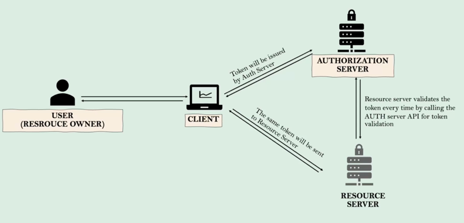  

2. 승인 서버와 리소스 서버가 공통 데이터베이스를 사용한다.
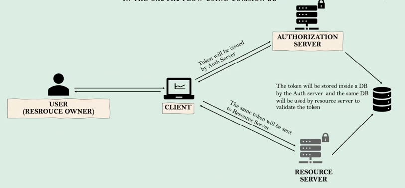  
액세스 토큰이 공통 데이터베이스에서 원할한 상태로 존재하는지 검증한다.

3. 리소스 서버가 승인 서버로 연결된다. (가장 많이 추천되는 방법이다.)
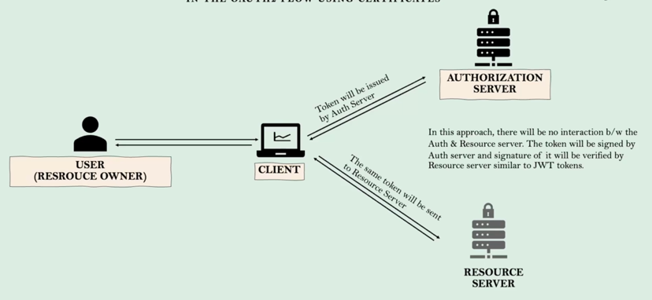  
웹 어플리케이션이 시작할 쯤 리소스 서버가 승인 서버로 연결된다.  
➡️ 승인 서버로부터 공개 인증서를 받는다.  
➡️ 이 동일한 공개 인증서를 사용하여 인증 서버로부터 발급되는 액세스 토큰을 발급받을 때마다 액세스 토큰의 조작에 대한 진위 여부를 확인할 수 있다.

### OpenID Connect(OIDC) 소개
- OAuth2와 OpenID의 차이점
  - OAuth2의 구조물로는 누가 엔드 유저인지 디테일은 무엇인지 이메일은 무엇인지 알 수 없다.
  - 많은 단체들이 엔드 유저 혹은 리소스 소유자의 정체에 대한 세부 사항을 알고 싶어 한다.
  - 따라서, 모두 본인만의 스타일로 클라이언트 어플리케이션이나 관리자들에게 사용자의 정보를 파악하고 보내기 시작했다.
  - 하지만, 통일성이 존재하지 않았다.
- 따라서, 등장한 것이 OpenID이다.
  - 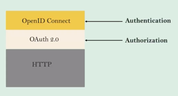
  - OAuth 2.0 구조물 위에서 작동되는 프로토콜이다.
  - OAuth 2.0를 감싸고 있다.
  - 우리가 인증 서버 안에 OpenID 연결을 실행시킬 때마다 두 가지 종류의 토큰을 보낼 것이다.
    - 액세스 토큰
      - 승인을 관리한다.
    - 리프레쉬 토큰
    - ID 토큰
      - 사용자의 세부 사항을 관리한다.
- 어떻게 사용하는가?
  - scope 안에 OpenID라는 값을 보내야 한다.
- 프로필 세부 사항, 이메일 세부 사항, 주소 세부 사항 등 신원에 관련해서 OpenID와 연결되는 스코프를 통해 조금 더 쉽게 파악될 수 있다.
- OAuth가 없다면 OpneID도 없다.  

> 이 두가지 토큰과 함께 등장한 새로운 컨셉은 ➡️ IAM, 접근 관리이다.  
> 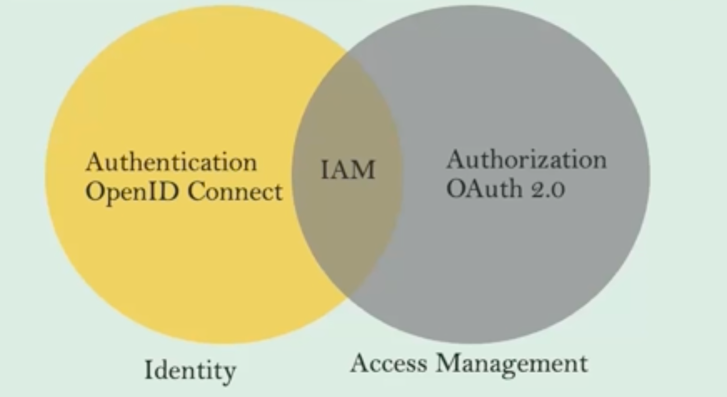

**실습**  
1. 인증 URL을 보낸다.
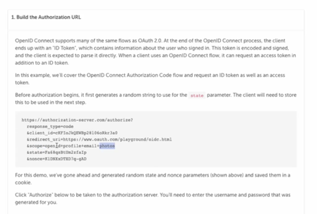  
client_id, redirect_url가 있고, scope에는 사진과 별도로 OpneID도 보내야하는 것을 알 수 있다.  
(만일 OpenID와 함께 프로필이나 이메일 같은 스코프를 추가로 보낼 수도 있다.)
2. 로그인을 한다.
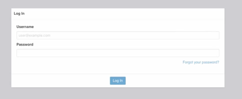
3. 이름, 이메일 주소를 어플리케이션과 함께 공유할 것이라고 밝힌다.
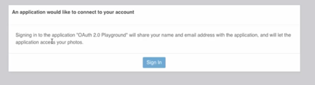  
4. 상태값과 함께 승인 코드를 받는다.
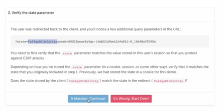  
5. 액세스 토큰과 ID 토큰에 대한 발급 요청을 한다.
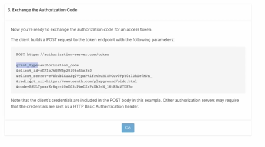  
6. ID 토큰을 분석해보면 이름, 이메일, 발행자, 발행 시간 등 개별적인 세부사항도 확인할 수 있다.
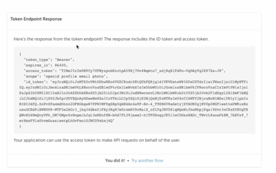
