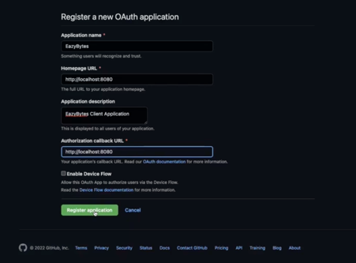
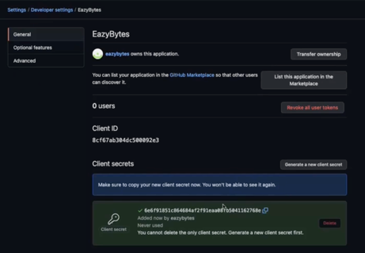
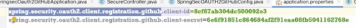
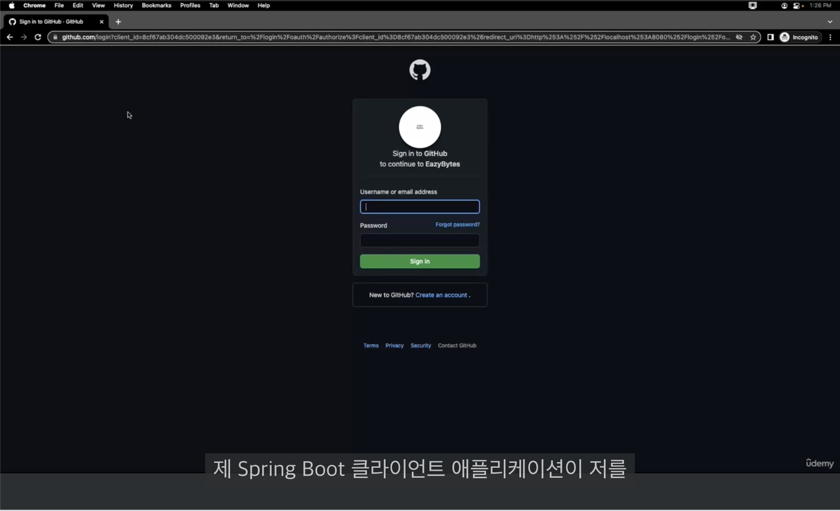
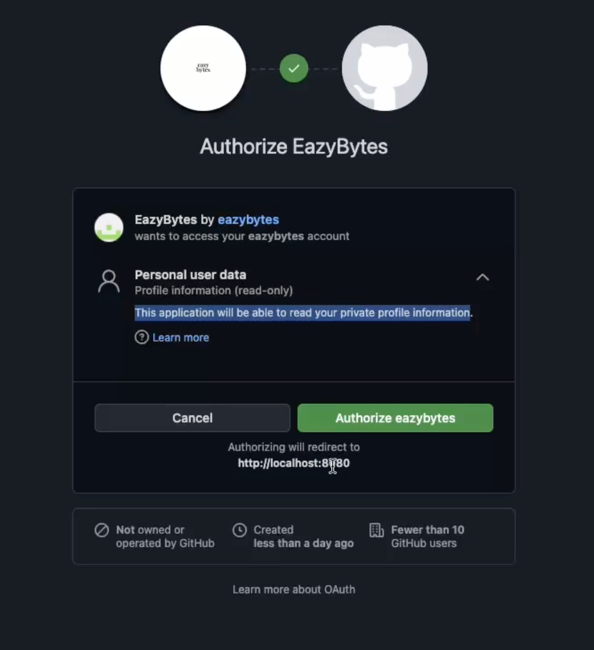
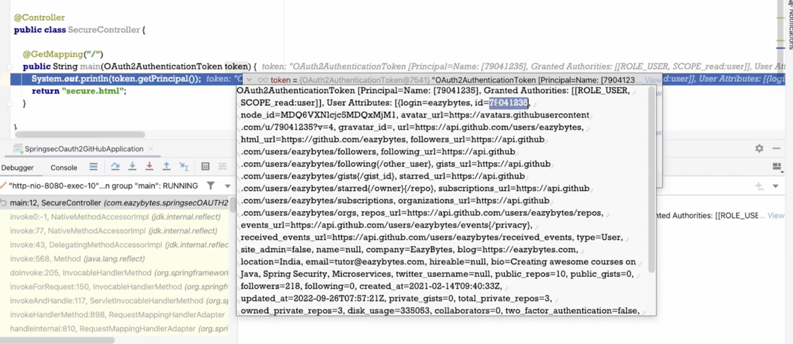

## Section 1️⃣2️⃣ - Spring Security에서의 OAuth2 구현
### OAUTH2 인증 서버 사용을 위해 Github로 클라이언트 정보 등록
**인증 서버를 Github로 사용하기**  
  
  
  

### OAUTH2 중에 Github 인증 서버를 사용하는 Spring Boot 어플리케이션 구축
**build.gralde에 dependency 추가**  


**OAuth2를 이용하여 서버에 접근하기**  
SecureController.java
```java
@Controller
public class SecureController {
    @GetMapping("/")
    public String main(OAuth2AuthenticationToken token) {
        System.out.println(token.getPrincipal());
        return "secure.html";
    }
}
```

SpringSecOAUTH2GitHubConfig.java
```java
@Configuration
public class SpringSecOAUTH2GitHubConfig {

    @Bean
    SecurityFilterChain defaultSecurityFilterChain(HttpSecurity http) throws Exception {
        http.authorizeHttpRequests((requests)->requests.anyRequest().authenticated())
                .oauth2Login(Customizer.withDefaults());
        return http.build();
    }

    @Bean
    public ClientRegistrationRepository clientRepository() {
        ClientRegistration clientReg = clientRegistration();
        return new InMemoryClientRegistrationRepository(clientReg);
    }

    private ClientRegistration clientRegistration() {
		return CommonOAuth2Provider.GITHUB.getBuilder("github").clientId("8cf67ab304dc500092e3")
	           .clientSecret("6e6f91851c864684af2f91eaa08fb5041162768e").build();
	 }
}
```

아래의 코드를 사용하지 않고 적용할 수 있는 방법이 있다. 
```java
    @Bean
    public ClientRegistrationRepository clientRepository() {
        ClientRegistration clientReg = clientRegistration();
        return new InMemoryClientRegistrationRepository(clientReg);
    }

    private ClientRegistration clientRegistration() {
		return CommonOAuth2Provider.GITHUB.getBuilder("github").clientId("8cf67ab304dc500092e3")
	           .clientSecret("6e6f91851c864684af2f91eaa08fb5041162768e").build();
	 }
```

applicaiton.properties를 사용하는 것이다.  


### Github OAUTH2를 사용한 샘플 어플리케이션 실행 및 검증
- localhost:8080을 시도하자마자 github 로그인 페이지로 redirect 되었다.  

- 정보 제공에 대한 동의를 받는다.  

- OAuth 객체에 담긴 정보이다.  


> 나의 단체에 속하는 유저가 아니기 때문에 나만의 역할과 권한을 직접 구성할 수는 없다.