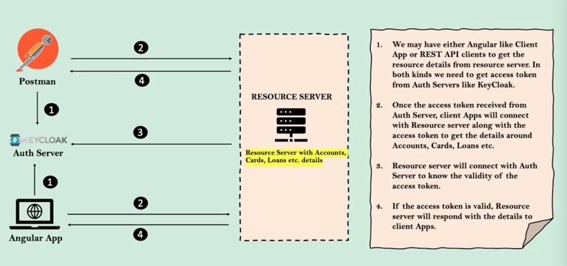
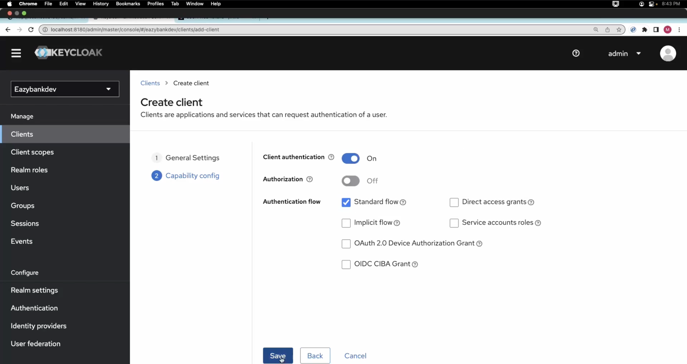
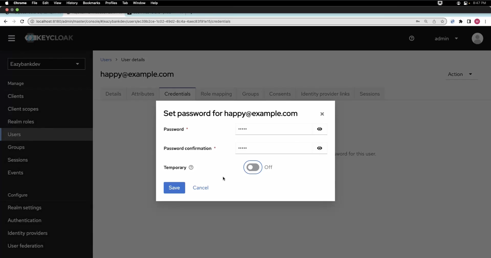
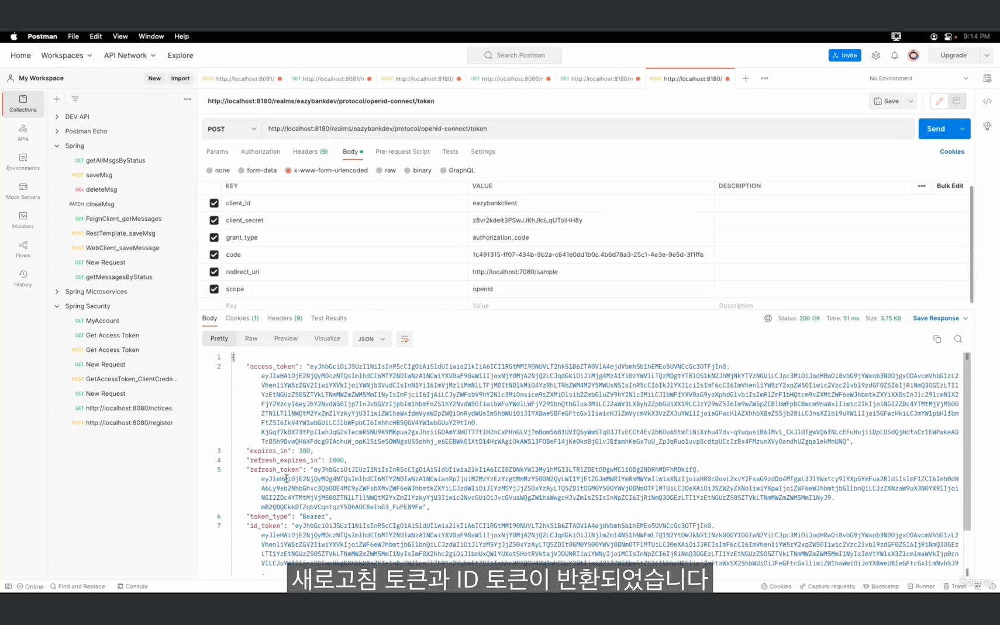

## Section 1️⃣3️⃣ - EazyBank에서 KeyCloak을 사용한 OAUTH2 형식의 로그인 구현
### EazyBank 웹 앱 내 OAUTH2 흐름 소개
이 프로젝트에서는 EazyBank 내에서 개발, 유지하고 있는 모든 어플리케이션이 활용할 수 있는 인증 서버를 만들 것이다.  
모바일 앱, 마이크로 서비스 등 다양한 형태로 성장해 나간다면 EazyBank에서 직접 소유하는 별도의 인증 서버를 두는 것이 좋은 방법이다.
KeyCloak을 이용하여 인증 서버를 만든 다음 모든 계정 정보를 저장하고 있는 백엔드 어플리케이션을 리소스 서버로 만들 것이다.  
두 가지의 시나리오를 경험해볼 것이다.  
1. 서드 파티 어플리케이션이 리소스 서버에 있는 REST 서비스를 이용하려고 할 때 client credentials grant flow를 사용할 것이다.
2. Angular 앱에서 리스소 서버에 접속해서 정보를 가져와 페이지에 띄운다.

### KeyCloak 인증 서버 소개
Google, Facebook 처럼 자기만의 인증 서버를 구축할 수 없기 때문에 인증 서버를 제공하는 서비스가 시장에 많이 나왔다.  
KeyCloak, Okta, ForgeRock, Amazon Cognito이 그 예시이다.  


### API-API 보안 호출을 위한 KeyCloak 내 클라이언트 인증 정보 생성
  
1. Postman이 KeyCloak 인증 서버로부터 액세스 토큰을 받아와야 한다.
2. 그걸 리소스 서버에 전송한다.
3. 리소스 서버는 그 액세스 토큰이 유효한지 KeyCloak 서버에 확인받는다.
4. 유효하다면, 리소스 서버는 Postman에게 유효한 응답을 보낸다. 

이 과정에서 client credentials grant type flow를 사용한다.  


**클라이언트 생성하기**  


  
- 서드 파티 어플리케이션에게 client secret을 주어 그걸로 인증하고 싶으므로 Client Authentication을 켠다.

### EazyBank 리소스 서버 구축
(현재의 프로젝트는 인증까지 모두 이루어지는 서버이다. 따라서, 리소스 서버의 역할만 하도록 변경한다.)  
1. dependency 추가한다.


2. ProjectSecurityConfig.java
- CsrfCookieFilter를 제외하고 모두 삭제한다.
```java
@Configuration
public class ProjectSecurityConfig {
    @Bean
    SecurityFilterChain defaultSecurityFilterChain(HttpSecurity http) throws Exception {
        CsrfTokenRequestAttributeHandler requestHandler = new CsrfTokenRequestAttributeHandler();
        requestHandler.setCsrfRequestAttributeName("_csrf");
        JwtAuthenticationConverter jwtAuthenticationConverter = new JwtAuthenticationConverter();
        jwtAuthenticationConverter.setJwtGrantedAuthoritiesConverter(new KeycloakRoleConverter());

        http.sessionManagement(session -> session.sessionCreationPolicy(SessionCreationPolicy.STATELESS))
            .cors(corsCustomizer -> corsCustomizer.configurationSource(new CorsConfigurationSource() {
            @Override
            public CorsConfiguration getCorsConfiguration(HttpServletRequest request) {
                CorsConfiguration config = new CorsConfiguration();
                config.setAllowedOrigins(Collections.singletonList("http://localhost:4200"));
                config.setAllowedMethods(Collections.singletonList("*"));
                config.setAllowCredentials(true);
                config.setAllowedHeaders(Collections.singletonList("*"));
                config.setExposedHeaders(Arrays.asList("Authorization"));
                config.setMaxAge(3600L);
                return config;
            }
        })).csrf((csrf) -> csrf.csrfTokenRequestHandler(requestHandler).ignoringRequestMatchers("/contact","/register")
                .csrfTokenRepository(CookieCsrfTokenRepository.withHttpOnlyFalse()))
                .addFilterAfter(new CsrfCookieFilter(), BasicAuthenticationFilter.class)
                .authorizeHttpRequests((requests)->requests
                        .requestMatchers("/myAccount").hasRole("USER")
                        .requestMatchers("/myBalance").hasAnyRole("USER","ADMIN")
                        .requestMatchers("/myLoans").authenticated()
                        .requestMatchers("/myCards").hasRole("USER")
                        .requestMatchers("/user").authenticated()
                        .requestMatchers("/notices","/contact","/register").permitAll())
                .oauth2ResourceServer(oauth2ResourceServerCustomizer ->
                        oauth2ResourceServerCustomizer.jwt(jwtCustomizer -> jwtCustomizer.jwtAuthenticationConverter(jwtAuthenticationConverter)));
        return http.build();
    }
}
```

3. 모든 Filter를 삭제한다.  


4. EazyBankUsernamePasswordAuthenticationProvider.java 삭제하기
- 데이터베이스의 도움을 받아 엔드 유저를 인증하지 않을 것이기 때문이다.

5. BCryptPasswordEncoder 빈을 삭제한다.
- 비밀번호를 보관하거나 인증하는 일을 하지 않기 때문에 삭제한다.

6. SecurityConstants.java 삭제한다.
- JWT 토큰을 생성하고 인증하는 과정을 삭제했기 때문이다.

7. KeycloakRoleConverter.java를 생성한다.
```java
public class KeycloakRoleConverter  implements Converter<Jwt, Collection<GrantedAuthority>> { // JWT 토큰을 받아서 GrantedAuthority 형식으로 변환한다.
    @Override
    public Collection<GrantedAuthority> convert(Jwt jwt) {
        Map<String, Object> realmAccess = (Map<String, Object>) jwt.getClaims().get("realm_access");

        if (realmAccess == null || realmAccess.isEmpty()) {
            return new ArrayList<>();
        }

        Collection<GrantedAuthority> returnValue = ((List<String>) realmAccess.get("roles"))
                .stream().map(roleName -> "ROLE_" + roleName)
                .map(SimpleGrantedAuthority::new)
                .collect(Collectors.toList());

        return returnValue;
    }
}
```
- KeyCloak 인증 서버가 액세스 토큰을 반환하고 그 토큰으로부터 역할 정보, 인증 정보를 추출하여 프레임워크가 알아들을 수 있는 형식으로 변환한다.

8. KeycloakRoleConverter의 환경설정을 한다.
ProjectSecurityConfig.java
```java
        JwtAuthenticationConverter jwtAuthenticationConverter = new JwtAuthenticationConverter();
        jwtAuthenticationConverter.setJwtGrantedAuthoritiesConverter(new KeycloakRoleConverter());

        // 생략
        
        // Spring Security 프레임워크에게 Spring Boot 웹 어플리케이션이 OAuth2ResourceServer로 기능하며 JWT 액세스 토큰을 활용할 것이라고 알려주는 것이다.
        .oauth2ResourceServer(oauth2ResourceServerCustomizer ->
                oauth2ResourceServerCustomizer.jwt(jwtCustomizer -> jwtCustomizer.jwtAuthenticationConverter(jwtAuthenticationConverter)));

```

9. ID를 이메일로 변경한다.
- 서드 파티 어플리케이션들은 이 웹 어플리케이션 내부에서 관리되고 있는 ID 정보를 알 수 없다. 따라서, ID를 이메일로 바꿔주어야 한다.
- 그러면, 서드 파티에서는 이메일을 보내고 이메일을 이용하여 계정 정보와 대출 정보를 반환하는 것이다.
AccountController.java
```java
@GetMapping("/myAccount")
public Accounts getAccountDetails(@RequestParam String email) {
    List<Customer> customers = customerRepository.findByEmail(email);
    if (customers != null && !customers.isEmpty()) {
        Accounts accounts = accountsRepository.findByCustomerId(customers.get(0).getId());
        if (accounts != null) {
            return accounts;
        }
    }
    return null;
}
```

10. 리소스 서버와 KeyCloak 서버를 연결한다.
application.properties
```properties
spring.security.oauth2.resourceserver.jwt.jwk-set-uri = http://localhost:8180/realms/eazybankdev/protocol/openid-connect/certs
```
- 리소스 서버가 백그라운드에서 할 작업은 인증 서버에 연결하여 인증서를 다운받는 것이다.

### 클라이언트 인증정보 부여 유형을 사용하여 KeyCloak에서 액세스 토큰 받기
> client credentials grant type flow를 이용하여 API간 커뮤니케이션을 시행하기 위해서는 Keycloak 인증 서버로부터 액세스 토큰을 받은 다음 그 토큰을 리소스 서버에 넘겨서 성공했다는 반응을 받아야 한다.

- 클라이언트가 KeyCloak 인증 서버에게 액세스 토큰 받기
  
(cf. 서버 간의 통신이고 브라우저를 거치지 않기 때문에 csrf 토큰을 넘길 필요가 없다.)  
(여기서 클라이언트는 EazyBank 어플리케이션이다.)  


### Postman으로 리소스 서버에게 전달하여 응답 받기
헤더에 액세스 토큰을 담아서 보내지 않으면 401 권한 에러가 뜬다.  
액세스 토큰이 유효하지 않아도 401 권한 에러가 뜬다.  
액세스 토큰이 유효하지만 권한이 맞지 않는다면 403 Forbidden 에러가 뜬다.

### EazyBank 앱을 위한 권한 코드 부여 유형 이해
Authorization Code Grant Type Flow는 실사용자가 연관되었을 때 사용하게 된다.  
  

### 권한 코드 부여 흐름을 위한 KeyCloak 내 클라이언트 및 유저 정보 생성
1. 클라이언트를 설정에 맞게 생성한다. (Standard Flow)
  
  
  
(인증에 성공한 사용자를 리다이렉트할 URI이다.)
2. 사용자를 등록한다.



### Postman으로 사용한 권한 코드 부여 유형 테스트
- 클라이언트 어플리케이션이 실사용자를 인증 서버로 보내 자격증명을 입력하도록 해야한다.
- 인증 서버는 클라이언트 어플리케이션에게 인증 코드를 보낸다.
- 인증 서버는 인증 코드를 받아 액세스 토큰을 얻기 위해 클라이언트의 자격 증명을 보낸다.


- 인증 코드를 가져오기 위해 위의 url을 이용한다.

  
  
- 리소스 서버의 실 사용자가 Keycloak의 로그인 페이지로 리다이렉트 되었다.


  
- 받은 인증 코드를 이용하여 액세스 토큰을 가져온다. 이제 이 토큰을 이용하여 리소스 서버에서 리소스를 가져올 수 있다.

### 권한 코드 부여 유형과 PKCE 심층 분석
- Angular 어플리케이션은 JavaScript 코드 기반이기 때문에 권한 코드 부여 유형을 실행할 수 없다.
- 이러한 상황을 위해 PKCE flow를 사용할 수 있다.
  - Proof Key for Code Exchange
  - 공개 클라이언트임에도 불구하고 보안을 지킬 수 있다.


1. 사용자는 공개 클라이언트에게 리소스에 접근하고 싶다는 의지를 밝힌다.
2. 공개 클라이언트는 인증 서버 로그인 페이지로 리다이렉트한다.
3. 사용자는 리다이렉트 되는 동시에 code challenge를 client id와 함께 인증 서버에 공유한다.
- 공개 클라이언트가 인증 서버에 보내야하는 정보
  - client_id
  - redirect_uri
  - scope
  - state
  - response_type
  - code_challenge
  - code_challenge_method (ex. S256)
4. 인증 서버는 받은 code challeng를 인증 코드와 대응하여 저장소에 저장한다.
5. 공개 클라이언트는 인증 서버로부터 인증 코드를 받아서 인증 서버로 액세스 토큰을 요청한다. 인증 코드와 code challenge를 만들 때 사용한 code verifier를 함께 보낸다.
- 인증 코드를 받은 공개 클라이언트가 인증 서버에게 토큰을 위해 다시 보내야하는 정보
  - code
  - client_id & client_secret(optional)
  - grant_type
  - redirect_uri
  - code_verifier
6. 인증 서버는 code verifier로 해시 알고리즘을 통과시켜 해시 값을 얻은 후에 처음 받았던 code challenge에 대조한다.
7. 두 개의 값이 동일하다면 인증 서버는 공개 클라이언트에게 액세스 토큰을 발급한다.
8. 공개 클라이언트는 이 액세스 토큰을 가지고 리소스 서버의 리소스에 접근한다.

### 권한 부여 유형과 PKCE 실습
(OAuth2 프레임워크 내부에 존재하는 PKCE grant type flow 예시)


### EazyBank 어플리케이션 내 PKCE 흐름 테스트

(Keycloak의 CORS에러 해결)

### Keycloak의 중요한 특징
- Keycloak에서 기본으로 제공하는 로그인 페이지를 커스텀할 수 있다.
  - 
- 관리자 자격 증명을 활용한 온갖 동작과 함수의 REST API를 제공한다.
  - 액세스 토큰을 발급하거나
  - 새로운 사용자를 생성하거나
  - 새로운 역할을 생성한다
- scope의 정보를 확인하거나 커스텀할 수 있다.
  - 
  - 필요하다면 생성 할 수도 있다.

_(Keycloak 관리는 개발 운영 쪽 담당자가 맡게 될 것이다.)_

### Keycloak 서버를 이용한 소셜 로그인 통합
Keycloak 인증 서버에 등록한 자격 증명으로만 로그인이 가능하다. 소셜 로그인을 Keycloak에 추가해보자.  


**과정**  


+ Keycloak 인증 서버는 Github로부터 받는 프로필 정보를 저장하고 있어서 실사용자가 여러번 어플리케이션에 로그인을 시도하면 액세스 토큰을 활용하여 여러번 로그인 할 필요가 없도록 만든다.