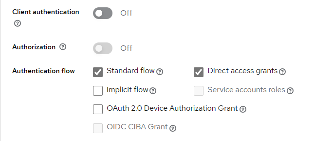

# Section 13

## 자체 인증 서버 제작

### 자체 인증 서버 흐름

- 인증 서버 : Keyloack을 이용하여 구축
- 리소스 서버 : Postman을 이용
- 인증 시나리오
  - API 간 커뮤니케이션
    - 서드 파티 애플리케이션이 리소스 서버에 있는 서비스 이용시 발생
    - client credentials grant flow 이용
  - UA 클라이언트 애플리케이션
    - 클라이언트에서의 접근
    - authorization grant flow 사용

### KeyCloak으로의 인증 서버 구축

- KeyCloak : 인증 서버를 대신 구축할 수 있는 무료 서비스
  - 유사 서비스
    - Okta
    - ForgeRock
- KeyCloak 사이트에서 다운로드 이후 해당 폴더의 터미널로 실행
  ```
  // Window
  > bin\kc.bat start-dev --http-port 8180
  ```
- 새로운 releam의 설정
  - 특정 환경 및 애플리케이션, 시나리오에 특화할 수 있음
  - releam 내부에서 클라이언트, 역할, 사용자, 그룹 사용자 생성 가능

### API 간의 소통 시나리오

- Postman이 Keycloak 인증 서버로부터 엑세스 토큰을 받아옴 \
  -> 리소스 서버로의 엑세스 토큰 전송 \
  -> 엑세스 토큰의 유효 여부에 대하여 Keycloak 서버에서 확인 \
  -> 유효하다면 성공 신호를 보내게 됨
- 클라이언트 설정
   - Client Authentication - 클라이언트 애플리케이션이 엑세스 토큰을 받기 위해 인증이 필요한지 설정 - standart flow - 인증 코드 flow - 엔드 유저와 관련 있는 flow \
   -> 사용하지 않음 - direct access grants - 리소스 소유자 패스워드 자격 증명 타입 - 엔드 유저와 관련 있는 flow \
   -> 사용하지 않음 - service accounts roles - 클라이언트 자격 증명 타입 flow 활용 \
   -> 활성화

### 리소스 서버 구축

- 리소스 서버 구축을 위한 의존성 생성

```groovy
implementation 'org.springframework.boot:spring-boot-starter-oauth2-resource-server'
```

- KeycloakRoleConverter 구축

  - Keycloak 인증 서버가 엑세스 토큰을 반환하도록 설정
  - 토큰으로부터 역할 정보 또는 인증 정보를 추출하여 프레임워크가 알아들을 수 있는 형식으로 반환

  ```Java
  public class KeycloakRoleConverter  implements Converter<Jwt, Collection<GrantedAuthority>> {

      @Override
      public Collection<GrantedAuthority> convert(Jwt jwt) {
          Map<String, Object> realmAccess = (Map<String, Object>) jwt.getClaims().get("realm_access");

          if (realmAccess == null || realmAccess.isEmpty()) {
              return new ArrayList<>();
          }

          Collection<GrantedAuthority> returnValue = ((List<String>) realmAccess.get("roles"))
                  .stream().map(roleName -> "ROLE_" + roleName)
                  .map(SimpleGrantedAuthority::new)
                  .collect(Collectors.toList());

          return returnValue;
      }
  }
  ```

  - `Converter<Jwt, Collection<GrantedAuthority>>`
    - jwt 토큰을 Keycloak 서버로부터 받아서 `GrantedAuthority` 추출 후 `Collection` 형태로 응답
      - spring 프레임워크는 `GrantedAutority` 객체 형식으로만 알아들을 수 있음
  - `convert()`
    - jwt토큰을 받아 `realm_access` 객체 정보 추출 \
      -> jwt 토큰 내부에 존재하는 모든 역할 정보와 인증 정보를 list형태로 반환 \
      -> list에 존재하는 역할마다 로직 실행
    - 역할 정보를 추출하고 `ROLE_` 을 역할 앞에 붙임
    - 역할 추출 이후 `SimpleGrantedAuthority` 생성

- 설정 파일 구축

  ```Java
  JwtAuthenticationConverter jwtAuthenticationConverter = new JwtAuthenticationConverter();
          jwtAuthenticationConverter.setJwtGrantedAuthoritiesConverter(new KeycloakRoleConverter());

  ```

  - converter에 커스텀 로직을 반환하여 Keycloak 서버로부터 받은 JWT 엑세스 토큰을 읽을 수 있도록 함

- 리소스 서버와 인증 서버의 연결
  ```
  spring.security.oauth2.resourceserver.jwt.jwk-set-uri = http://localhost:8180/realms/eazybankdev/protocol/openid-connect/certs
  ```

### 인증 서버에서 리소스 서버로의 토큰 전송 확인 작업

- Postman에서의 전송
  ```json
  {
    "client_id": "eazybankapi",
    "client_secret": "secret_key",
    "scope": "openid"
  }
  ```

## Authorization Code Grant Type Flow

- 실사용자가 연관되었을 때 사용
- 서드파티 애플리케이션이 REST API를 호출하려고 하는 시나리오
  - 리소스 서버는 access token 요구 \
    -> 인증 서버와 연결하여 access token을 받아 리소스 서버에 넘겨야 함

## PKCE

- Proof Key for Code Exchange

### 사용해야 하는 이유

- PKCE 외의 또 다른 인증 코드 flow로는 공개 클라이언트
  - 클라이언트 secret 값이 코드 기반에 짜여 들어가 있다는 한계 존재 \
    -> PCKE와 함께 authorization code flow 이용

### PKCE의 해결 방법

- `code_verifier`
  - 리소스 소유자인 실사용자를 인증 서버의 로그인 페이지로 리다이렉트 할때마다 생성
  - 클라이언트가 무작위 값으로 생성
- `code_chanllenge`
  - `code_verifier`로부터 `code_challenge` 값 생성
    - SHA256 해시 알고리즘을 무작위로 생성된 `code_verifier`에 대해 실행 \
      -> 얻은 해시 string을 Base64-URL 인코딩으로 변환 \
      -> `code_challenge`값으로 변환
- 클라이언트가 엑세스 토큰을 요청중이지 않고 인증 코드를 얻으려 할 때
  - 인증 서버에 `code_challenge` 전송 \
    -> 인증 서버는 `code challenge`를 저장소에 보관 \
    -> 클라이언트에게 `code_challenge`에 대응하는 인증코드 전송
  - 보내는 정보
    - `client_id`
    - `redirect_uri`
    - `scope`
    - `state`
    - `response_type`
    - `code_challenge`
    - `code_challenge_method`
      - SHA256
- 클라이언트가 엑세스토큰을 얻으려고 할 때
  - `code_verifier` 값을 이용하여 인증 서버가 발급했던 인증 코드와 함께 보냄 \
    -> 그 사이 인증 서버가 클라이언트에게 받은 `code_verifier` 확인 후 SHA256 해시 진행 \
    -> 이전에 저장했던 `code_challenge` 값과 비교 후 일치해야 엑세스 토큰 발급
  - 보내는 정보
    - `code`
    - `client_id`
      - `client_secret` (optional)
    - `grant_type`
    - `redirect_uri`
    - `code_verifier`
- 해커가 code_challenge로 해킹 시도를 하더라도 code_verifier값이 없다면 할 수 있는 것이 없음 \
  -> 보안도 간접적으로 적용 가능

### Keycloak과 소셜 로그인 연동

- Identify Providers를 이용하여 연동 가능
  - github, instagram, facebook, paypal 등
- 해당 소셜 서비스에서 생성한 개발자 계정의 `ClientID`와 `Client Secret` 설정 필요

### KeyCloak 특징

- 자체 로그인 페이지 제공
  - 테마 편집 가능
    - 관리자 콘솔 - Realm settings - Themes
- 클라이언트 scope 기본 설정
  - address, email, phone, profile roles 등
- 인증 정책 설정 가능
  - Authentication - Policies
  - 비밀번호 길이 제한, OTP 정책 등
- Identify Providers
  - 소셜 로그인 추가 가능
- User federation
  - Keycloak가 아닌 다른 저장소 설정 가능
    - Ldap, Kerberos 등
